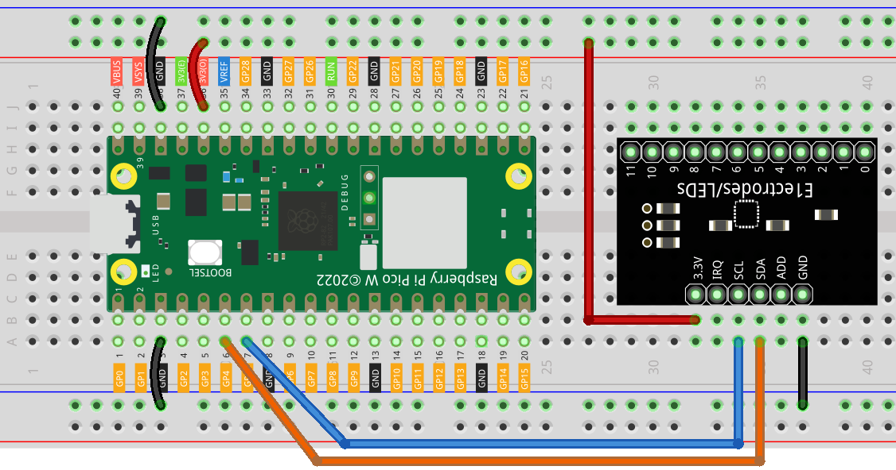
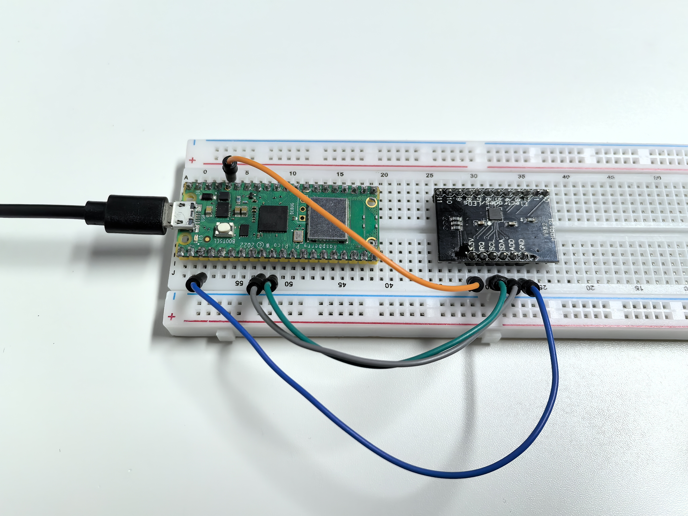

3.3 Touch Keyboard
=========================
Enter the world of **capacitive touch sensing**! The MPR121 chip can detect touch through **12 separate channels** - imagine having 12 invisible buttons that respond to the slightest touch, no physical pressure needed!

**The magic:** Each electrode detects tiny changes in electrical capacitance when your finger approaches. But here's the fun part - you can extend these electrodes to **any conductive material**: fruits, metal objects, water, even plants! Turn a banana into a button, or create a musical fruit piano.

**Creative possibilities:** Touch-sensitive art installations, interactive walls, musical instruments, or invisible control panels.

Component List
^^^^^^^^^^^^^^^
- Raspberry Pi Pico W x1
- MicroUSB cable x1
- 830 Tie-Points Breadboard x1
- MPR121 Module x1
- Jumper Wire Several

Component knowledge
^^^^^^^^^^^^^^^^^^^^
:ref:`MPR121 Module <cpn_mpr121>`
"""""""""""""""""""""""""""""""""""

Connect
^^^^^^^^^

Code
^^^^^^^
.. note::

    * Open the ``3.3_touch_keyboard.py`` file under the path of ``Ultimate-Starter-Kit-for-Pico-W\Python\1.Project`` or copy this code into Thonny, then click "Run Current Script" or simply press F5 to run it.

    * Don't forget to click on the "MicroPython (Raspberry Pi Pico)" interpreter in the bottom right corner. 

.. 3.3.png

After running the code, start touching the 12 electrodes on the MPR121 board! The serial monitor displays a live **binary pattern** (like "001010000100") showing which electrodes are being touched in real-time.

**Experiment time:** Try connecting wires to the electrodes and touching fruits, aluminum foil, or even cups of water. Watch how the touch patterns change as you create your own custom touch interfaces! Each electrode can detect touch through thin materials, opening up endless creative possibilities.

The following is the program code:

.. code-block:: python

    """
    MPR121 Capacitive Touch Sensor Project

    Reads 12-channel touch input and displays touch patterns.
    Hardware: MPR121 breakout board connected via I2C
    """

    from mpr121 import MPR121
    from machine import Pin, I2C
    import time

    # Configuration Constants
    TOUCH_CHANNELS = 12          # Number of touch channels
    I2C_SDA_PIN = 4             # I2C data pin
    I2C_SCL_PIN = 5             # I2C clock pin
    SCAN_INTERVAL_MS = 100      # Scan interval in milliseconds

    class TouchKeyboard:
        """MPR121 Touch Keyboard Class"""
        
        def __init__(self):
            """Initialize touch sensor"""
            print("MPR121 Touch Sensor Initializing...")
            
            # Initialize I2C and MPR121
            self.i2c = I2C(0, sda=Pin(I2C_SDA_PIN), scl=Pin(I2C_SCL_PIN))
            self.mpr = MPR121(self.i2c)
            
            # State variables
            self.last_touched = []
            self.current_touched = []
            self.touch_state = [False] * TOUCH_CHANNELS
            
            print("Touch sensor initialization complete")
        
        def read_touch_states(self):
            """Read current touch states"""
            self.current_touched = self.mpr.get_all_states()
            return self.current_touched
        
        def update_touch_states(self):
            """Update individual touch states"""
            # Reset state array
            self.touch_state = [False] * TOUCH_CHANNELS
            
            # Update touched channel states
            for channel in self.current_touched:
                if 0 <= channel < TOUCH_CHANNELS:
                    self.touch_state[channel] = True
        
        def display_touch_pattern(self):
            """Display touch pattern (binary mode)"""
            pattern = "Touch: "
            for i in range(TOUCH_CHANNELS):
                pattern += "1" if self.touch_state[i] else "0"
            print(pattern)
        
        def display_touched_channels(self):
            """Display touched channel numbers"""
            if self.current_touched:
                print(f"Touched channels: {self.current_touched}")
        
        def has_touch_changed(self):
            """Check if touch state has changed"""
            return self.current_touched != self.last_touched
        
        def run(self):
            """Main execution loop"""
            print("Starting touch state monitoring...")
            print("Touch the sensor to see effects")
            
            while True:
                # Read current touch states
                self.read_touch_states()
                
                # Only display when state changes
                if self.has_touch_changed():
                    self.update_touch_states()
                    
                    # Display touch information
                    if self.current_touched:
                        self.display_touched_channels()
                        self.display_touch_pattern()
                    else:
                        print("No touch")
                    
                    # Update last state
                    self.last_touched = self.current_touched.copy()
                
                time.sleep_ms(SCAN_INTERVAL_MS)

    # Create and run touch keyboard
    if __name__ == "__main__":
        try:
            touch_keyboard = TouchKeyboard()
            touch_keyboard.run()
        except KeyboardInterrupt:
            print("\nProgram stopped")
        except Exception as e:
            print(f"Error: {e}")

Phenomenon
^^^^^^^^^^^
