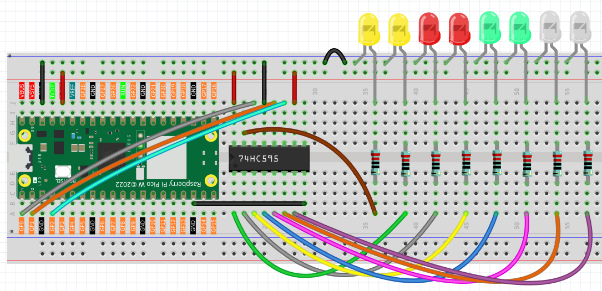

4.1 74HC595
=========================
Meet the **74HC595 shift register** - your **GPIO pin multiplier**! Instead of using 8 precious GPIO pins to control 8 LEDs, this clever chip lets you control 8 outputs using only **3 pins**. It's like having a digital assistant that takes your commands and distributes them to multiple devices.

**The magic:** Send an 8-bit number (like 11010011) to the chip, and it instantly sets 8 output pins to match that pattern. Need to control 16 LEDs? Chain two 74HC595s together! Need 24? Chain three! The possibilities are endless.

Perfect for LED displays, digital clocks, status indicators, or any project where you need lots of outputs but have limited GPIO pins.

Component List
^^^^^^^^^^^^^^^
- Raspberry Pi Pico W x1
- MicroUSB cable x1
- 830 Tie-Points Breadboard x1
- LED x8
- Resistor 220Ω x8
- 74HC595 x1
- Jumper Wire Several

Component knowledge
^^^^^^^^^^^^^^^^^^^^

:ref:`74HC595 <cpn_74hc595>`
"""""""""""""""""""""""""""""""""""

How the 74HC595 works:

**Simple 3-Pin Control:**
- **DATA pin**: Send your 8-bit pattern one bit at a time
- **CLOCK pin**: Each pulse shifts the data one position
- **LATCH pin**: When pulsed, all 8 outputs update simultaneously

**The Process:**
1. Send 8 bits of data (one per clock pulse)
2. Pulse the latch pin
3. All 8 LEDs instantly show your pattern!

Connect
^^^^^^^^^

Code
^^^^^^^
.. note::

    * Open the ``4.1_74hc595.py`` file under the path of ``Ultimate-Starter-Kit-for-Pico-W\Python\1.Project`` or copy this code into Thonny, then click "Run Current Script" or simply press F5 to run it.

    * Don't forget to click on the "MicroPython (Raspberry Pi Pico)" interpreter in the bottom right corner. 

.. 4.1.png

After running the code, watch the mesmerizing "flowing water" LED effect! The LEDs progressively light up from left to right, creating a smooth flowing pattern, then flow back in the opposite direction. This demonstrates how you can create complex animations with just simple binary patterns sent to the 74HC595.

The following is the program code:

.. code-block:: python

      """
      74HC595 Smooth Flowing LED Project

      Creates a smooth flowing LED effect using a 74HC595 shift register.
      LEDs progressively light up and then smoothly flow back, creating
      a continuous mesmerizing water-like animation.

      Hardware: 74HC595 shift register + 8 LEDs with current limiting resistors
      """

      import machine
      import time

      # 74HC595 Pin Configuration Constants
      DATA_PIN = 0        # DS (Serial Data Input) - pin 14 of 74HC595
      LATCH_PIN = 1       # ST_CP (Storage Register Clock) - pin 12 of 74HC595
      CLOCK_PIN = 2       # SH_CP (Shift Register Clock) - pin 11 of 74HC595

      # Animation Timing Constants
      FLOW_DELAY_MS = 150  # Delay between flow steps for smooth animation

      class HC595FlowingLED:
          """74HC595 Smooth Flowing LED Controller"""
          
          def __init__(self):
              """Initialize 74HC595 control pins"""
              self.data_pin = machine.Pin(DATA_PIN, machine.Pin.OUT)
              self.latch_pin = machine.Pin(LATCH_PIN, machine.Pin.OUT)
              self.clock_pin = machine.Pin(CLOCK_PIN, machine.Pin.OUT)
              
              # Smooth Flowing LED Patterns
              self.flow_patterns = [
                  0b00000000,  # All off (start)
                  0b00000001,  # 1 LED
                  0b00000011,  # 2 LEDs
                  0b00000111,  # 3 LEDs
                  0b00001111,  # 4 LEDs
                  0b00011111,  # 5 LEDs
                  0b00111111,  # 6 LEDs
                  0b01111111,  # 7 LEDs
                  0b11111111,  # All on (peak)
                  0b11111110,  # Flow back: 7 LEDs
                  0b11111100,  # 6 LEDs
                  0b11111000,  # 5 LEDs
                  0b11110000,  # 4 LEDs
                  0b11100000,  # 3 LEDs
                  0b11000000,  # 2 LEDs
                  0b10000000,  # 1 LED
                  0b00000000   # All off (end cycle)
              ]
              
              # Clear all LEDs initially
              self.update_shift_register(0b00000000)
              print("74HC595 Smooth Flowing LED initialized")
          
          def update_shift_register(self, pattern):
              """
              Update Shift Register
              Sends data to 74HC595 and latches the output.
              """
              self.latch_pin.low()                           # Prepare for data
              self.shift_out_msb_first(pattern)              # Send 8 bits
              self.latch_pin.high()                          # Latch data to outputs
          
          def shift_out_msb_first(self, data):
              """
              Shift out data MSB first (Most Significant Bit first)
              Equivalent to Arduino's shiftOut() function
              """
              for bit in range(7, -1, -1):  # Start from bit 7 down to bit 0
                  self.clock_pin.low()
                  time.sleep_ms(1)
                  
                  # Extract the bit value
                  bit_value = (data >> bit) & 1
                  self.data_pin.value(bit_value)
                  time.sleep_ms(1)
                  
                  self.clock_pin.high()
                  time.sleep_ms(1)
          
          def run_smooth_flowing_animation(self):
              """
              Run Smooth Flowing Animation
              Creates a mesmerizing water-like flow effect that builds up
              all LEDs then smoothly flows back to create continuous motion.
              """
              for i, pattern in enumerate(self.flow_patterns):
                  self.update_shift_register(pattern)
                  print(f"Step {i:2d}: {pattern:08b}")
                  time.sleep_ms(FLOW_DELAY_MS)
          
          def run_continuous_animation(self):
              """Run continuous smooth flowing animation"""
              print("Starting smooth flowing LED animation...")
              print("Press Ctrl+C to stop")
              
              try:
                  while True:
                      self.run_smooth_flowing_animation()
              except KeyboardInterrupt:
                  print("\nAnimation stopped")
                  self.update_shift_register(0b00000000)  # Clear all LEDs
          
          def test_all_leds(self):
              """Test all LEDs individually"""
              print("Testing all LEDs individually...")
              
              for i in range(8):
                  pattern = 1 << i  # Light up LED i
                  self.update_shift_register(pattern)
                  print(f"LED {i}: {pattern:08b}")
                  time.sleep_ms(300)
              
              # Turn off all LEDs
              self.update_shift_register(0b00000000)
              print("LED test complete")
          
          def custom_pattern(self, pattern):
              """Display a custom pattern"""
              self.update_shift_register(pattern)
              print(f"Custom pattern: {pattern:08b}")

      # Create and run the flowing LED controller
      if __name__ == "__main__":
          try:
              led_controller = HC595FlowingLED()
              
              # Optional: Test all LEDs first
              # led_controller.test_all_leds()
              # time.sleep_ms(1000)
              
              # Run continuous smooth flowing animation
              led_controller.run_continuous_animation()
              
          except Exception as e:
              print(f"Error: {e}")

Phenomenon
^^^^^^^^^^^
.. video:: img/5.phenomenon/4.1.mp4
    :width: 100%