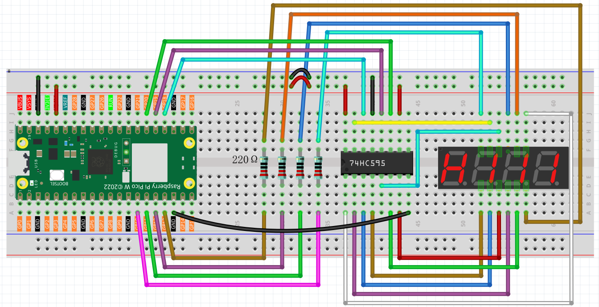

4.3 Digital Stopwatch 
================================
Now let's build a **digital timer** using a 4-digit display! This is like having four 7-segment displays working together to show numbers from 0000 to 9999 - perfect for clocks, stopwatches, or counters.

**The clever trick - Multiplexing:**
Instead of controlling all 4 digits simultaneously (which would need tons of wires), we use a **"visual magic trick"**. We rapidly flash each digit one at a time:
- Display "1" on digit 1, others off
- Display "2" on digit 2, others off  
- Display "3" on digit 3, others off
- Display "4" on digit 4, others off
- Repeat super fast!

Your eyes can't see the flashing (it happens 200+ times per second), so you see "1234" continuously!

Component List
^^^^^^^^^^^^^^^
- Raspberry Pi Pico W x1
- MicroUSB cable x1
- 830 Tie-Points Breadboard x1
- 4-Digit 7-Segment Display x1
- Resistor 220Ω x4
- 74HC595 x1
- Jumper Wire Several

Component knowledge
^^^^^^^^^^^^^^^^^^^^
:ref:`4-Digit 7-Segment Display <cpn_4_digit_7_segment_display>`
"""""""""""""""""""""""""""""""""""""""""""""""""""""""""""""""""""""""""""

How our timer display works:

**Smart Control System:**
- **74HC595**: Controls which segments light up (the digit pattern)
- **4 digit select pins**: Choose which of the 4 displays is active
- **Multiplexing code**: Rapidly switches between digits to create the illusion

**Timer Logic:** The code counts elapsed seconds since startup and breaks the number into individual digits (1234 → 1, 2, 3, 4), then displays each digit in rapid succession.

Connect
^^^^^^^^^

Code
^^^^^^^
.. note::

    * Open the ``4.3_digital_stopwatch.py`` file under the path of ``Ultimate-Starter-Kit-for-Pico-W\Python\1.Project`` or copy this code into Thonny, then click "Run Current Script" or simply press F5 to run it.

    * Don't forget to click on the "MicroPython (Raspberry Pi Pico)" interpreter in the bottom right corner. 

.. 4.3.png

After running the code, watch your homemade digital timer come to life! The display counts up in seconds from 0000, incrementing every second: 0001, 0002, 0003... all the way to 9999, then resets. You've just built a functional digital stopwatch using multiplexing techniques found in real electronic devices!

The following is the program code:

.. code-block:: python

    import machine
    import time

    # =========================
    # Constants and pin mapping
    # =========================
    SEGMENT_CODES = [
        0x3F, 0x06, 0x5B, 0x4F, 0x66,
        0x6D, 0x7D, 0x07, 0x7F, 0x6F,
    ]

    SHIFT_DATA_PIN = 18   # 74HC595 DS
    LATCH_PIN = 19        # 74HC595 RCLK (latch)
    CLOCK_PIN = 20        # 74HC595 SRCLK (shift clock)

    DIGIT_PINS = [10, 13, 12, 11]  # position 0..3 -> ones, tens, hundreds, thousands

    NUM_DIGITS = 4
    BITS_PER_BYTE = 8
    SHIFT_DELAY_US = 200
    MS_PER_SECOND = 1000
    POWER_OF_TEN = (1, 10, 100, 1000)

    # ===============
    # Hardware setup
    # ===============
    sdi = machine.Pin(SHIFT_DATA_PIN, machine.Pin.OUT)
    rclk = machine.Pin(LATCH_PIN, machine.Pin.OUT)
    srclk = machine.Pin(CLOCK_PIN, machine.Pin.OUT)

    digit_select_pins = [machine.Pin(pin, machine.Pin.OUT) for pin in DIGIT_PINS]

    start_ms = time.ticks_ms()

    # ==================
    # Utility functions
    # ==================
    def get_elapsed_seconds():
        """Return elapsed seconds since the script started."""
        return int((time.ticks_ms() - start_ms) / MS_PER_SECOND)

    def select_digit(position):
        """Enable one digit (active low) and disable the others."""
        for pin in digit_select_pins:
            pin.value(1)
        digit_select_pins[position].value(0)

    def clear_display():
        """Turn off all segments."""
        shift_out(0x00)

    def shift_out(byte_value):
        """Shift out one byte to 74HC595, MSB first."""
        rclk.low()
        time.sleep_us(SHIFT_DELAY_US)
        for bit_index in range(BITS_PER_BYTE - 1, -1, -1):
            srclk.low()
            time.sleep_us(SHIFT_DELAY_US)
            bit_value = (byte_value >> bit_index) & 0x01
            sdi.value(bit_value)
            time.sleep_us(SHIFT_DELAY_US)
            srclk.high()
            time.sleep_us(SHIFT_DELAY_US)
        time.sleep_us(SHIFT_DELAY_US)
        rclk.high()
        time.sleep_us(SHIFT_DELAY_US)

    def get_digit_value(number, position):
        """Extract decimal digit at position (0 = ones)."""
        return (number // POWER_OF_TEN[position]) % 10

    def display_number_once(number):
        """Multiplex the 4 digits once. Call repeatedly in a fast loop."""
        for position in range(NUM_DIGITS):
            select_digit(position)
            digit = get_digit_value(number, position)
            shift_out(SEGMENT_CODES[digit])

    def main():
        """Simple 4-digit timer (seconds)."""
        while True:
            seconds = get_elapsed_seconds()
            display_number_once(seconds)

    if __name__ == "__main__":
        main()

Phenomenon
^^^^^^^^^^^
.. video:: img/5.phenomenon/4.3.mp4
    :width: 100%