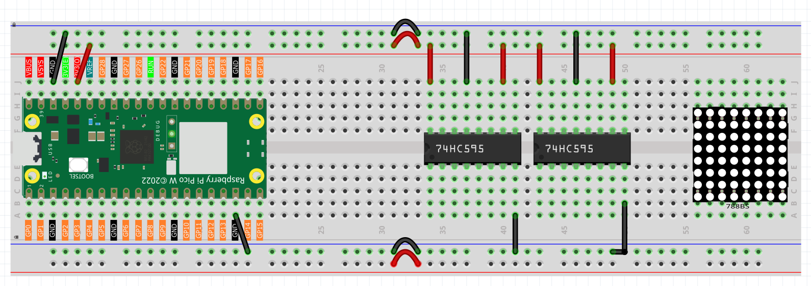
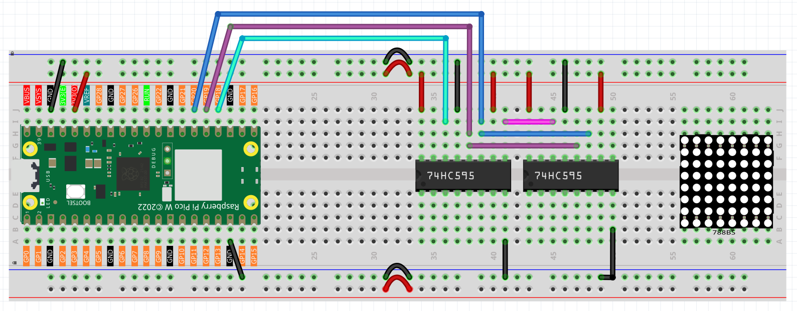

4.4 LED Dot Matrix
=========================
The LED matrix is a low-resolution dot-matrix display that uses an array of light-emitting 
diodes (LEDs) as pixels to create patterned displays. These matrices are bright enough to 
be visible even in outdoor sunlight and are commonly seen in stores, billboards, signs, 
and variable message displays (such as those on public transit vehicles).

The LED matrix used in this kit is an 8x8 dot matrix with 16 pins. The anodes of the 
LEDs are connected in rows, while the cathodes are connected in columns (at the circuit 
level). This configuration allows control over the 64 individual LEDs.

To light up the first LED, you need to provide a high level to Row 1 and a low level 
to Column 1. To light up the second LED, you would provide a high level to Row 1 and 
a low level to Column 2, and so on. By controlling the current through each pair of 
rows and columns, each LED can be individually controlled to display characters or images.

Component List
^^^^^^^^^^^^^^^
- Raspberry Pi Pico W x1
- MicroUSB cable x1
- 830 Tie-Points Breadboard x1
- LED Dot Matrix x1
- 74HC595 x2
- Jumper Wire Several

Component knowledge
^^^^^^^^^^^^^^^^^^^^
:ref:`LED Dot Matrix <cpn_led_dot_matrix>`
""""""""""""""""""""""""""""""""""""""""""

The 8x8 dot matrix is controlled by two 74HC595 chips: one for the rows and one for 
the columns. These two chips share pins G18 to G20, which significantly reduces the 
number of I/O ports required on the Pico W board.

To display a pattern, the Pico W outputs a 16-bit binary number. The first 8 bits 
are sent to the 74HC595 controlling the rows, while the last 8 bits are sent to the 
74HC595 controlling the columns.

The Q7' pin is a series output pin, which can be connected to the DS pin of another 
74HC595 to daisy-chain multiple 74HC595 chips together.

Connect
^^^^^^^^^
Build the circuit. Since the wiring is complicated, let’s make it step by step.

Step 1: First, insert the Pico W, the LED dot matrix and two 74HC595 chips into breadboard. Connect the 3.3V and GND of the Pico W to holes on the two sides of the board, then hook up pin16 and 10 of the two 74HC595 chips to VCC, pin 13 and pin 8 to GND.

Step 2: Connect pin 11 of the two 74HC595 together, and then to GP20; then pin 12 of the two chips, and to GP19; next, pin 14 of the 74HC595 on the left side to GP18 and pin 9 to pin 14 of the second 74HC595.

Step 3: The 74HC595 on the right side is to control columns of the LED dot matrix. See the table below for the mapping. Therefore, Q0-Q7 pins of the 74HC595 are mapped with pin 13, 3, 4, 10, 6, 11, 15, and 16 respectively.

.. image:: img/3.connect/4.4-3.png

Step 4: Now connect the ROWs of the LED dot matrix. The 74HC595 on the left controls ROW of the LED dot matrix. See the table below for the mapping. We can see, Q0-Q7 of the 74HC595 on the left are mapped with pin 9, 14, 8, 12, 1, 7, 2, and 5 respectively.

.. image:: img/3.connect/4.4-4.png

Code
^^^^^^^
.. note::

    * Open the ``4.4_led_dot_matrix.py`` file under the path of ``Ultimate-Starter-Kit-for-Pico-W\Python\1.Project`` or copy this code into Thonny, then click "Run Current Script" or simply press F5 to run it.

    * Don't forget to click on the "MicroPython (Raspberry Pi Pico)" interpreter in the bottom right corner. 

.. 4.4.png

Click “Run current script”, you will see a x graphic displayed on the 8x8 dot matrix.

The following is the program code:

.. code-block:: python

    import machine
    import time

    sdi = machine.Pin(18, machine.Pin.OUT)
    rclk = machine.Pin(19, machine.Pin.OUT)
    srclk = machine.Pin(20, machine.Pin.OUT)

    hi_pattern = [
        0xFF, # 11111111
        0xAD, # 10101101
        0xAD, # 10101101
        0xA1, # 10100001
        0xAD, # 10101101
        0xAD, # 10101101
        0xFF, # 11111111
        0xFF  # 11111111
    ]

    music_note = [
        0xFF, # 11111111
        0xFF, # 11110111
        0xF1, # 11110001
        0xF3, # 11110011
        0xF7, # 11110111
        0xF7, # 11110111
        0xF7, # 11110111
        0xFF  # 11111111
    ]

    smile = [
        0xFF, # 11111111
        0xFF, # 11111111
        0xC3, # 11000011
        0xBD, # 10111101
        0xFF, # 11111111
        0x93, # 10010011
        0x93, # 10010011
        0xFF  # 11111111
    ]

    arrow_right = [0xFF,0xF7,0xFB,0x81,0xFB,0xF7,0xFF,0xFF]
    arrow_left = [0xFF,0xEF,0xDF,0x81,0xDF,0xEF,0xFF,0xFF]

    def scroll_pattern_left(pattern):
        return [((row << 1) | (row >> 7)) & 0xFF for row in pattern]

    def scroll_pattern_right(pattern):
        return [((row >> 1) | (row << 7)) & 0xFF for row in pattern]

    def scroll_animation(pattern, direction='left', steps=8, step_delay=200):
        current = pattern
        for _ in range(steps):
            display_pattern(current, step_delay)
            if direction == 'left':
                current = scroll_pattern_left(current)
            else:
                current = scroll_pattern_right(current)

    def hc595_in(dat):
        for bit in range(7, -1, -1):
            srclk.low()
            sdi.value(1 & (dat >> bit))
            srclk.high()

    def hc595_out():
        rclk.high()
        rclk.low()

    def display_pattern(pattern, duration_ms=1000):
        end_time = time.ticks_add(time.ticks_ms(), duration_ms)
        while time.ticks_diff(end_time, time.ticks_ms()) > 0:
            for i in range(8):
                hc595_in(pattern[i]) 
                hc595_in(0x80 >> i) 
                hc595_out()
                time.sleep_us(500) 

    def main():
        while True:
            display_pattern(hi_pattern, 1500)
            
            display_pattern(music_note, 1000)
            scroll_animation(music_note, 'left', 8, 150)
            scroll_animation(music_note, 'right', 8, 150)
            
            display_pattern(smile, 1500)
            
            for _ in range(2):
                display_pattern(arrow_right, 400)
                display_pattern(arrow_left, 400)

    try:
        main()
    except KeyboardInterrupt:
        pass
            
Phenomenon
^^^^^^^^^^^
.. video:: img/5.phenomenon/4.4.mp4
    :width: 100%