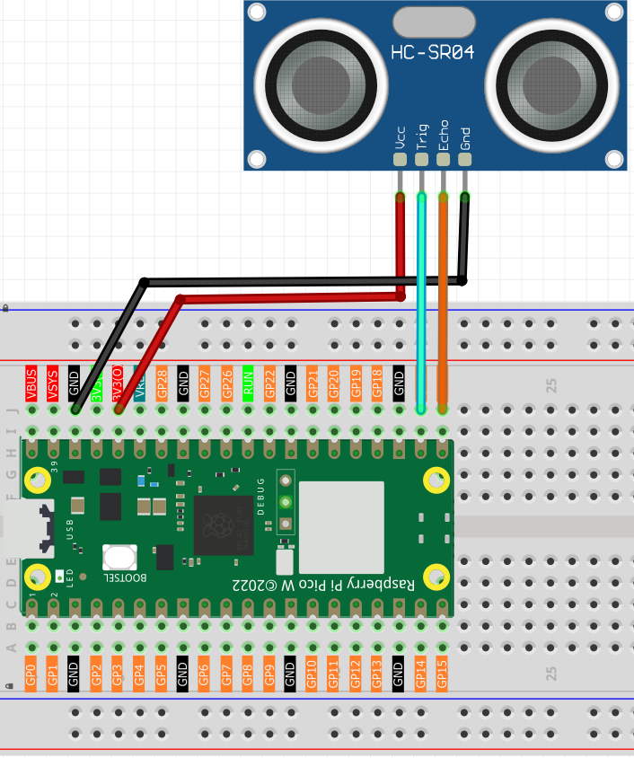
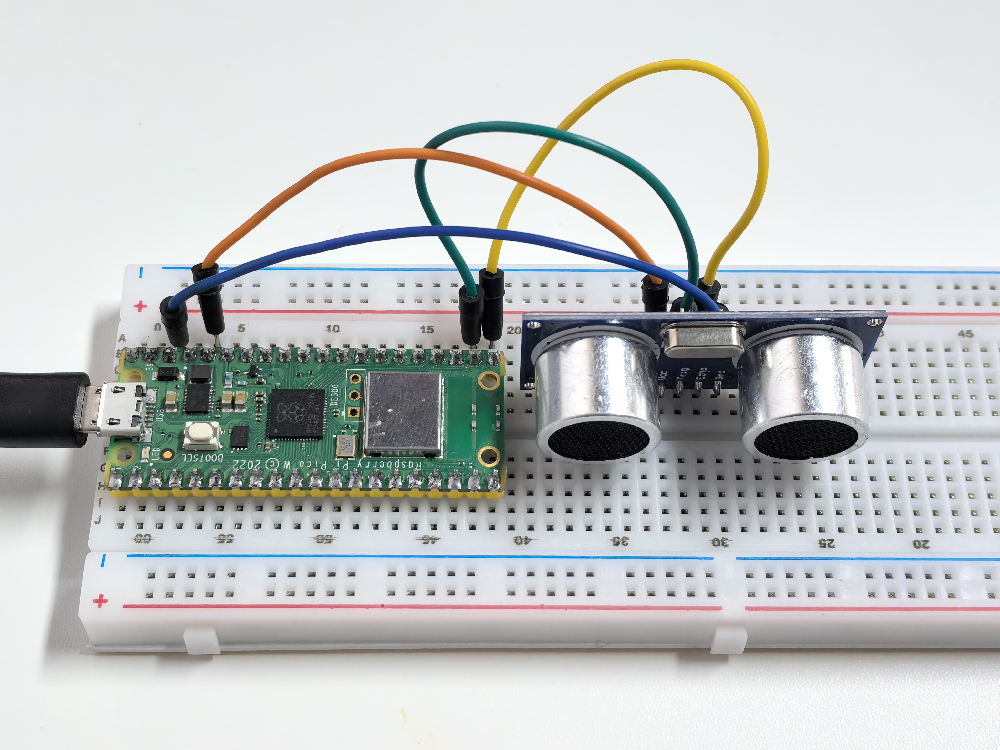

5.1 Digital Distance Meter
=============================
Time to build your own **digital radar**! The ultrasonic sensor works like a bat's echolocation or ship sonar - it sends out sound waves you can't hear and measures how long they take to bounce back. This gives you precise distance measurements from 2cm to 4 meters!

**Perfect for:** Parking sensors, automatic doors, robot navigation, water level monitoring, or security systems. Imagine creating a "smart trash can" that opens when you approach, or a device that tells you how full your water tank is!

Component List
^^^^^^^^^^^^^^^
- Raspberry Pi Pico W x1
- MicroUSB cable x1
- 830 Tie-Points Breadboard x1
- Ultrasonic Module x1
- Jumper Wire Several

Component knowledge
^^^^^^^^^^^^^^^^^^^^
:ref:`Ultrasonic Module <cpn_ultrasonic_module>`
""""""""""""""""""""""""""""""""""""""""""""""""""

Connect
^^^^^^^^^

Code
^^^^^^^
.. note::

    * Open the ``5.1_digital_distance_meter.py`` file under the path of ``Ultimate-Starter-Kit-for-Pico-W\Python\1.Project`` or copy this code into Thonny, then click "Run Current Script" or simply press F5 to run it.

    * Don't forget to click on the "MicroPython (Raspberry Pi Pico)" interpreter in the bottom right corner. 

.. 5.1.png

After running the code, move your hand or objects in front of the sensor and watch real-time distance measurements! The sensor updates every 0.5 seconds with precision to 1cm. Try testing different objects, distances, and angles to see how this "electronic measuring tape" responds. It can even detect through thin materials like paper!

The following is the program code:

.. code-block:: python

    #!/usr/bin/env python3

    """
    Ultrasonic ranging with HC-SR04 (MicroPython)

    This refactor keeps the original functionality while improving readability:
    - English comments and prints
    - Replaces magic numbers with constants
    - Adds timeouts to avoid infinite loops
    - Simple, beginner-friendly structure
    """

    import machine
    import time

    # =========================
    # Constants (hardware/timing)
    # =========================
    TRIGGER_PIN = 17
    ECHO_PIN = 16

    TRIGGER_PULSE_US = 10
    SETTLE_DELAY_US = 2
    MEASURE_INTERVAL_MS = 300

    TIMEOUT_US = 100_000  # 0.1s timeout to avoid getting stuck

    # Speed of sound: 340 m/s = 34,000 cm/s = 0.034 cm/us
    SPEED_OF_SOUND_CM_PER_US = 0.034

    class UltrasonicSensor:
        """HC-SR04 distance measurement helper (MicroPython)."""

        def __init__(self, trigger_pin: int, echo_pin: int) -> None:
            self.trigger = machine.Pin(trigger_pin, machine.Pin.OUT)
            self.echo = machine.Pin(echo_pin, machine.Pin.IN)

            # Ensure trigger starts low and sensor is settled
            self.trigger.low()
            time.sleep_ms(50)

        def _send_trigger_pulse(self) -> None:
            """Send a 10us trigger pulse to start measurement."""
            self.trigger.low()
            time.sleep_us(SETTLE_DELAY_US)
            self.trigger.high()
            time.sleep_us(TRIGGER_PULSE_US)
            self.trigger.low()

        def measure_distance_cm(self) -> float:
            """Measure distance in centimeters; return -1 on timeout."""
            self._send_trigger_pulse()

            # Wait for echo to go high (start)
            start_wait = time.ticks_us()
            while self.echo.value() == 0:
                if time.ticks_diff(time.ticks_us(), start_wait) > TIMEOUT_US:
                    return -1

            pulse_start = time.ticks_us()

            # Wait for echo to go low (end)
            while self.echo.value() == 1:
                if time.ticks_diff(time.ticks_us(), pulse_start) > TIMEOUT_US:
                    return -1

            pulse_end = time.ticks_us()
            duration_us = time.ticks_diff(pulse_end, pulse_start)

            # Distance = (duration_us * speed_of_sound_cm_per_us) / 2
            distance_cm = (duration_us * SPEED_OF_SOUND_CM_PER_US) / 2.0
            return distance_cm

    def main() -> None:
        sensor = UltrasonicSensor(TRIGGER_PIN, ECHO_PIN)
        print("Starting measurements. Press Ctrl+C to stop.")
        try:
            while True:
                distance_cm = sensor.measure_distance_cm()
                if distance_cm >= 0:
                    print("Distance: %.2f cm" % distance_cm)
                else:
                    print("Measurement failed (timeout). Check sensor wiring and range.")
                time.sleep_ms(MEASURE_INTERVAL_MS)
        except KeyboardInterrupt:
            print("Measurement stopped by user.")

    if __name__ == "__main__":
        main()

Phenomenon
^^^^^^^^^^^
