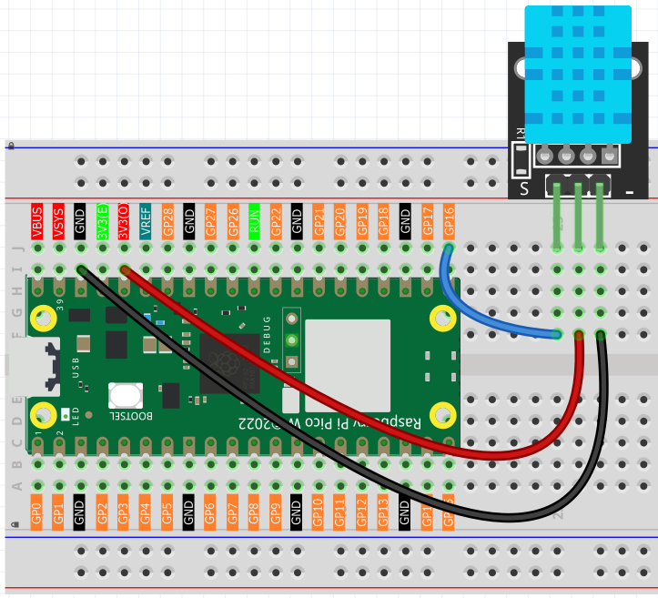

5.2 Temp & Humidity Monitoring
==============================
Build your own **weather station**! The DHT11 sensor can read both temperature and humidity from the air around it - perfect for monitoring room comfort, greenhouse conditions, or weather tracking projects.

**Why monitor both?**
- **Temperature**: How hot or cold it feels (measured in °C)
- **Humidity**: How much moisture is in the air (measured in %RH)
- **Together**: They determine comfort levels - 40-60% humidity feels best!

.. image:: img/1.detail/5.2.png

**Smart features:** The DHT11 sends **digital data** directly to your Pico - no complex analog readings needed! It's like having a tiny meteorologist that reports weather conditions every few seconds.

Component List
^^^^^^^^^^^^^^^
- Raspberry Pi Pico W x1
- MicroUSB cable x1
- 830 Tie-Points Breadboard x1
- DHT11 Module x1
- Jumper Wire Several

Component knowledge
^^^^^^^^^^^^^^^^^^^^
:ref:`DHT11 Module <cpn_dht11_module>`
""""""""""""""""""""""""""""""""""""""""

Connect
^^^^^^^^^

Code
^^^^^^^
.. note::

    * Open the ``5.2_temp_and_humidity_monitoring.py`` file under the path of ``Ultimate-Starter-Kit-for-Pico-W\Python\1.Project`` or copy this code into Thonny, then click "Run Current Script" or simply press F5 to run it.

    * Don't forget to click on the "MicroPython (Raspberry Pi Pico)" interpreter in the bottom right corner. 

.. 5.2.png

After running the code, watch your personal weather station come alive! The sensor reports temperature and humidity every 2 seconds. Try breathing on the sensor (increases humidity), or moving it to different rooms to see how conditions vary. The readings stabilize and become more accurate after a few minutes of operation.

The following is the program code:

.. code-block:: python

    """
    Simple DHT11 temperature and humidity monitoring (MicroPython)

    Refactor goals:
    - English comments and prints
    - Replace magic numbers with named constants
    - Keep the original functionality (periodic reads and printing)
    - Beginner-friendly structure
    """

    from machine import Pin
    import utime as time
    from dht import DHT11, InvalidPulseCount

    # =========================
    # Constants
    # =========================
    SENSOR_PIN = 16
    INITIAL_DELAY_S = 5       # initial sensor warm-up time
    READ_INTERVAL_S = 2       # interval between reads
    ERROR_RETRY_DELAY_MS = 200

    def main() -> None:
        # Initialize sensor
        pin = Pin(SENSOR_PIN, Pin.IN)
        sensor = DHT11(pin)

        # Allow sensor to stabilize
        print("Warming up DHT11 sensor...")
        time.sleep(INITIAL_DELAY_S)
        print("DHT11 sensor is ready.")

        try:
            while True:
                try:
                    sensor.measure()
                    temperature_c = sensor.temperature
                    humidity_pct = sensor.humidity
                    print(f"Temperature: {temperature_c} C, Humidity: {humidity_pct} %")
                    time.sleep(READ_INTERVAL_S)
                except InvalidPulseCount:
                    print("Bad pulse count - retrying ...")
                    time.sleep_ms(ERROR_RETRY_DELAY_MS)
        except KeyboardInterrupt:
            print("Measurement stopped by user.")

    if __name__ == "__main__":
        main()

Phenomenon
^^^^^^^^^^^
.. image:: img/5.phenomenon/5.2.png
    :width: 100%