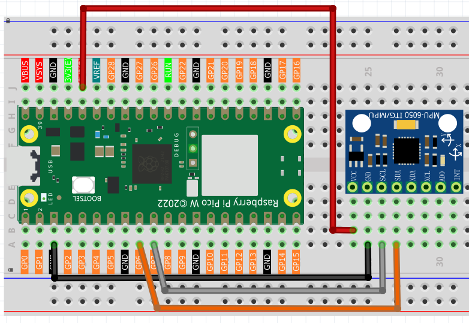
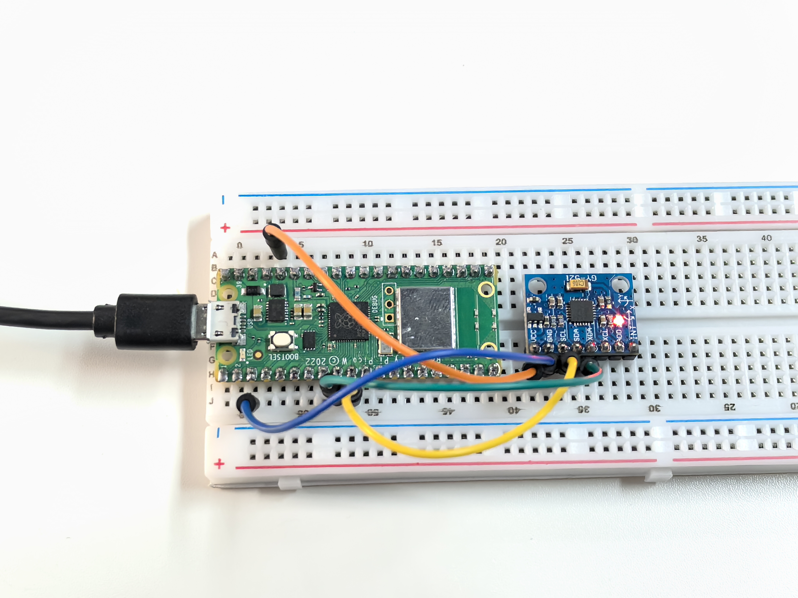

5.3 GY521 Module
=========================
Meet the **GY-521** - your project's motion detective! This tiny sensor is like having a smartphone's motion sensing brain in your project. It combines two powerful sensors in one:

**6-Axis Motion Sensing:**
- **3-axis Accelerometer**: Detects acceleration and gravity (up/down, left/right, forward/back)
- **3-axis Gyroscope**: Detects rotation speed (pitch, roll, yaw)
- **Together**: They create a complete picture of how your project is moving in 3D space!

**Real-world applications:** Drone stabilization, gaming controllers, fitness trackers, earthquake detectors, or self-balancing robots. It's the same technology that makes your phone rotate the screen and helps drones stay stable!

Component List
^^^^^^^^^^^^^^^
- Raspberry Pi Pico W x1
- MicroUSB cable x1
- 830 Tie-Points Breadboard x1
- MPU6050 Module
- Jumper Wire Several

Component knowledge
^^^^^^^^^^^^^^^^^^^^

:ref:`MPU6050 Module <cpn_mpu6050_module>`
"""""""""""""""""""""""""""""""""""""""""""

Connect
^^^^^^^^^

Code
^^^^^^^
.. note::

    * Open the ``5.3_gy521_module.py`` file under the path of ``Ultimate-Starter-Kit-for-Pico-W\Python\1.Project`` or copy this code into Thonny, then click "Run Current Script" or simply press F5 to run it.

    * Don't forget to click on the "MicroPython (Raspberry Pi Pico)" interpreter in the bottom right corner. 

.. 5.3.png

After running the code, try rotating and moving the sensor in different directions! Watch the real-time 6-axis data streaming:

- **Gyroscope values (°/s)**: Show rotation speed - twist the sensor to see these change
- **Accelerometer values (g-force)**: Show acceleration and tilt - flip the sensor to see gravity effects
- **Calculated angles**: The code even calculates tilt angles for you!

Try different movements: gentle tilting, fast spinning, or shaking to see how this "digital motion detector" responds to every movement.

The following is the program code:

.. code-block:: python

    """
    MPU6050 accelerometer and gyroscope reader (MicroPython)

    Refactor goals:
    - English comments and prints
    - Replace magic numbers with named constants
    - Keep original functionality (periodic reading and printing)
    - Beginner-friendly, minimal OOP wrapper
    """

    from imu import MPU6050
    from machine import I2C, Pin
    import time
    import math

    # =========================
    # Constants (I2C and timing)
    # =========================
    I2C_ID = 1
    I2C_SDA_PIN = 6
    I2C_SCL_PIN = 7
    I2C_FREQ_HZ = 400_000

    READING_INTERVAL_MS = 500
    SAMPLE_INTERVAL_S = READING_INTERVAL_MS / 1000.0

    # Complementary filter parameters
    RAD_TO_DEG = 57.2957795

    # Sensor configuration to mirror Arduino example
    MPU6050_I2C_ADDR = 0x68
    REG_GYRO_CONFIG = 0x1B
    REG_ACCEL_CONFIG = 0x1C
    REG_CONFIG = 0x1A

    ACCEL_RANGE_G = 8       # ±8g
    GYRO_RANGE_DPS = 500    # ±500 °/s
    FILTER_BANDWIDTH_HZ = 21

    class MPU6050Sensor:
        """Small helper to read MPU6050 over I2C."""

        def __init__(self, i2c_id: int, sda_pin: int, scl_pin: int, freq_hz: int) -> None:
            self.i2c = I2C(i2c_id, sda=Pin(sda_pin), scl=Pin(scl_pin), freq=freq_hz)
            self.mpu = MPU6050(self.i2c)

        def configure(self, accel_range_g: int, gyro_range_dps: int, dlpf_hz: int) -> None:
            """Configure accel/gyro ranges and low-pass filter to match Arduino settings."""
            # Map accel range (g) to AFS_SEL bits
            accel_sel_map = {2: 0, 4: 1, 8: 2, 16: 3}
            accel_sel = accel_sel_map.get(accel_range_g, 2)  # default ±8g
            self.i2c.writeto_mem(MPU6050_I2C_ADDR, REG_ACCEL_CONFIG, bytes([accel_sel << 3]))

            # Map gyro range (°/s) to FS_SEL bits
            gyro_sel_map = {250: 0, 500: 1, 1000: 2, 2000: 3}
            gyro_sel = gyro_sel_map.get(gyro_range_dps, 1)  # default ±500 dps
            self.i2c.writeto_mem(MPU6050_I2C_ADDR, REG_GYRO_CONFIG, bytes([gyro_sel << 3]))

            # Map DLPF bandwidth (Hz) to CONFIG.DLPF_CFG
            dlpf_map = {260: 0, 184: 1, 94: 2, 44: 3, 21: 4, 10: 5, 5: 6}
            dlpf = dlpf_map.get(dlpf_hz, 4)  # default 21 Hz
            self.i2c.writeto_mem(MPU6050_I2C_ADDR, REG_CONFIG, bytes([dlpf]))

        def read_acceleration(self):
            """Return accelerometer vector as a tuple (x, y, z)."""
            a = self.mpu.accel
            return (a.x, a.y, a.z)

        def read_gyroscope(self):
            """Return gyroscope vector as a tuple (x, y, z)."""
            g = self.mpu.gyro
            return (g.x, g.y, g.z)

    def calculate_x_rotation_deg(ax: float, ay: float, az: float) -> float:
        """Calculate X-rotation (roll) from accelerometer data, degrees."""
        return math.atan2(ay, math.sqrt(ax * ax + az * az)) * RAD_TO_DEG

    def calculate_y_rotation_deg(ax: float, ay: float, az: float) -> float:
        """Calculate Y-rotation (pitch) from accelerometer data, degrees (negative sign to match convention)."""
        return -math.atan2(ax, math.sqrt(ay * ay + az * az)) * RAD_TO_DEG

    def main() -> None:
        sensor = MPU6050Sensor(I2C_ID, I2C_SDA_PIN, I2C_SCL_PIN, I2C_FREQ_HZ)
        print("MPU6050 sensor reading started.")
        print("MPU6050 sensor is ready.\n")
        try:
            # Configure sensor ranges and filter to mirror Arduino example
            sensor.configure(ACCEL_RANGE_G, GYRO_RANGE_DPS, FILTER_BANDWIDTH_HZ)
            while True:
                ax, ay, az = sensor.read_acceleration()
                gx, gy, gz = sensor.read_gyroscope()
                x_rot_deg = calculate_x_rotation_deg(ax, ay, az)
                y_rot_deg = calculate_y_rotation_deg(ax, ay, az)

                # Match Arduino-like formatted output
                print("--- Gyroscope (°/s) ---")
                print("X: %.2f | Y: %.2f | Z: %.2f" % (gx, gy, gz))

                print("--- Accelerometer (g) ---")
                print("X: %.2f | Y: %.2f | Z: %.2f" % (ax, ay, az))

                print("--- Calculated Rotation (°) ---")
                print("X-Rotation: %.1f | Y-Rotation: %.1f" % (x_rot_deg, y_rot_deg))

                print("\n----------------------------------\n")
                time.sleep(SAMPLE_INTERVAL_S)
        except KeyboardInterrupt:
            print("Measurement stopped by user.")

    if __name__ == "__main__":
        main()

Phenomenon
^^^^^^^^^^^
