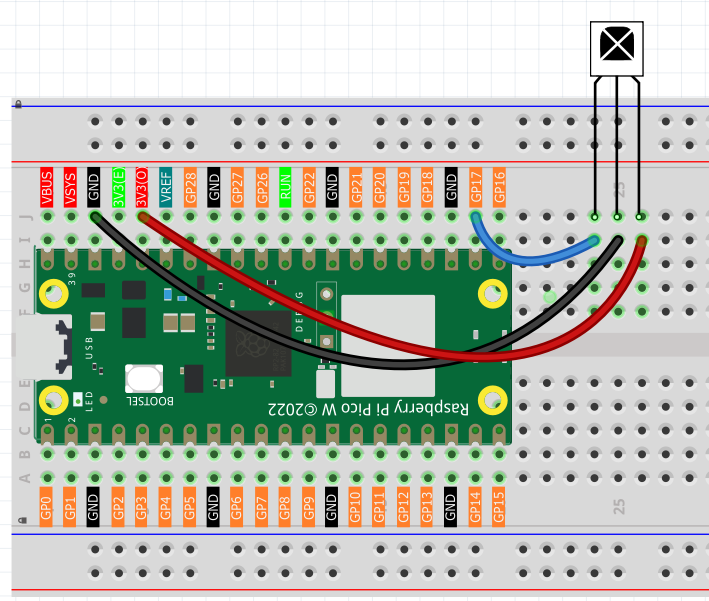
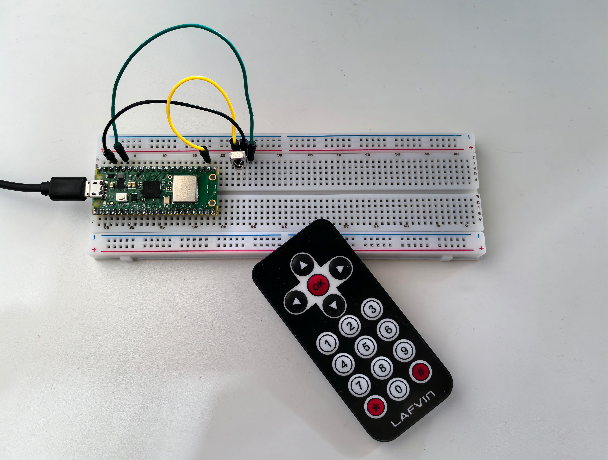

5.4 IR Remote Control
=========================
Add **wireless remote control** to your projects! IR (Infrared) remote control is the same technology used in TV remotes, air conditioners, and countless household devices. Now you can make your own projects respond to button presses from across the room!

**How it works:** 
- **Remote control**: Contains an IR LED that blinks invisible light patterns
- **IR receiver**: Detects these light patterns and decodes them into button presses
- **Your code**: Responds to specific buttons (numbers, arrows, OK button, etc.)

**Project possibilities:** Remote-controlled robots, wireless light switches, presentation clickers, or smart home devices that respond to any IR remote!

Component List
^^^^^^^^^^^^^^^
- Raspberry Pi Pico W x1
- MicroUSB cable x1
- 830 Tie-Points Breadboard x1
- Infrared Receiver x1
- Jumper Wire Several

Component knowledge
^^^^^^^^^^^^^^^^^^^^

:ref:`Infrared Receiver <cpn_infrared_receiver>`
"""""""""""""""""""""""""""""""""""""""""""""""""""

Connect
^^^^^^^^^

Code
^^^^^^^
.. note::

    * Open the ``5.4_ir_remote_control.py`` file under the path of ``Ultimate-Starter-Kit-for-Pico-W\Python\1.Project`` or copy this code into Thonny, then click "Run Current Script" or simply press F5 to run it.

    * Don't forget to click on the "MicroPython (Raspberry Pi Pico)" interpreter in the bottom right corner. 

.. 5.4.png

The new remote control has a plastic piece at the end to isolate the battery inside. You need to pull out this plastic piece to power up the remote when you are using it. Once the program is running, when you press the remote control, the Shell will print out the key you pressed.

The following is the program code:

.. code-block:: python

    """
    IR Remote Control Receiver (NEC protocol, MicroPython)

    Refactor goals:
    - English comments and organized output
    - Replace magic numbers with named constants
    - Clean, professional data formatting
    """

    import time
    from machine import Pin
    from ir_rx.print_error import print_error
    from ir_rx.nec import NEC_8

    # =========================
    # Constants
    # =========================
    IR_RECEIVER_PIN = 17

    # NEC_8 sends repeat codes as negative "data" in callback
    REPEAT_NOTICE = "(repeat)"  # informational note if needed

    # Key map (8-bit command codes for typical NEC remote)
    KEY_MAP = {
        0x52: "0",
        0x16: "1",
        0x19: "2",
        0x0D: "3",
        0x0C: "4",
        0x18: "5",
        0x5E: "6",
        0x08: "7",
        0x1C: "8",
        0x5A: "9",
        0x42: "*",
        0x4A: "#",
        0x46: "UP",
        0x15: "DOWN",
        0x40: "OK",
        0x44: "LEFT",
        0x43: "RIGHT",
    }

    def decode_ir_key(data: int) -> str:
        """Return key name or 'UNKNOWN' and print raw code for debugging when unknown."""
        name = KEY_MAP.get(data)
        if name is None:
            print("Unknown IR Code: 0x%X" % data)
            return "UNKNOWN"
        return name

    def display_key_press(name: str, data: int) -> None:
        """Print formatted key info (Arduino-like)."""
        print("Key: %s | Code: 0x%X" % (name, data))

    def on_ir(data: int, addr: int, ctrl: int) -> None:
        """NEC_8 callback: handle key decode, ignore repeats (negative data)."""
        if data < 0:
            # Repeat code: key held down. Ignore to match Arduino behavior.
            return

        name = decode_ir_key(data)
        if name != "UNKNOWN":
            display_key_press(name, data)

    def main() -> None:
        pin_ir = Pin(IR_RECEIVER_PIN, Pin.IN)
        ir = NEC_8(pin_ir, on_ir)
        ir.error_function(print_error)

        print("IR Remote Control Receiver Started")
        print("Press any key on the remote control...")
        print("================================")

        try:
            while True:
                time.sleep(0.1)  # avoid busy-waiting
        except KeyboardInterrupt:
            ir.close()

    if __name__ == "__main__":
        main()

Phenomenon
^^^^^^^^^^^
