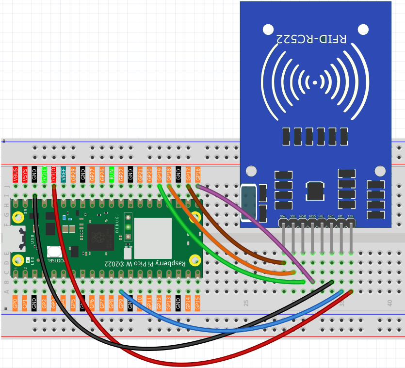

5.5 MFRC522 RFID Module
=========================
Enter the world of **RFID technology** - contactless smart cards! RFID (Radio Frequency Identification) lets you store and read data by simply bringing a card or tag near a sensor. No contact needed!

**How RFID works:**
- **RFID tags/cards**: Contain a tiny chip and antenna (like credit cards, hotel keycards, or transit cards)
- **RFID reader**: Sends radio waves that power the tag and read/write data
- **Your projects**: Can store custom messages, unlock doors, track inventory, or create interactive experiences

**Magic moment:** Just tap a card near the sensor and instantly read/write data! It's the same technology in contactless payments, building access cards, and smart transportation systems.

Component List
^^^^^^^^^^^^^^^
- Raspberry Pi Pico W x1
- MicroUSB cable x1
- 830 Tie-Points Breadboard x1
- MFRC522 Module x1
- Jumper Wire Several

Component knowledge
^^^^^^^^^^^^^^^^^^^^
:ref:`MFRC522 Module <cpn_mfrc522_module>`
"""""""""""""""""""""""""""""""""""""""""""

Connect
^^^^^^^^^

Code
^^^^^^^
.. note::

    * Open the ``5.5_rfid_write.py and 5.5_rfid_read.py`` file under the path of ``Ultimate-Starter-Kit-for-Pico-W\Python\1.Project`` or copy this code into Thonny, then click "Run Current Script" or simply press F5 to run it.

    * Don't forget to click on the "MicroPython (Raspberry Pi Pico)" interpreter in the bottom right corner. 
    
    * Please ensure that the libraries in the mfrc522 folder have been uploaded to the Pico W. You can refer to the details in the "Uploading Library Files" section of the Python Preparation guide for more information.

This project has **two powerful programs**:

.. 5.5-1.png

**RFID Writer Program:** Type any message (ending with #) and tap a card to store it!

After running the writer, type your message in the serial monitor (like "Hello World#") then bring your RFID card close to the sensor. The message gets permanently written to the card's memory.

.. code-block:: python

    #!/usr/bin/env python3
    # -*- coding: utf8 -*-

    # RFID Card Writer
    # This script writes data to an RFID card using the MFRC522 module.
    # Features input validation and user-friendly interface.

    from mfrc522 import SimpleMFRC522

    # --- Configuration Constants ---
    # SPI pin configuration for Raspberry Pi Pico W
    SPI_ID = 0
    SCK_PIN = 18
    MISO_PIN = 16
    MOSI_PIN = 19
    CS_PIN = 17
    RST_PIN = 9

    # Data constraints
    MAX_DATA_LENGTH = 16  # Maximum characters that can be stored

    def get_user_input():
        """
        Get and validate user input for the data to write.
        
        Returns:
            str: The validated data to write to the card
        """
        while True:
            user_data = input(f"💬 Enter message to write (max {MAX_DATA_LENGTH} chars): ").strip()
            
            if not user_data:
                print("❌ Empty input. Please enter some text.")
                continue
            
            if len(user_data) > MAX_DATA_LENGTH:
                print(f"⚠️  Input too long. Truncating to {MAX_DATA_LENGTH} characters.")
                user_data = user_data[:MAX_DATA_LENGTH]
            
            return user_data

    def display_write_preview(data):
        """
        Display a preview of the data to be written.
        
        Args:
            data (str): The data that will be written
        """
        print("\n📦 Write Preview:")
        print("+" + "-" * 48 + "+")
        padding = ' ' * (40 - len(data))
        print(f"| Data: '{data}'{padding} |")
        print(f"| Length: {len(data)} characters{' ' * (32 - len(str(len(data))))} |")
        print("+" + "-" * 48 + "+")

    def main():
        """
        Main function to handle the card writing process.
        """
        # Initialize the MFRC522 reader with pin configuration
        reader = SimpleMFRC522(spi_id=SPI_ID, sck=SCK_PIN, miso=MISO_PIN, 
                              mosi=MOSI_PIN, cs=CS_PIN, rst=RST_PIN)
        
        # Display program header
        print("=" * 50)
        print("    ✍️  RFID CARD WRITER ✍️")
        print("=" * 50)
        print("This program writes data to RFID cards.")
        print("Press Ctrl+C at any time to exit.")
        print("=" * 50)
        
        try:
            # Get user input
            data_to_write = get_user_input()
            
            # Display preview
            display_write_preview(data_to_write)
            
            # Confirm operation
            confirm = input("\n🤔 Proceed with writing? (y/N): ").lower().strip()
            if confirm not in ['y', 'yes']:
                print("❌ Write operation cancelled.")
                return
            
            # Wait for card and write data
            print("\n📡 Waiting for card...")
            print("📝 Please place an RFID card near the sensor.")
            
            # Write data to card
            card_id, written_text = reader.write(data_to_write)
            
            # Display success results
            print("\n✅ CARD DETECTED & WRITTEN!")
            print("+" + "-" * 48 + "+")
            print(f"| 🆔 Card ID:     {card_id:<31} |")
            
            # Display written content
            padding = ' ' * (29 - len(written_text))
            print(f"| 📄 Written:     '{written_text}'{padding} |")
            print("+" + "-" * 48 + "+")
            print("✅ Write operation completed successfully!")
            
        except KeyboardInterrupt:
            print("\n\n⏹️  Operation interrupted by user.")
        except Exception as e:
            print(f"\n❌ Error during write operation: {e}")
            print("💡 Tip: Make sure the card is properly positioned.")
        finally:
            print("\n👋 Program terminated. Goodbye!")

    if __name__ == '__main__':
        main()

.. 5.5-2.png

**RFID Reader Program:** Tap any programmed card to instantly read its stored message!

After running the reader, simply bring your programmed RFID card near the sensor. The stored message appears instantly on screen with card details. It's like having a digital library where each card holds a different piece of information!

.. code-block:: python

    #!/usr/bin/env python3
    # -*- coding: utf8 -*-

    # RFID Card Reader
    # This script reads data from an RFID card using the MFRC522 module.
    # Features a user-friendly interface inspired by professional implementations.

    from mfrc522 import SimpleMFRC522

    # --- Configuration Constants ---
    # SPI pin configuration for Raspberry Pi Pico W
    SPI_ID = 0
    SCK_PIN = 18
    MISO_PIN = 16
    MOSI_PIN = 19
    CS_PIN = 17
    RST_PIN = 9

    def main():
        """
        Main function to handle the card reading process.
        """
        # Initialize the MFRC522 reader with pin configuration
        reader = SimpleMFRC522(spi_id=SPI_ID, sck=SCK_PIN, miso=MISO_PIN, 
                              mosi=MOSI_PIN, cs=CS_PIN, rst=RST_PIN)
        
        # Display program header
        print("=" * 50)
        print("    📖 RFID CARD READER 📖")
        print("=" * 50)
        print("This program reads data from RFID cards.")
        print("=" * 50)
        
        try:
            # Wait for card and read data
            print("\n🔍 Reading mode active...")
            print("📡 Please place an RFID card near the sensor.")
            
            # Read card data
            card_id, text_data = reader.read()
            
            # Display results in a formatted table
            print("\n✅ CARD DETECTED!")
            print("+" + "-" * 48 + "+")
            print(f"| 🆔 Card ID:    {card_id:<32} |")
            
            # Process and display the text data
            if text_data and text_data.strip():
                clean_text = text_data.strip()
                padding = ' ' * (30 - len(clean_text))
                print(f"| 📄 Content:   '{clean_text}'{padding} |")
            else:
                print(f"| 📄 Content:   Empty or uninitialized{' ' * 12} |")
            
            print("+" + "-" * 48 + "+")
            print("✅ Read operation completed successfully!")
            
        except KeyboardInterrupt:
            print("\n\n⏹️  Operation interrupted by user.")
        except Exception as e:
            print(f"\n❌ Error during read operation: {e}")
        finally:
            print("\n👋 Program terminated. Goodbye!")

    if __name__ == '__main__':
        main()

Phenomenon
^^^^^^^^^^^
.. image:: img/5.phenomenon/5.5.png
    :width: 100%