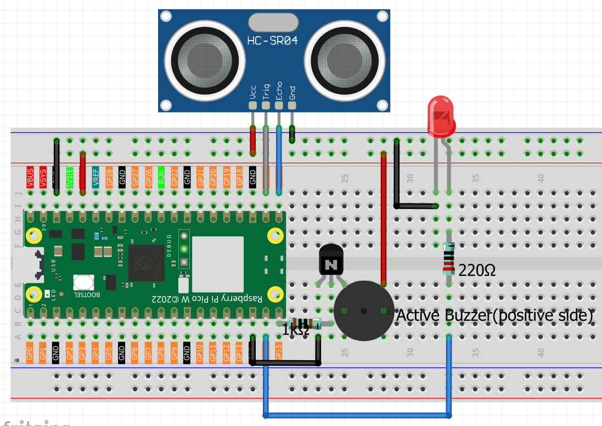

6.10 Reversing Alarm
=========================
Create your own **professional parking radar system** just like the ones in modern cars! This project combines distance sensing with smart audio-visual alerts to help you park safely and avoid obstacles.

**🚗 Real-World Application:**
Ever wondered how cars know exactly how close they are to obstacles when parking? This is the same technology! Your system will beep faster and flash brighter as objects get closer - just like a real car's parking sensors.

**🎯 What You'll Build:**
- **Professional parking radar** with authentic car-like behavior
- **Three alert zones**: Safe, Warning, and Danger with different patterns
- **Dual feedback system**: Visual LED alerts + Audio buzzer warnings
- **Real-time distance display**: See exact measurements in centimeters
- **Smart sensor technology**: Uses ultrasonic waves just like real parking systems

**✨ Key Features:**
- **🟢 Safe Zone (>50cm)**: Quiet operation, LED off - you're good to go!
- **🟡 Warning Zone (20-50cm)**: Slower beeps with LED flashes - getting close!
- **🔴 Danger Zone (<20cm)**: Rapid beeping and flashing - STOP immediately!
- **📏 Precision sensing**: Accurate distance readings updated in real-time
- **🛡️ Safety first**: Clear visual and audio cues prevent accidents

**🏗️ Perfect For:**
- Adding to RC cars for realistic parking assistance
- Learning about automotive sensor technology
- Creating interactive distance-sensing projects
- Understanding how professional parking systems work

Component List
^^^^^^^^^^^^^^^
- Raspberry Pi Pico W x1
- MicroUSB cable x1
- 830 Tie-Points Breadboard x1
- Resistor 1KΩ x1,220Ω x1
- Transistor S8050 x1
- Active Buzzer x1
- LED x1
- Ultrasonic Module x1
- Jumper Wire Several

Connect
^^^^^^^^^

Code
^^^^^^^
.. note::

    * Open the ``6.10_reversing_alarm.py`` file under the path of ``Ultimate-Starter-Kit-for-Pico-W\Python\1.Project`` or copy this code into Thonny, then click "Run Current Script" or simply press F5 to run it.

    * Don't forget to click on the "MicroPython (Raspberry Pi Pico)" interpreter in the bottom right corner. 

.. 6.10.png

After running the code, experience your **automotive-grade parking assistant** in action!

**🎮 How Your Parking System Works:**

**📡 Continuous Monitoring:**
The ultrasonic sensor constantly sends out sound waves and measures how long they take to bounce back, calculating precise distances in real-time. You'll see exact measurements displayed in the terminal!

**🚨 Smart Alert System:**
- **🟢 SAFE (>50cm)**: "✅ SAFE. Distance: 67.3 cm" - LED off, no beeping
- **🟡 WARNING (20-50cm)**: "⚠️ WARNING! Distance: 35.2 cm" - Slow beeps (0.1s on, 0.3s off)  
- **🔴 DANGER (<20cm)**: "🚨 DANGER! Distance: 15.8 cm" - Rapid beeps (0.07s intervals)

**⚡ Advanced Engineering:**
Unlike simpler distance projects, this system uses sophisticated timing to ensure the LED and buzzer patterns are never interrupted by sensor readings. This creates the smooth, professional behavior you expect from real car parking systems.

**🧪 Test Your Parking Skills:**
1. **Start far away** (>50cm) - Notice the calm "SAFE" readings
2. **Move closer slowly** - Watch the transition to WARNING mode at 50cm
3. **Approach the danger zone** - Feel the urgency as alerts intensify at 20cm
4. **Test different objects** - See how the system responds to walls, boxes, or your hand

**🔧 Real-World Applications:**
This exact technology is used in millions of cars worldwide. You're learning the fundamentals of automotive sensor systems!

The following is the program code:

.. code-block:: python

    # 6.10_reversing_alarm.py
    # A professional, feature-rich reversing alarm system for MicroPython,
    # inspired by a well-structured Raspberry Pi example.
    #
    # This system measures distance using an HC-SR04 ultrasonic sensor and provides
    # distinct visual and audio alerts based on proximity zones.

    import machine
    import time
    import sys

    # --- Configuration ---
    # Hardware Pins
    TRIG_PIN = 17       # Ultrasonic sensor Trigger pin
    ECHO_PIN = 16       # Ultrasonic sensor Echo pin
    BUZZER_PIN = 15     # Buzzer pin
    LED_PIN = 14        # LED pin

    # Proximity Zones (in cm)
    DANGER_ZONE_CM = 20   # Less than this is DANGER
    WARNING_ZONE_CM = 50  # Less than this is WARNING
    # Anything above WARNING_ZONE_CM is considered SAFE.

    class ReversingAlarmSystem:
        """
        Manages all functionality for the reversing alarm system.
        """
        def __init__(self):
            """Initializes all hardware components."""
            print("🔧 Initializing Reversing Alarm System...")
            
            self.trig = machine.Pin(TRIG_PIN, machine.Pin.OUT)
            self.echo = machine.Pin(ECHO_PIN, machine.Pin.IN)
            self.buzzer = machine.Pin(BUZZER_PIN, machine.Pin.OUT)
            self.led = machine.Pin(LED_PIN, machine.Pin.OUT)
            
            self.cleanup() # Ensure all outputs are off initially
            print("✅ System Ready. Press Ctrl+C to exit.")

        def measure_distance(self):
            """
            Measures distance using the HC-SR04 sensor.
            Returns the distance in centimeters, or -1 on timeout.
            """
            # Send a 10µs trigger pulse
            self.trig.low()
            time.sleep_us(2)
            self.trig.high()
            time.sleep_us(10)
            self.trig.low()

            # Wait for the echo pulse to start, with a timeout
            # This prevents the program from getting stuck if the sensor is disconnected.
            timeout_us = 30000 # 30ms, corresponds to ~5 meters, well beyond our needs.
            start_time = time.ticks_us()
            while not self.echo.value():
                if time.ticks_diff(time.ticks_us(), start_time) > timeout_us:
                    return -1 # Timeout error

            pulse_start = time.ticks_us()

            # Wait for the echo pulse to end, with a timeout
            while self.echo.value():
                if time.ticks_diff(time.ticks_us(), pulse_start) > timeout_us:
                    return -1 # Timeout error

            pulse_end = time.ticks_us()

            # Calculate distance: (pulse_duration * speed_of_sound) / 2
            # Speed of sound is ~343 m/s or 34,300 cm/s or 0.0343 cm/µs
            pulse_duration = time.ticks_diff(pulse_end, pulse_start)
            distance_cm = (pulse_duration * 0.0343) / 2
            
            return distance_cm

        def play_alert(self, distance):
            """
            Plays a specific alert pattern on the LED and buzzer based on the distance.
            """
            if distance < 0:
                print("Sensor timeout. Check wiring.")
                time.sleep(0.5)
                return

            if distance <= DANGER_ZONE_CM:
                # DANGER ZONE: Fast, continuous beeps
                print(f"🚨 DANGER!  Distance: {distance:.1f} cm")
                self.led.high()
                self.buzzer.high()
                time.sleep(0.07)
                self.led.low()
                self.buzzer.low()
                time.sleep(0.07)
            
            elif distance <= WARNING_ZONE_CM:
                # WARNING ZONE: Slower, intermittent beeps
                print(f"⚠️ WARNING! Distance: {distance:.1f} cm")
                self.led.high()
                self.buzzer.high()
                time.sleep(0.1)
                self.led.low()
                self.buzzer.low()
                time.sleep(0.3) # Longer pause
                
            else:
                # SAFE ZONE: No sound, solid LED for feedback
                print(f"✅ SAFE.    Distance: {distance:.1f} cm")
                self.led.low() # Or you could turn it on to show it's "active"
                self.buzzer.low()
                time.sleep(0.5) # Longer delay in the safe zone

        def cleanup(self):
            """Turns off all hardware outputs to ensure a safe state."""
            self.buzzer.low()
            self.led.low()

        def run(self):
            """The main interactive loop for the alarm system."""
            print("\n" + "="*40)
            print("🎯 Smart Reversing Alarm System is Active")
            print(f"   - 🚨 Danger:  < {DANGER_ZONE_CM} cm")
            print(f"   - ⚠️ Warning: < {WARNING_ZONE_CM} cm")
            print("="*40 + "\n")

            while True:
                distance = self.measure_distance()
                self.play_alert(distance)
                
    def main():
        """Main function to start the application."""
        alarm_system = ReversingAlarmSystem()
        
        try:
            alarm_system.run()
        except KeyboardInterrupt:
            print("\n🛑 Program interrupted by user.")
        finally:
            alarm_system.cleanup()
            print("🧹 System shut down. All outputs are off.")

    if __name__ == '__main__':
        main()

Phenomenon
^^^^^^^^^^^
.. video:: img/5.phenomenon/6.10.mp4
    :width: 100%