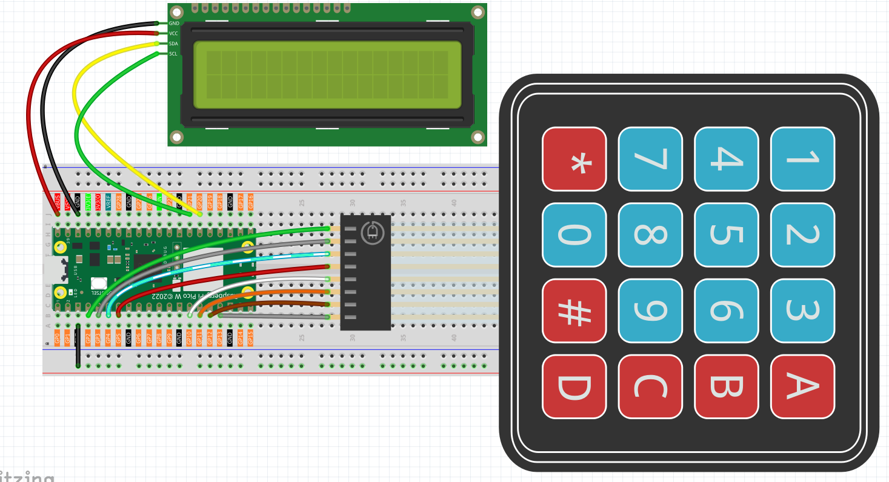
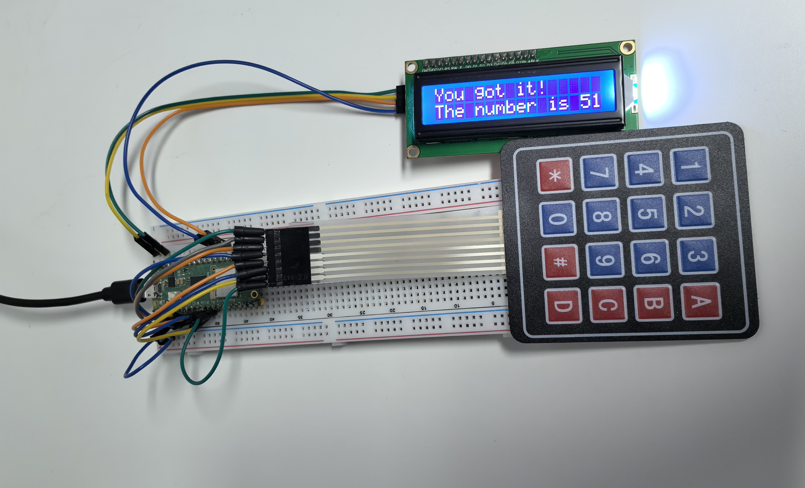

6.11 Game - Guess Number
=========================
Create the ultimate **interactive guessing game** with professional LCD display and physical keypad input! This isn't just any number game - it's a fully interactive experience that brings digital gaming into the physical world.

**🎯 Game Concept:**
The system secretly picks a number between 0-99. Your job? Find it using the fewest guesses possible! But here's the twist - with each guess, the system gives you clues and narrows down the range, making it a strategic puzzle rather than pure luck.

**🎮 How The Game Works:**
Imagine the secret number is **42** (but you can't see this):
1. **You guess 60** → System says "60 is too high" → New range: 0-60
2. **You guess 30** → System says "30 is too low" → New range: 30-60  
3. **You guess 45** → System says "45 is too high" → New range: 30-45
4. **You guess 42** → System says "You got it!" → Victory! 🎉

**✨ Professional Gaming Features:**
- **Real LCD display** shows all game information clearly
- **Physical keypad input** for authentic arcade-style interaction
- **Smart range tracking** helps you strategize your next move
- **Instant feedback** tells you if you're too high or too low
- **Automatic reset** for endless rounds of fun
- **Professional debouncing** ensures every keypress is registered perfectly

**🏆 Why This is Special:**
- Learn **binary search strategy** - the most efficient guessing method
- Experience **physical computing** - real buttons and real display
- Understand **game state management** and user interface design
- Create a **party game** that everyone can enjoy together!

Component List
^^^^^^^^^^^^^^^
- Raspberry Pi Pico W x1
- MicroUSB cable x1
- 830 Tie-Points Breadboard x1
- Resistor 10KΩ x4
- 4x4 Keypad x1
- I2C LCD1602 x1
- Jumper Wire Several


**🎛️ The Gaming Interface:**

**🔤 4x4 Keypad Layout:**
```
[1] [2] [3] [A] ← Start New Game  
[4] [5] [6] [B]
[7] [8] [9] [C]  
[*] [0] [#] [D] ← Confirm Guess
```

**📺 LCD Display Magic:**
The LCD shows everything you need:
- **Line 1**: Current game status and your input
- **Line 2**: The current guessing range or results
- **Real-time updates** as you type and play

**⚡ Smart Input System:**
This isn't just a simple keypad connection - it uses advanced techniques:
- **Internal pull-down resistors** eliminate the need for external resistors
- **Professional debouncing** prevents double-clicks and missed inputs  
- **State management** tracks exactly what you're doing at each moment

Connect
^^^^^^^^^


**🔧 Simplified Wiring:**
Thanks to the internal pull-down resistors in the improved code, the wiring is much cleaner than traditional keypad circuits. No external resistors needed - just direct connections!

Code
^^^^^^^
.. note::

    * Open the ``6.11_game_guess_number.py`` file under the path of ``Ultimate-Starter-Kit-for-Pico-W\Python\1.Project`` or copy this code into Thonny, then click "Run Current Script" or simply press F5 to run it.

    * Don't forget to click on the "MicroPython (Raspberry Pi Pico)" interpreter in the bottom right corner. 

.. 6.11.png

After running the code, get ready for an **exciting interactive gaming experience**!

**🚀 Getting Started:**
1. **Welcome screen appears**: "Guess The Number" / "Press 'A' to start"
2. **Press 'A'** to begin your first game
3. **Secret number generated**: The system picks a random number (0-99) but keeps it hidden
4. **Start guessing**: LCD shows "Guess the number!" / "0 < ? < 99"

**🎮 How to Play:**
1. **Enter your guess**: Use number keys (0-9) - your input appears on screen
2. **Confirm with 'D'**: Press D to submit your guess  
3. **Get instant feedback**:

   - **"42 is too high"** → Range updates to show new limits
   - **"35 is too low"** → Range narrows to guide your next guess
   - **"You got it!"** → Victory! The secret number is revealed

4. **Game resets automatically** → Ready for another round!

**🎯 Pro Gaming Tips:**
- **Use binary search**: Always guess the middle of the current range
- **Watch the range**: LCD line 2 shows "25 < ? < 75" to guide you  
- **Clear mistakes**: Press '#' to clear your current input
- **Start over**: Press 'A' anytime to begin a fresh game

**🧠 Strategic Gameplay:**
- **Best strategy**: Start with 50, then use the middle of each new range
- **Maximum guesses needed**: Only 7 guesses if you play optimally!
- **Learning opportunity**: Understand how efficient searching algorithms work

**🎪 Party Mode:**
Take turns with friends and see who can guess the number in the fewest tries. The LCD makes it perfect for group play - everyone can see the action!

The following is the program code:

.. code-block:: python

    # 6.11_game_guess_number_pro.py
    # A professionally refactored version of the Number Guessing Game.
    #
    # Key Improvements:
    # - Uses internal pull-down resistors for the keypad, removing the need for external ones.
    # - Implements proper debouncing and state management for reliable key presses.
    # - Features a more robust and responsive game loop.
    # - Provides a clearer and more interactive user experience on the LCD.

    from lcd1602 import LCD
    from machine import I2C, Pin
    import time
    import urandom

    # --- Hardware & Game Configuration ---
    # LCD Display (I2C bus 0)
    LCD_SDA_PIN = 20
    LCD_SCL_PIN = 21

    # 4x4 Keypad Pins
    ROW_PINS = [2, 3, 4, 5]
    COL_PINS = [6, 7, 8, 9]

    # Keypad Layout
    KEYPAD_LAYOUT = [
        ["1", "2", "3", "A"],
        ["4", "5", "6", "B"],
        ["7", "8", "9", "C"],
        ["*", "0", "#", "D"]
    ]

    class GuessTheNumberGame:
        """
        Encapsulates all logic for the number guessing game.
        """
        def __init__(self):
            """Initializes hardware and game state."""
            print("Initializing Guess The Number Game...")
            # Hardware
            self.i2c = I2C(0, sda=Pin(LCD_SDA_PIN), scl=Pin(LCD_SCL_PIN), freq=400000)
            self.lcd = LCD(self.i2c)
            self.row_pins = [Pin(p, Pin.OUT) for p in ROW_PINS]
            # **CRITICAL FIX**: Initialize column pins with internal pull-down resistors.
            self.col_pins = [Pin(p, Pin.IN, Pin.PULL_DOWN) for p in COL_PINS]
            
            # Game State
            self.target_number = 0
            self.upper_bound = 99
            self.lower_bound = 0
            self.current_guess_str = ""
            
            # Keypad State Management
            self.last_key_pressed = None
            self.last_key_time = 0
            self.debounce_delay_ms = 200 # Debounce delay to prevent multiple presses

        def reset_game(self):
            """Resets the game to a new round."""
            self.target_number = urandom.randint(0, 99)
            self.upper_bound = 99
            self.lower_bound = 0
            self.current_guess_str = ""
            print(f"New game started. Secret number is: {self.target_number}") # For debugging
            self.update_lcd_display("Guess the number!", f"{self.lower_bound} < ? < {self.upper_bound}")

        def scan_keypad(self):
            """
            Scans the keypad for a single key press.
            Returns the character of the pressed key or None.
            """
            for r, row_pin in enumerate(self.row_pins):
                row_pin.high()
                for c, col_pin in enumerate(self.col_pins):
                    if col_pin.value() == 1:
                        row_pin.low() # Reset the row pin
                        return KEYPAD_LAYOUT[r][c]
                row_pin.low()
            return None

        def get_key_press(self):
            """
            Gets a single, debounced key press from the keypad.
            Returns the key character or None if no new key is pressed.
            """
            key = self.scan_keypad()
            current_time = time.ticks_ms()
            
            if key is not None:
                # Check if this key is different from the last one OR if enough time has passed
                if key != self.last_key_pressed or time.ticks_diff(current_time, self.last_key_time) > self.debounce_delay_ms:
                    self.last_key_pressed = key
                    self.last_key_time = current_time
                    return key
            else:
                # If no key is pressed, reset the last key state
                self.last_key_pressed = None
                
            return None

        def process_guess(self):
            """Processes the player's guess and updates the game state."""
            if not self.current_guess_str:
                return # Do nothing if guess is empty

            guess = int(self.current_guess_str)
            
            if guess == self.target_number:
                self.update_lcd_display("You got it!", f"The number is   {self.target_number}")
                time.sleep(3) # Show success message
                self.reset_game()
            elif guess < self.target_number:
                self.lower_bound = max(self.lower_bound, guess)
                self.update_lcd_display(f"{guess} is too low", f"{self.lower_bound} < ? < {self.upper_bound}")
                self.current_guess_str = "" # Clear guess for next try
            else: # guess > self.target_number
                self.upper_bound = min(self.upper_bound, guess)
                self.update_lcd_display(f"{guess} is too high", f"{self.lower_bound} < ? < {self.upper_bound}")
                self.current_guess_str = "" # Clear guess for next try

        def update_lcd_display(self, line1, line2=""):
            """Clears and updates the LCD with two lines of text."""
            self.lcd.clear()
            self.lcd.message(f"{line1}\n{line2}")

        def handle_input(self, key):
            """Handles user input from the keypad."""
            if key.isdigit():
                # Append number to the guess string, with a limit of 2 digits
                if len(self.current_guess_str) < 2:
                    self.current_guess_str += key
                    self.update_lcd_display("Your guess:", self.current_guess_str)
            
            elif key == 'D': # 'D' is the confirm/enter key
                self.process_guess()
                
            elif key == 'A': # 'A' is the new game key
                self.reset_game()
            
            elif key == '#': # '#' can be used as a backspace/clear key
                self.current_guess_str = ""
                self.update_lcd_display("Guess cleared", "Enter new number")

        def run(self):
            """The main game loop."""
            self.update_lcd_display("Guess The Number", "Press 'A' to start")
            
            # Wait for 'A' to start the first game
            while self.get_key_press() != 'A':
                time.sleep_ms(50)
                
            self.reset_game()

            while True:
                key = self.get_key_press()
                if key:
                    print(f"Key Pressed: {key}") # For debugging
                    self.handle_input(key)
                
                # A small delay to keep the loop from running too fast
                time.sleep_ms(20)

    def main():
        """Main entry point of the program."""
        try:
            game = GuessTheNumberGame()
            game.run()
        except Exception as e:
            print(f"\nAn unexpected error occurred: {e}")
            # Attempt to clear LCD on error
            try:
                lcd = LCD(I2C(0, sda=Pin(20), scl=Pin(21)))
                lcd.clear()
                lcd.message("System Error.\nPlease Reboot.")
            except:
                pass # Ignore if LCD also fails
        finally:
            print("Shutting down.")

    if __name__ == "__main__":
        main()


Phenomenon
^^^^^^^^^^^
