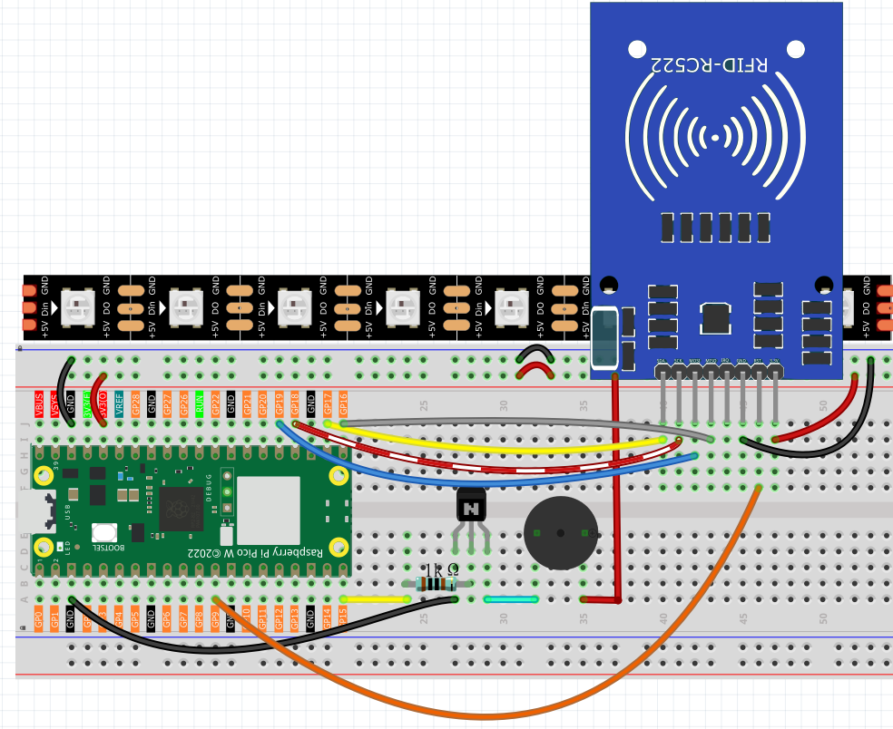

6.12 RFID Music Jukebox
=========================
Build your own **magical music player** where each RFID card becomes a musical album! Simply tap a card, and watch as your system transforms stored musical notes into beautiful melodies with synchronized LED light shows.

**🎵 What You'll Create:**
A professional-grade **contactless music player** that reads musical scores from RFID cards and plays them with stunning visual effects. It's like having a futuristic jukebox where each card contains a different song!

**✨ The Magic Experience:**
1. **Write music to cards**: Store musical notation (like "EEFGGFEDCCDEEDD") on RFID cards using project 5.5
2. **Tap to play**: Simply bring a card near the reader - no buttons needed!
3. **Instant playback**: Your melody plays automatically with buzzer tones
4. **Light show**: WS2812 LED strip creates a **VU meter effect** that dances with the music
5. **Share music**: Give cards to friends with your favorite melodies stored on them

**🎼 Musical Features:**
- **8-note scale**: Supports C, D, E, F, G, A, B, and high C notes
- **Custom melodies**: Write your own songs or find sheet music online
- **Visual feedback**: LED strip lights up like a professional audio equalizer
- **Seamless playback**: Smooth note transitions with perfect timing
- **Error handling**: Gracefully handles invalid notes or empty cards

**🌈 LED Light Show:**
Each note triggers a corresponding LED pattern - low notes light up fewer LEDs (green), high notes light up more LEDs (red). It's like watching your music come alive in color!

**💡 Perfect For:**
- Creating a personal music library on RFID cards
- Learning about musical notation and frequencies  
- Understanding contactless technology and audio synthesis
- Impressing friends with a futuristic music player
- Building the foundation for more complex RFID applications

Component List
^^^^^^^^^^^^^^^
- Raspberry Pi Pico W x1
- MicroUSB cable x1
- 830 Tie-Points Breadboard x1
- Resistor 1kΩ x1
- Transistor S8050 x1
- Passive Buzzer x1
- MFRC522 Module x1
- WS2812 RGB LED Strip x1 (8 LEDs)
- Jumper Wire Several

**🔧 How the System Works:**

**📡 RFID Magic:**
The MFRC522 module reads data from cards using radio waves - no physical contact needed! Each card can store up to 48 characters of musical notation that becomes your personal song library.

**🎵 Audio Engine:**
The passive buzzer uses PWM (Pulse Width Modulation) to generate precise musical frequencies. Each letter (C, D, E, F, G, A, B, N) corresponds to a specific musical note frequency.

**🌈 Visual Synthesizer:**
The WS2812 LED strip acts like a professional VU meter - each note lights up LEDs based on its pitch:
- **Low notes (C, D)**: Light up 1-2 LEDs in green  
- **Mid notes (E, F, G)**: Light up 3-5 LEDs in yellow
- **High notes (A, B, N)**: Light up 6-8 LEDs in red
- **Invalid notes**: Flash all LEDs red as an error indicator

Connect
^^^^^^^^^

Code
^^^^^^^
.. note::

    * Open the ``6.12_rfid_jukebox.py`` file under the path of ``Ultimate-Starter-Kit-for-Pico-W\Python\1.Project`` or copy this code into Thonny, then click "Run Current Script" or simply press F5 to run it.

    * Don't forget to click on the "MicroPython (Raspberry Pi Pico)" interpreter in the bottom right corner. 

.. 6.12.png

After running the code, prepare for your **magical music experience**! Here's how to use your RFID jukebox:

**🎪 Getting Started:**
1. **System initializes**: "✅ Jukebox Ready! Please scan a card." appears in terminal
2. **Prepare your music cards**: Use cards programmed with project 5.5 (RFID write/read)

.. 6.12-1.png

3. **Bring card close**: Hold any programmed RFID card near the reader module
4. **Instant magic**: Music starts playing automatically with synchronized light show!

.. 6.12-2.png

**🎵 What You'll Experience:**
- **Card detection**: "💳 Card Scanned! ID: 123456789" shows which card was read
- **Music playback**: Each note plays through the buzzer with perfect timing (250ms per note)
- **Light show**: LED strip creates a beautiful VU meter effect synchronized with each note
- **Visual feedback**: Watch the LEDs light up from green (low notes) to red (high notes)
- **Seamless operation**: After one song finishes, system waits for the next card

**🎼 Example Musical Experience:**
If your card contains "EEFGGFEDCCDEEDD":
- **E notes** → LEDs 1-3 light up in yellow-green
- **F and G notes** → LEDs 1-4 light up in yellow  
- **C and D notes** → LEDs 1-2 light up in green
- **Complete melody** plays with perfect timing and visual accompaniment

**🎯 Pro Tips:**
- **Multiple cards**: Program different cards with different songs for variety
- **Song sharing**: Share programmed cards with friends to exchange music
- **Visual learning**: Watch the LED patterns to understand note relationships
- **Error handling**: Invalid notes flash all LEDs red - system keeps playing

**🎨 Creative Ideas:**
- Create a **musical greeting card** system
- Build a **song library** with labeled cards
- Use for **music education** - visualize note patterns
- Make **interactive exhibits** or art installations

Ready to become a digital DJ? Your contactless music collection awaits! 🎧✨

The following is the program code:

.. code-block:: python

    # 6.12_rfid_jukebox.py
    # A professional, feature-rich RFID Music Player for MicroPython.
    #
    # This system continuously waits for an RFID card and plays a musical score
    # stored on it. It provides interactive visual feedback on a WS2812 LED strip,
    # handles errors gracefully, and is structured for easy maintenance.

    from mfrc522 import SimpleMFRC522
    from ws2812 import WS2812
    import machine
    import time
    import urandom

    # --- Configuration ---
    # Hardware Pins
    WS2812_PIN = 0
    BUZZER_PIN = 15
    RFID_SCK_PIN = 18
    RFID_MISO_PIN = 16
    RFID_MOSI_PIN = 19
    RFID_CS_PIN = 17
    RFID_RST_PIN = 9

    # LED & Sound Config
    NUM_LEDS = 8
    NOTE_DURATION_MS = 250
    # A nice color palette for the VU meter effect (in GRB format for WS2812)
    VU_METER_COLORS = [
        0x00FF00, 0x33FF00, 0x66FF00, 0x99FF00,
        0xFFFF00, 0xFF9900, 0xFF6600, 0xFF0000
    ]

    # Note Frequencies (in Hz)
    NOTES = {
        'C': 262, 'D': 294, 'E': 330, 'F': 349,
        'G': 392, 'A': 440, 'B': 494, 'N': 523 # 'N' for next octave C
    }
    NOTE_SEQUENCE = ['C', 'D', 'E', 'F', 'G', 'A', 'B', 'N']

    class RFIDJukebox:
        """
        Manages all functionality for the RFID Jukebox system.
        """
        def __init__(self):
            """Initializes all hardware components."""
            print("🔧 Initializing RFID Jukebox...")
            
            # WS2812 LED Strip
            self.led_strip = WS2812(machine.Pin(WS2812_PIN), NUM_LEDS)
            
            # MFRC522 RFID Reader
            self.reader = SimpleMFRC522(
                spi_id=0, sck=RFID_SCK_PIN, miso=RFID_MISO_PIN,
                mosi=RFID_MOSI_PIN, cs=RFID_CS_PIN, rst=RFID_RST_PIN
            )
            
            # Buzzer (PWM)
            self.buzzer = machine.PWM(machine.Pin(BUZZER_PIN))
            
            self.cleanup() # Ensure all outputs are off
            print("✅ Jukebox Ready! Please scan a card.")

        def play_note(self, note_char):
            """Plays a single note with corresponding visual feedback."""
            try:
                # Find the note's frequency and its position for the VU meter
                note_index = NOTE_SEQUENCE.index(note_char)
                frequency = NOTES[note_char]

                # --- Visual Feedback (VU Meter) ---
                for i in range(NUM_LEDS):
                    if i <= note_index:
                        self.led_strip[i] = VU_METER_COLORS[i]
                    else:
                        self.led_strip[i] = 0 # Off
                self.led_strip.write()

                # --- Audio Feedback ---
                self.buzzer.freq(frequency)
                self.buzzer.duty_u16(30000) # 50% duty cycle
                time.sleep_ms(NOTE_DURATION_MS)
                self.buzzer.duty_u16(0) # Stop sound
                
            except (ValueError, KeyError):
                print(f"⚠️ Warning: Character '{note_char}' is not a valid note. Skipping.")
                # Flash all LEDs red for an error
                for i in range(NUM_LEDS):
                    self.led_strip[i] = 0xFF0000 # Red
                self.led_strip.write()
                time.sleep_ms(NOTE_DURATION_MS)

        def play_score(self, text):
            """Plays an entire musical score from a text string."""
            if not text:
                print("Card is empty. Nothing to play.")
                return
                
            print(f"🎵 Playing score: \"{text}\"")
            clean_text = text.replace(' ', '').upper()
            
            for note_char in clean_text:
                self.play_note(note_char)
                time.sleep_ms(50) # Short pause between notes
                
            print("✅ Score finished.")

        def cleanup(self):
            """Turns off all hardware outputs for a safe state."""
            self.buzzer.duty_u16(0)
            for i in range(NUM_LEDS):
                self.led_strip[i] = 0
            self.led_strip.write()

        def run(self):
            """The main continuous loop to read cards and play music."""
            while True:
                self.cleanup()
                print("\nWaiting for a card...")
                
                # This read() call will block until a card is present
                card_id, text = self.reader.read()
                
                print("-" * 30)
                print(f"💳 Card Scanned! ID: {card_id}")
                self.play_score(text)

    def main():
        """Main function to start the application."""
        jukebox = RFIDJukebox()
        
        try:
            jukebox.run()
        except KeyboardInterrupt:
            print("\n🛑 Program interrupted by user.")
        finally:
            jukebox.cleanup()
            print("🧹 System shut down cleanly.")

    if __name__ == '__main__':
        main()

Phenomenon
^^^^^^^^^^^
.. video:: img/5.phenomenon/6.12-3.mp4
    :width: 100%