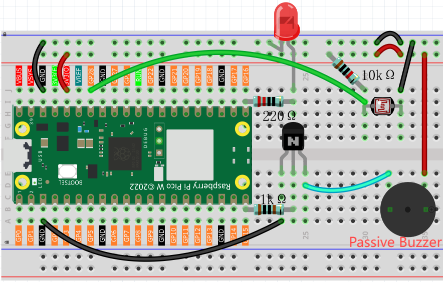

6.1 Musical Light Theremin
=============================
Build your own **magical musical instrument** that plays music by waving your hand in the air! No buttons, no keys - just pure hand gestures creating beautiful melodies.

**What's a Theremin?** It's a mysterious electronic instrument played without touching it. Move your hand closer or farther from the sensor, and it plays different musical notes - like conducting an invisible orchestra!

**Our version:** Instead of using expensive antennas like real theremins, we'll use a simple light sensor. Cover the sensor with your hand for low notes, move away for high notes. It's like having a **light-controlled piano** that responds to shadows and brightness!

**The magic:** This project combines light sensing, sound generation, and musical scales to create an instrument that's both educational and incredibly fun to play.

Component List
^^^^^^^^^^^^^^^
- Raspberry Pi Pico W x1
- MicroUSB cable x1
- 830 Tie-Points Breadboard x1
- LED x1
- Transistor S8050 x1
- Resistor 220Ω, 1kΩ, 10kΩ x1
- Passive Buzzer x1
- Photoresistor x1
- Jumper Wire Several

**How it works - The Science Made Simple:**

🔧 **The Setup:**
- **Light Sensor (GP28)**: Detects how much light hits it - like a digital eye!
- **Buzzer (GP15)**: Makes musical sounds when powered through the transistor
- **Status LED (GP16)**: Shows when the system is calibrating (learning your playing style)
- **Transistor S8050**: Acts like an electronic switch to control the buzzer volume

🎵 **The Magic Formula:**
- **Hand closer** = Less light hits sensor = Lower musical notes
- **Hand farther** = More light hits sensor = Higher musical notes
- **No hand** = Maximum light = Highest pitch

🎯 **Calibration Process:**
When you first run the program, the LED lights up for 5 seconds. During this time, wave your hand over the sensor from very close to very far. This teaches the system your "playing range" so it can map your movements to the full musical scale.

Connect
^^^^^^^^^

Code
^^^^^^^
.. note::

    * Open the ``6.1_musical_light_theremin.py`` file under the path of ``Ultimate-Starter-Kit-for-Pico-W\Python\1.Project`` or copy this code into Thonny, then click "Run Current Script" or simply press F5 to run it.

    * Don't forget to click on the "MicroPython (Raspberry Pi Pico)" interpreter in the bottom right corner. 

.. 6.1.png

After running the code, get ready for your **musical adventure** in 3 easy steps:

**🚀 Step 1: Automatic Calibration (5 seconds)**
- The LED lights up - calibration has started!
- **Wave your hand** over the sensor like you're conducting an orchestra
- Move from **very close** (almost touching) to **very far** (arm's length away)
- This teaches your theremin your personal playing style

**🎵 Step 2: Listen for the Welcome Melody**
- After 5 seconds, the LED turns off
- You'll hear a beautiful startup melody - this means your theremin is ready!
- The system has learned your hand movement range

**🎼 Step 3: Start Playing!**
- **Hover your hand** over the light sensor
- **Move closer** for deeper, bass notes 🎶
- **Move away** for higher, treble notes 🎵
- **Experiment** with different heights and speeds
- Try creating melodies by moving your hand smoothly up and down!

**🎯 Pro Playing Tips:**
- Start with slow, gentle movements to hear the note changes clearly
- The system uses a **pentatonic scale** (like traditional Asian music) - every note sounds good together!
- Try "playing" simple songs like "Twinkle Twinkle Little Star" by moving your hand to different heights

The following is the program code:

.. code-block:: python

    """
    Musical Light Theremin v2.0
    Enhanced with standard musical notes and improved user experience

    Based on the tutorial:
    https://sg.cytron.io/tutorial/build-a-light-theremin-using-maker-pi-pico-and-circuitpython

    Key improvements over original:
    - Uses pentatonic scale for more pleasant sounds
    - Enhanced with proper exception handling
    - Simplified user interface (no buttons required)
    - Added startup melody and status feedback
    - Safe buzzer shutdown when program stops

    Hardware Requirements:
    - Raspberry Pi Pico or compatible board
    - Photoresistor on ADC pin 28
    - Buzzer with PWM support on pin 15
    - Status LED on pin 16
    """

    import machine
    import utime

    # Hardware pin definitions
    LED_PIN = 16                # Status LED pin
    PHOTORESISTOR_PIN = 28      # Light sensor ADC pin
    BUZZER_PIN = 15             # PWM buzzer pin

    # Calibration timing constants
    CALIBRATION_TIME_MS = 5000          # 5 seconds for light range calibration
    INITIAL_LIGHT_LOW = 65535           # Maximum ADC value (16-bit) - starting point
    INITIAL_LIGHT_HIGH = 0              # Minimum ADC value - starting point

    # Audio configuration constants  
    BUZZER_DUTY_CYCLE = 32768           # 50% duty cycle for optimal sound quality
    DEFAULT_NOTE_DURATION_MS = 100      # Default note length in milliseconds
    LOOP_DELAY_MS = 10                  # Main loop delay for responsiveness

    # Musical note frequencies (in Hz) - Based on A4 = 440Hz standard tuning
    NOTE_FREQUENCIES = {
        'C3': 131, 'D3': 147, 'E3': 165, 'F3': 175, 'G3': 196, 'A3': 220, 'B3': 247,
        'C4': 262, 'D4': 294, 'E4': 330, 'F4': 349, 'G4': 392, 'A4': 440, 'B4': 494,
        'C5': 523, 'D5': 587, 'E5': 659, 'F5': 698, 'G5': 784, 'A5': 880, 'B5': 988,
        'C6': 1047, 'D6': 1175, 'E6': 1319, 'F6': 1397, 'G6': 1568, 'A6': 1760
    }

    # Musical scale for theremin - Pentatonic + Major scale for pleasant harmonics
    THEREMIN_NOTES = [
        # Pentatonic scale (naturally harmonious - avoids dissonant half-steps)
        'C3', 'D3', 'E3', 'G3', 'A3',      # Lower octave pentatonic
        'C4', 'D4', 'E4', 'G4', 'A4',      # Middle octave pentatonic 
        'C5', 'D5', 'E5', 'G5', 'A5',      # Higher octave pentatonic
        # Major scale notes for additional variety
        'F3', 'B3', 'F4', 'B4', 'F5', 'B5',
        # Extended high range for full musical expression
        'C6', 'D6', 'E6', 'G6', 'A6'
    ]

    TOTAL_NOTES = len(THEREMIN_NOTES)   # Total number of available musical notes

    # Initialize hardware components
    led = machine.Pin(LED_PIN, machine.Pin.OUT)        # Status indicator LED
    photoresistor = machine.ADC(PHOTORESISTOR_PIN)     # Light level sensor
    buzzer = machine.PWM(machine.Pin(BUZZER_PIN))      # PWM-controlled buzzer

    # System state variables for operation
    light_range_min = INITIAL_LIGHT_LOW     # Minimum light value from calibration
    light_range_max = INITIAL_LIGHT_HIGH    # Maximum light value from calibration
    note_duration_ms = DEFAULT_NOTE_DURATION_MS  # Current note duration setting

    def map_to_note_index(light_value, min_light, max_light):
        """
        Map light sensor value to a discrete note index
        
        Args:
            light_value: Current ADC reading from photoresistor
            min_light: Minimum light value from calibration
            max_light: Maximum light value from calibration
        
        Returns:
            Integer index (0 to TOTAL_NOTES-1) for note selection
        """
        if max_light <= min_light:
            return 0
        
        # Clamp light value to calibrated range to prevent index overflow
        light_value = max(min_light, min(light_value, max_light))
        
        # Normalize to 0-1 range, then map to discrete note indices
        normalized = (light_value - min_light) / (max_light - min_light)
        note_index = int(normalized * (TOTAL_NOTES - 1))
        return max(0, min(note_index, TOTAL_NOTES - 1))

    def play_musical_note(note_name, duration_ms):
        """
        Play a musical note by name for specified duration
        
        Args:
            note_name: String name of note (e.g., 'C4', 'A5')
            duration_ms: How long to play the note in milliseconds
        """
        try:
            if note_name in NOTE_FREQUENCIES:
                frequency = NOTE_FREQUENCIES[note_name]
                buzzer.freq(frequency)
                buzzer.duty_u16(BUZZER_DUTY_CYCLE)
                utime.sleep_ms(duration_ms)
                buzzer.duty_u16(0)  # Turn off buzzer after note
            else:
                # Silent pause for unknown notes
                utime.sleep_ms(duration_ms)
        except:
            # Ensure buzzer stops on any error to prevent continuous noise
            buzzer.duty_u16(0)

    def stop_buzzer():
        """
        Safely stop the buzzer and release PWM resources
        Called when program terminates to ensure clean shutdown
        """
        try:
            buzzer.duty_u16(0)      # Set duty cycle to 0 (silent)
            buzzer.deinit()         # Release PWM hardware resource
        except:
            pass  # Ignore errors during cleanup

    def get_current_note(light_value):
        """
        Get the current musical note based on light sensor reading
        
        Args:
            light_value: Current ADC reading from photoresistor
            
        Returns:
            String name of the musical note to play
        """
        note_index = map_to_note_index(light_value, light_range_min, light_range_max)
        return THEREMIN_NOTES[note_index]

    def read_light_sensor():
        """
        Read current light level from photoresistor
        
        Returns:
            Integer ADC value (0-65535 for 16-bit ADC)
        """
        return photoresistor.read_u16()

    def calibrate_light_sensor():
        """
        Calibrate light sensor by recording min/max light values over calibration period
        User should create varied lighting conditions during this time for optimal range
        
        Updates global variables:
            light_range_min: Minimum light value detected
            light_range_max: Maximum light value detected
        """
        global light_range_min, light_range_max
        
        print("=== Starting Light Sensor Calibration ===")
        print("Wave your hand over the sensor for 5 seconds...")
        print("Create bright and dark conditions for best musical range")
        
        # Reset calibration values to starting extremes
        light_range_min = INITIAL_LIGHT_LOW
        light_range_max = INITIAL_LIGHT_HIGH
        
        # Run calibration for specified time with visual feedback
        start_time = utime.ticks_ms()
        
        while utime.ticks_diff(utime.ticks_ms(), start_time) < CALIBRATION_TIME_MS:
            current_light = read_light_sensor()
            
            # Track minimum and maximum light values encountered
            if current_light > light_range_max:
                light_range_max = current_light
            if current_light < light_range_min:
                light_range_min = current_light
            
            # Provide visual feedback during calibration (LED blinks every 250ms)
            led.value((utime.ticks_ms() // 250) % 2)
            utime.sleep_ms(50)
                
        led.value(0)  # Turn off LED after calibration complete
        
        # Display calibration results
        print(f"Calibration complete!")
        print(f"Light range detected: {light_range_min} - {light_range_max}")
        print(f"Musical notes available: {TOTAL_NOTES} (Pentatonic + Major scale)")
        print("Theremin ready - wave your hand to play beautiful music!")

    def play_startup_melody():
        """
        Play a pleasant pentatonic melody to indicate system initialization complete
        Uses ascending pentatonic scale for harmonious startup sound
        """
        startup_notes = ['C4', 'D4', 'E4', 'G4', 'A4', 'C5']  # Rising pentatonic melody
        for note in startup_notes:
            play_musical_note(note, 180)    # Play each note for 180ms
            utime.sleep_ms(50)              # Brief pause between notes

    # === System Initialization ===
    print("=== Musical Light Theremin v2.0 ===")
    print("Enhanced with standard musical notes!")

    # Perform light sensor calibration to establish musical range
    calibrate_light_sensor()

    # Play welcome melody to confirm system ready
    play_startup_melody()

    print("\n=== Theremin Ready ===")
    print("Simply wave your hand over the sensor to play beautiful music!")
    print("Each light level corresponds to a different musical note")

    # === Main Control Loop ===
    # Track current and previous notes to provide smooth playback
    current_note = None
    last_note = None

    try:
        while True:
            # Read current light level and determine corresponding musical note
            current_light = read_light_sensor()
            current_note = get_current_note(current_light)
            
            # Only play new note if it changed (prevents continuous note restart)
            if current_note != last_note:
                print(f"Playing: {current_note} (Light: {current_light})")
                play_musical_note(current_note, note_duration_ms)
                last_note = current_note
            else:
                # Continue current note with shorter duration for smooth sound
                play_musical_note(current_note, note_duration_ms // 2)
                
            # Brief delay for system responsiveness and note timing
            utime.sleep_ms(LOOP_DELAY_MS)

    except KeyboardInterrupt:
        # Handle Ctrl+C or Stop button gracefully
        print("\nTheremin stopped by user")
    except Exception as e:
        # Handle any unexpected errors
        print(f"\nError occurred: {e}")
    finally:
        # Critical: Always stop buzzer when program ends to prevent continuous noise
        print("Stopping buzzer...")
        stop_buzzer()
        led.value(0)  # Turn off status LED
        print("Theremin safely stopped")

Phenomenon
^^^^^^^^^^^
.. video:: img/5.phenomenon/6.1.mp4
    :width: 100%