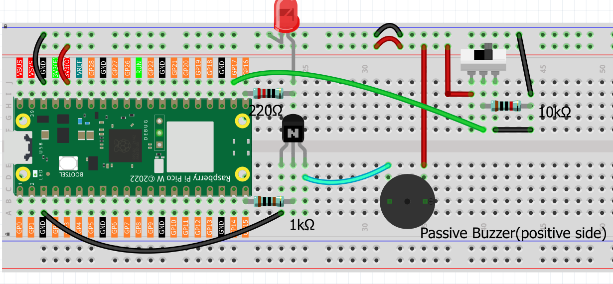

6.3 Interactive Alarm System
==============================
Build your own **professional emergency siren** with flashing lights and authentic alarm sounds! Ever wondered how police cars, ambulances, and fire trucks create those attention-grabbing warning signals? Now you can create your own mini version!

**What makes this special?** This isn't just a simple beeper - it's a sophisticated alarm system with **3 different professional modes**:
- 🌊 **Sweep Mode**: Like a tornado siren with gradually rising pitch
- 💓 **Pulse Mode**: Like a heartbeat monitor with rhythmic beeps  
- ⚡ **Rapid Mode**: Like emergency vehicle flashers with quick bursts

**Real-world applications:** Perfect for security projects, emergency simulations, attention-getting devices, or just impressing friends with realistic sound effects!

**🎯 Project Highlights:**
- 🎵 **3 Professional Sound Modes**: Choose from Sweep, Pulse, or Rapid alarm patterns
- 💡 **Synchronized Light Show**: LED brightness changes match the sound patterns
- 🎛️ **Easy Control**: Simple slide switch to activate/deactivate the alarm
- 🔊 **Authentic Effects**: Uses PWM to create realistic emergency vehicle sounds
- ⚙️ **Smart Programming**: Interactive mode selection at startup

**🔧 How the Magic Works:**

**🎚️ The Control System:**
- **Slide Switch (GP17)**: Your on/off control with stable switching (thanks to the capacitor filter)
- **Sound Generator (GP15)**: Controls the transistor that powers the buzzer
- **Light Controller (GP16)**: Makes the LED flash and dim in sync with sounds

**🎵 The Sound Science:**
The passive buzzer can play different frequencies - like a tiny musical instrument! By changing the frequency rapidly, we create:
- **Rising Sirens**: Start low, sweep high (like tornado warnings)
- **Pulse Beats**: Quick on-off patterns (like medical monitors)
- **Rapid Alerts**: Fast flashing patterns (like emergency vehicles)

**💡 The Light Show:**
The LED brightness is controlled by PWM (Pulse Width Modulation) - think of it as a digital dimmer switch that can change brightness hundreds of times per second to create smooth effects!

Component List
^^^^^^^^^^^^^^^
- Raspberry Pi Pico W x1
- MicroUSB cable x1
- 830 Tie-Points Breadboard x1
- LED x1
- Transistor S8050 x1
- Resistor 220Ω, 1kΩ, 10kΩ x1
- Passive Buzzer x1
- Capacitor 104 x1
- Slide Switch x1
- Jumper Wire Several

Connect
^^^^^^^^^

Code
^^^^^^^
.. note::

    * Open the ``6.3_interactive_alarm_system.py`` file under the path of ``Ultimate-Starter-Kit-for-Pico-W\Python\1.Project`` or copy this code into Thonny, then click "Run Current Script" or simply press F5 to run it.

    * Don't forget to click on the "MicroPython (Raspberry Pi Pico)" interpreter in the bottom right corner. 

.. 6.3.png

Get ready for an exciting **interactive alarm experience**! Here's your step-by-step guide:

**🚀 Step 1: Choose Your Alarm Style**
When you run the program, you'll see a professional menu asking you to select an alarm mode. Simply type **0**, **1**, or **2** and press Enter:

- **Type 0** for Sweep Mode (gradual frequency sweep)
- **Type 1** for Pulse Mode (on/off pulsing)  
- **Type 2** for Rapid Mode (fast flashing)

You'll hear a confirmation beep after making your selection!

**🎵 Step 2: Test Each Mode** (Try them all!)
- **Mode 0 (Sweep)**: Like a tornado siren - starts low and sweeps to high pitch 🌪️
- **Mode 1 (Pulse)**: Like a medical monitor - rhythmic beeps with flashing 💓
- **Mode 2 (Rapid)**: Like police flashers - quick bursts of sound and light ⚡

**🎛️ Step 3: Control Your Alarm**
- **Slide switch LEFT** = Alarm ON (sirens blaring, lights flashing!)
- **Slide switch RIGHT** = Alarm OFF (peaceful silence)
- **Note**: Your switch might be wired opposite - just try both directions!

**🎪 Step 4: Enjoy the Show!**
Watch how the LED brightness perfectly synchronizes with the sound patterns. Each mode creates a completely different audio-visual experience!

**💡 Pro Tips:**
- Try switching modes and comparing the different effects
- Show friends and let them guess which emergency vehicle each mode sounds like
- Use in a dark room for the best visual effect
- The system remembers your mode until you restart the program

The following is the program code:

.. code-block:: python

    import machine
    import time

    # Hardware Pin Constants
    BUZZER_PIN = 15
    LED_PIN = 16
    SWITCH_PIN = 17

    # PWM and Frequency Constants
    LED_PWM_FREQUENCY = 1000
    BUZZER_DUTY_CYCLE = 30000

    # Alarm Effect Constants  
    EFFECT_STEPS = 100
    EFFECT_INCREMENT = 2
    EFFECT_DELAY_MS = 10

    # Sound Frequency Range
    MIN_FREQUENCY = 130
    MAX_FREQUENCY = 800

    # LED Brightness Range
    MIN_BRIGHTNESS = 0
    MAX_BRIGHTNESS = 65535

    # Alarm Modes
    MODE_SWEEP = 0
    MODE_PULSE = 1
    MODE_RAPID = 2

    # Initialize hardware components
    buzzer = machine.PWM(machine.Pin(BUZZER_PIN))
    led = machine.PWM(machine.Pin(LED_PIN))
    led.freq(LED_PWM_FREQUENCY)
    switch = machine.Pin(SWITCH_PIN, machine.Pin.IN)

    # Global variables
    alarm_active = False
    alarm_mode = MODE_SWEEP

    def stop_buzzer(pwm_pin):
        """Turn off the buzzer by setting duty cycle to zero"""
        pwm_pin.duty_u16(0)

    def play_tone(pwm_pin, frequency):
        """Play a tone at specified frequency on the buzzer"""
        pwm_pin.freq(frequency)
        pwm_pin.duty_u16(BUZZER_DUTY_CYCLE)

    def map_value(x, in_min, in_max, out_min, out_max):
        """Map a value from one range to another"""
        return (x - in_min) * (out_max - out_min) / (in_max - in_min) + out_min

    def sweep_alarm_effect():
        """Create a sweeping alarm effect with gradual frequency and brightness change"""
        for step in range(0, EFFECT_STEPS, EFFECT_INCREMENT):
            if not alarm_active:
                break
            
            # Calculate LED brightness and buzzer frequency
            brightness = int(map_value(step, 0, EFFECT_STEPS, MIN_BRIGHTNESS, MAX_BRIGHTNESS))
            frequency = int(map_value(step, 0, EFFECT_STEPS, MIN_FREQUENCY, MAX_FREQUENCY))
            
            # Apply effects
            led.duty_u16(brightness)
            play_tone(buzzer, frequency)
            time.sleep_ms(EFFECT_DELAY_MS)

    def pulse_alarm_effect():
        """Create a pulsing alarm effect with on/off cycles"""
        # High intensity pulse
        led.duty_u16(MAX_BRIGHTNESS)
        play_tone(buzzer, MAX_FREQUENCY)
        time.sleep_ms(200)
        
        # Off period
        led.duty_u16(MIN_BRIGHTNESS)
        stop_buzzer(buzzer)
        time.sleep_ms(100)

    def rapid_alarm_effect():
        """Create a rapid flashing alarm effect"""
        # Quick flash sequence
        for _ in range(5):
            if not alarm_active:
                break
            led.duty_u16(MAX_BRIGHTNESS)
            play_tone(buzzer, MIN_FREQUENCY + MAX_FREQUENCY // 2)
            time.sleep_ms(50)
            
            led.duty_u16(MIN_BRIGHTNESS)
            stop_buzzer(buzzer)
            time.sleep_ms(50)

    def run_alarm_effect():
        """Execute the appropriate alarm effect based on current mode"""
        if alarm_mode == MODE_SWEEP:
            sweep_alarm_effect()
        elif alarm_mode == MODE_PULSE:
            pulse_alarm_effect()
        elif alarm_mode == MODE_RAPID:
            rapid_alarm_effect()

    def turn_off_alarm():
        """Turn off both buzzer and LED"""
        stop_buzzer(buzzer)
        led.duty_u16(MIN_BRIGHTNESS)

    def display_mode_selection():
        """Display mode selection menu"""
        print("\n" + "="*50)
        print("        ALARM SIREN LAMP - MODE SELECTION")
        print("="*50)
        print("Available alarm modes:")
        print("  0 - Sweep Mode   (Gradual frequency sweep)")
        print("  1 - Pulse Mode   (On/off pulsing)")
        print("  2 - Rapid Mode   (Fast flashing)")
        print("-"*50)

    def select_alarm_mode():
        """Allow user to select alarm mode at startup"""
        global alarm_mode
        
        mode_names = ["Sweep", "Pulse", "Rapid"]
        
        while True:
            display_mode_selection()
            try:
                user_input = input("Please select mode (0-2): ").strip()
                mode = int(user_input)
                
                if 0 <= mode <= 2:
                    alarm_mode = mode
                    print(f"\n✓ Mode selected: {mode} ({mode_names[mode]})")
                    
                    # Mode confirmation beep
                    play_tone(buzzer, 500 + mode * 200)
                    time.sleep_ms(200)
                    stop_buzzer(buzzer)
                    
                    print(f"Alarm system is ready in {mode_names[mode]} mode!")
                    print("Toggle the switch to activate the alarm.")
                    print("To change mode, restart the program.\n")
                    return
                else:
                    print("❌ Invalid mode! Please enter 0, 1, or 2\n")
                    
            except ValueError:
                print("❌ Invalid input! Please enter a number (0-2)\n")
            except KeyboardInterrupt:
                print("\n\nProgram interrupted by user. Goodbye!")
                turn_off_alarm()  # Ensure everything is turned off
                raise SystemExit

    def switch_interrupt_handler(pin):
        """Handle switch state changes for alarm on/off control"""
        global alarm_active
        
        alarm_active = pin.value()
        mode_names = ["Sweep", "Pulse", "Rapid"]
        
        if alarm_active:
            print(f"🚨 Alarm activated - Mode: {mode_names[alarm_mode]}")
            
            # Startup confirmation beep
            play_tone(buzzer, 1000)
            led.duty_u16(MAX_BRIGHTNESS // 2)
            time.sleep_ms(100)
            turn_off_alarm()
            time.sleep_ms(50)
        else:
            print("✅ Alarm deactivated")
            turn_off_alarm()

    # Main program starts here
    def main():
        """Main program function"""
        print("\n🚨 ALARM SIREN LAMP SYSTEM 🚨")
        print("Copyright 2024 - IoT Alarm Project")
        
        # Let user select the alarm mode
        select_alarm_mode()
        
        # Configure switch interrupt for both rising and falling edges
        switch.irq(trigger=machine.Pin.IRQ_RISING | machine.Pin.IRQ_FALLING, 
                  handler=switch_interrupt_handler)
        
        print("🔄 System running... (Press Ctrl+C to exit)")
        
        try:
            # Main program loop
            while True:
                if alarm_active:
                    run_alarm_effect()
                else:
                    turn_off_alarm()
                    time.sleep_ms(50)  # Small delay when inactive
                    
        except KeyboardInterrupt:
            print("\n\n👋 Program stopped by user")
            turn_off_alarm()
            print("All devices turned off. Goodbye!")

    # Run the main program
    if __name__ == "__main__":
        main()

Phenomenon
^^^^^^^^^^^
.. video:: img/5.phenomenon/6.3.mp4
    :width: 100%