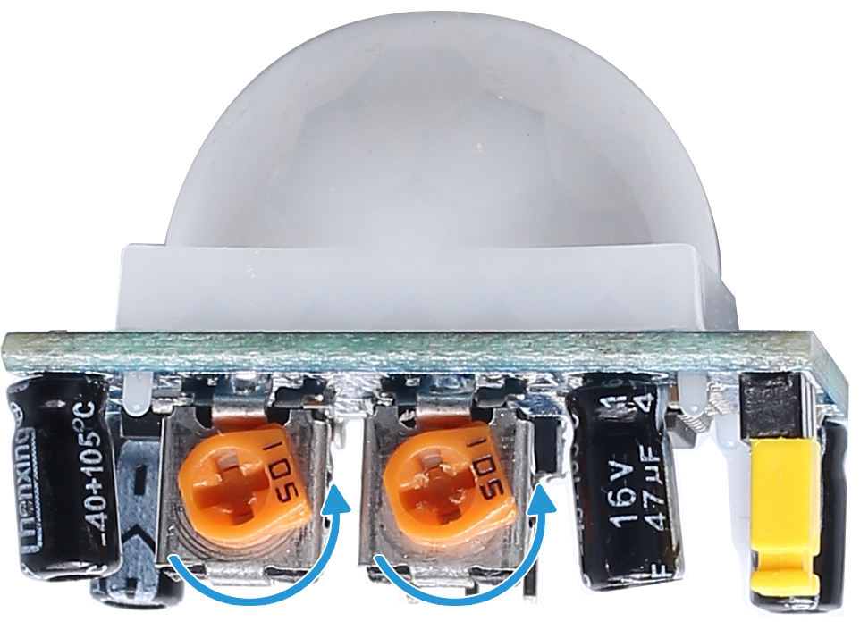
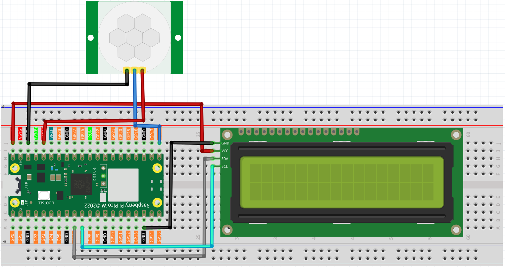

6.4 LCD Moti Motion Counter
===================================
Here we will make a number-displaying counter system, consisting of a PIR sensor and a LCD1602 Display. When the PIR detects that someone is passing by, the number on the LCD1602 Display will add 1. You can use this counter to count the number of people walking through the passageway.

Component List
^^^^^^^^^^^^^^^
- Raspberry Pi Pico W x1
- MicroUSB cable x1
- 830 Tie-Points Breadboard x1
- Resistor 220Ω x4
- LCD1602 Display x1
- 74HC595 x1
- PIR Motion Sensor Module x1
- Jumper Wire Several

The circuit consists of an LCD1602 and a PIR module.

The PIR will send a high signal of about 2.8s long when someone passes by.

Connect
^^^^^^^^^

.. note:: 
    * The PIR sensor will have a one-minute initialization time after powering on. During this period, infrared signals should be avoided, otherwise the measurement may be inaccurate.

    * There are two potentiometers on the PIR module: one is to adjust sensitivity and the other is to adjust the detection distance. To make the PIR module work better, you You need to turn both of them counterclockwise to the end.

Code
^^^^^^^
.. note::

    * Open the ``6.4_lcd_motion_counter.py`` file under the path of ``Ultimate-Starter-Kit-for-Pico-W\Python\1.Project`` or copy this code into Thonny, then click "Run Current Script" or simply press F5 to run it.

    * Don't forget to click on the "MicroPython (Raspberry Pi Pico)" interpreter in the bottom right corner. 

.. 6.4.png

Click “Run current script”, the number on the LCD1602 Display will be added by one if someone passes in front of the PIR module.

The following is the program code:

.. code-block:: python

    from lcd1602 import LCD
    from machine import I2C, Pin
    import utime as time

    pir = Pin(16, Pin.IN) 
    i2c = I2C(1, sda=Pin(6), scl=Pin(7), freq=400000)
    lcd = LCD(i2c)

    motion_count = 0
    last_detection_time = 0

    def display_status(motion_detected, count):
        lcd.clear()
        if motion_detected:
            lcd.message("Motion Detected!\nCount: {}".format(count))
        else:
            lcd.message("Monitoring...\nCount: {}".format(count))

    # Main loop
    print("PIR Sensor initializing...")
    time.sleep(2)  # Wait for the PIR sensor to stabilize
    lcd.message("System Ready\nStarting...")
    time.sleep(2)

    while True:
        try:
            current_time = time.ticks_ms()
            
            if pir.value() == 1:  # Motion detected
                # Check if this is a new motion (at least 2 seconds since the last detection)
                if time.ticks_diff(current_time, last_detection_time) > 2000:
                    motion_count += 1
                    last_detection_time = current_time
                    display_status(True, motion_count)
                    print("Motion detected! Count:", motion_count)
                    time.sleep(1)
            else:
                # No motion detected
                if time.ticks_diff(current_time, last_detection_time) > 2000:
                    display_status(False, motion_count)
            
            time.sleep_ms(100)  # Short delay to avoid excessive detection frequency
            
        except Exception as e:
            print("Error:", e)
            lcd.clear()
            lcd.message("Error occurred\nRestarting...")
            time.sleep(2)
            continue

Phenomenon
^^^^^^^^^^^
.. video:: img/5.phenomenon/6.4.mp4
    :width: 100%