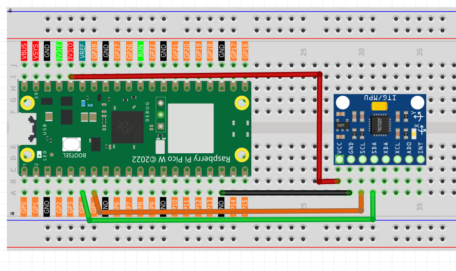

6.5 Somatosensory Game
==============================
Get ready for the ultimate **motion-controlled space adventure**! This isn't just any game - it's a real-time flight simulator where YOU are the pilot, controlling your starship by simply tilting the GY-521 sensor with your hand!

**🚀 The Game Experience:**
Imagine flying through a dangerous asteroid field where your survival depends on quick reflexes and smooth movements. Tilt the sensor left and right to navigate your starship ✈ through obstacles ◈ while trying to achieve the highest score possible!

**🎮 What Makes This Special:**
- **Physical Motion Control**: No buttons or joysticks - just natural hand movements
- **Real-time Response**: The starship follows your every move instantly  
- **Challenging Gameplay**: Dodge obstacles, collect points, manage your 3 lives
- **Immersive ASCII Graphics**: Classic terminal-style gaming with smooth animations
- **Progressive Difficulty**: The longer you survive, the more challenging it becomes!

**🎯 Game Objective:**
Pilot your starship through an endless obstacle course. Tilt the GY-521 sensor to move up and down, avoid collisions, and see how long you can survive!

**🎮 How Motion Control Works:**

The GY-521 (MPU6050) sensor acts as your **flight controller**:
- **Tilt sensor left/right** → Starship moves up/down on screen
- **Hold level** → Starship stays in center position
- **Smooth movements** → Precise flight control for dodging obstacles

**🧠 The Smart Technology:**
The MPU6050 measures acceleration in all directions and calculates your hand's tilt angle. The game maps this angle (-45° to +45°) to your starship's vertical position on the screen, creating incredibly responsive and intuitive controls!

Component List
^^^^^^^^^^^^^^^
- Raspberry Pi Pico W x1
- MicroUSB cable x1
- 830 Tie-Points Breadboard x1
- MPU6050 Module x1
- Jumper Wire Several

**Note:** This project only needs the GY-521 sensor - no servo required! The game runs entirely on your computer screen with motion-controlled input

Connect
^^^^^^^^^

Code
^^^^^^^
.. note::

    * Open the ``6.5_somatosensory_game.py`` file under the path of ``Ultimate-Starter-Kit-for-Pico-W\Python\1.Project`` or copy this code into Thonny, then click "Run Current Script" or simply press F5 to run it.

    * Don't forget to click on the "MicroPython (Raspberry Pi Pico)" interpreter in the bottom right corner. 

After running the code, prepare for an epic space adventure! Here's how to play your **motion-controlled starship game**:

**🚀 Game Setup:**
1. **Game starts automatically** - you'll see your starship ✈ on the left side of the screen
2. **Obstacles ◈ appear** from the right side, moving toward your ship
3. **Your mission**: Survive as long as possible and rack up points!

**🎮 How to Play:**
- **Hold the GY-521 sensor** in your hand like a flight controller
- **Tilt LEFT** → Starship moves UP on screen
- **Tilt RIGHT** → Starship moves DOWN on screen  
- **Hold LEVEL** → Starship stays in center position
- **Dodge obstacles** by tilting the sensor smoothly

**📊 Game Features:**
- **Score System**: +1 point for each obstacle you successfully dodge
- **Life System**: You start with 3 lives (♥♥♥), lose one for each collision
- **Real-time Display**: See your current score and remaining lives
- **Smooth Animation**: 60fps-style terminal graphics for fluid gameplay
- **Game Over**: When all lives are lost, see your final score!

**🎯 Pro Gaming Tips:**
- Make **smooth, gentle movements** - jerky motions make control harder
- **Anticipate obstacles** - they move from right to left continuously  
- **Stay calm** - the game gets more challenging the longer you survive
- **Find your sweet spot** - discover the tilt angles that work best for you

Ready to become a starship pilot? Your high score awaits! 🌟

The following is the program code:

.. code-block:: python

    from imu import MPU6050
    from machine import I2C, Pin
    import time
    import math
    import random

    # --- Hardware & Game Constants ---

    # 1. MPU6050 (GY-521) Setup
    i2c = I2C(0, sda=Pin(4), scl=Pin(5), freq=400000)
    mpu = MPU6050(i2c)

    # 2. Game Configuration
    SCREEN_WIDTH = 25
    SCREEN_HEIGHT = 7
    PLANE_X_POS = 3
    INITIAL_LIVES = 3
    OBSTACLE_DENSITY = 0.12  # Slightly lower obstacle density
    FRAME_DELAY = 0.1  # Reduce frame delay for better responsiveness

    # 3. Game Characters
    PLANE_CHAR = "✈"
    OBSTACLE_CHAR = "◈"
    EMPTY_CHAR = " "

    # --- Optimized Helper Functions ---

    def interval_mapping(x, in_min, in_max, out_min, out_max):
      """Maps a value from one range to another."""
      # Add boundary checks to prevent out-of-range calculations.
      if x <= in_min:
          return out_min
      if x >= in_max:
          return out_max
      return int((x - in_min) * (out_max - out_min) / (in_max - in_min) + out_min)

    def get_y_rotation_fast(x, y, z):
      """Calculates the rotation angle around the Y-axis."""
      return -math.degrees(math.atan2(x, math.sqrt(y*y + z*z)))

    # --- Optimized Game Logic ---

    def play_game():
      """Main function to run the starship pilot game."""
      
      player_y = SCREEN_HEIGHT // 2
      obstacles = []  # List to store [x, y] for each obstacle
      score = 0
      lives = INITIAL_LIVES
      game_over = False
      
      # Pre-allocate the screen array to avoid recreating it in the loop.
      screen = [[EMPTY_CHAR for _ in range(SCREEN_WIDTH)] for _ in range(SCREEN_HEIGHT)]
      
      # Pre-calculate border strings to avoid repeated string concatenation.
      top_border = "+" + "-" * SCREEN_WIDTH + "+"
      bottom_border = top_border
      
      print("--- GY-521 Starship Pilot (Optimized) ---")
      print(f"Survive as long as you can! You have {lives} lives.")
      print("Get ready...")
      time.sleep(1)  # Reduce the initial waiting time.

      while not game_over:
          # --- 1. Update Player Position from MPU6050 ---
          angle = get_y_rotation_fast(mpu.accel.x, mpu.accel.y, mpu.accel.z)
          player_y = interval_mapping(angle, -45, 45, 0, SCREEN_HEIGHT - 1)

          # --- 2. Optimized Obstacle Management ---
          # This section moves existing obstacles and filters out ones that have left the screen.
          new_obstacles = []
          passed_count = 0
          
          for obs in obstacles:
              obs[0] -= 1
              if obs[0] >= 0:
                  new_obstacles.append(obs)
              else:
                  passed_count += 1
          
          obstacles = new_obstacles
          
          # Update the score based on how many obstacles were passed.
          if passed_count > 0:
              score += passed_count
          
          # Randomly add new obstacles.
          if random.random() < OBSTACLE_DENSITY:
              obs_y = random.randint(0, SCREEN_HEIGHT - 1)
              # Add a new obstacle at the far right of the screen.
              obstacles.append([SCREEN_WIDTH - 1, obs_y])

          # --- 3. Optimized Collision Detection ---
          collided = False
          obstacles_after_collision = []
          
          for obs in obstacles:
              if obs[0] == PLANE_X_POS and obs[1] == player_y:
                  lives -= 1
                  collided = True
                  # If a collision happens, don't add the obstacle to the new list.
                  # This effectively removes it from the game.
              else:
                  obstacles_after_collision.append(obs)
          
          obstacles = obstacles_after_collision
          
          if collided and lives <= 0:
              game_over = True

          # --- 4. Optimized Screen Drawing ---
          # First, quickly fill the entire screen buffer with empty spaces.
          for row in screen:
              for i in range(SCREEN_WIDTH):
                  row[i] = EMPTY_CHAR
          
          # Place the plane on the screen.
          if not game_over:
              screen[player_y][PLANE_X_POS] = PLANE_CHAR
          
          # Place all current obstacles on the screen.
          for x, y in obstacles:
              if 0 <= x < SCREEN_WIDTH:
                  screen[y][x] = OBSTACLE_CHAR
          
          # Print the whole frame at once for smoother animation.
          print("\033[H\033[J", end="")  # This special code clears the console screen.
          print(top_border)
          for row in screen:
              print("|" + "".join(row) + "|")
          print(bottom_border)
          
          # Display the current score and lives.
          hearts = "♥" * lives + "♡" * (INITIAL_LIVES - lives)
          print(f"Score: {score} | Lives: {hearts}")

          # --- 5. Optimized Frame Rate ---
          time.sleep(FRAME_DELAY)

      # --- Game Over Sequence ---
      print("\n--- GAME OVER ---")
      print(f"Final Score: {score}")

    # --- Run the game ---
    if __name__ == "__main__":
      play_game()

Phenomenon
^^^^^^^^^^^
.. video:: img/5.phenomenon/6.5.mp4
    :width: 100%