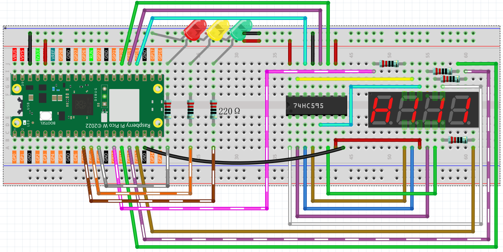

6.6 Traffic Light System
=========================
Build your own **smart traffic light controller** with authentic timing and professional display! Ever wondered how real traffic lights work? Now you can create a miniature version that follows actual traffic light patterns.

**🚦 What You'll Create:**
A fully functional traffic light system that automatically cycles through all three phases - just like the ones controlling traffic at intersections! Plus, it includes a digital countdown timer showing exactly how much time is left in each phase.

**🎯 Real Traffic Light Rules:**
- 🔴 **Red Light (30 seconds)**: STOP! All traffic must wait
- 🟡 **Yellow Light (5 seconds)**: CAUTION! Prepare to stop  
- 🟢 **Green Light (30 seconds)**: GO! Safe to proceed

**⏰ Smart Features:**
- **Automatic Timing**: Follows real-world traffic light timing patterns
- **Digital Countdown**: 4-digit display shows remaining seconds for each phase
- **Authentic Colors**: Uses actual red, yellow, and green LEDs
- **Continuous Operation**: Runs indefinitely just like real traffic lights
- **Professional Display**: 7-segment display for clear time visibility

**🏗️ Why This is Cool:**
Learn about traffic management systems, timing circuits, and multi-component coordination while building something that actually resembles real infrastructure!

Component List
^^^^^^^^^^^^^^^
- Raspberry Pi Pico W x1
- MicroUSB cable x1
- 830 Tie-Points Breadboard x1
- Resistor 220Ω x7
- 4-Digit 7-Segment Display x1
- 74HC595 x1
- LED x3
- Jumper Wire Several

**🔧 How It Works:**
This project combines two powerful systems:
- **4-digit 7-segment display** (from project 4.3) shows the countdown timer
- **3 traffic light LEDs** connected to GP7, GP8, and GP9 for red, yellow, and green

**🎛️ The Smart Control System:**
The Pico acts as a traffic controller, automatically managing both the LED states and countdown display. When one light phase ends, it immediately switches to the next phase and resets the timer - just like real traffic management systems!

Connect
^^^^^^^^^

Code
^^^^^^^
.. note::

    * Open the ``6.6_traffic_light.py`` file under the path of ``Ultimate-Starter-Kit-for-Pico-W\Python\1.Project`` or copy this code into Thonny, then click "Run Current Script" or simply press F5 to run it.

    * Don't forget to click on the "MicroPython (Raspberry Pi Pico)" interpreter in the bottom right corner. 

.. 6.6.png

After running the code, watch your **professional traffic light system** come alive!

**🚦 What You'll See:**
1. **Green Phase**: Green LED lights up, display counts down from 30 to 1
2. **Yellow Phase**: Yellow LED lights up, display counts down from 5 to 1  
3. **Red Phase**: Red LED lights up, display counts down from 30 to 1
4. **Cycle Repeats**: System automatically returns to green and continues forever

**🎮 Interactive Experience:**
- Watch the **countdown timer** tick down in real-time
- See the **smooth transitions** between each traffic phase
- Observe how the **LED and display sync perfectly** 
- Experience the **authentic timing** used in real traffic systems

**🧪 Fun Experiments:**
- Time how long each full cycle takes (65 seconds total!)
- Compare with real traffic lights in your area
- Imagine controlling toy cars or model trains with this system
- Think about how traffic engineers use these timing patterns to manage city traffic

This is exactly how real traffic lights work - with precise timing, automatic cycling, and clear visual indicators!

The following is the program code:

.. code-block:: python

    import machine
    import time
    from machine import Timer

    # Traffic light timing constants (seconds)
    GREEN_TIME = 30
    YELLOW_TIME = 5  
    RED_TIME = 30
    LIGHT_DURATIONS = [GREEN_TIME, YELLOW_TIME, RED_TIME]

    # Traffic light states
    STATE_GREEN = 0
    STATE_YELLOW = 1
    STATE_RED = 2
    STATE_NAMES = ["GREEN", "YELLOW", "RED"]

    # 7-segment display constants
    SEGMENT_CODES = [0x3f, 0x06, 0x5b, 0x4f, 0x66, 0x6d, 0x7d, 0x07, 0x7f, 0x6f]
    DISPLAY_CLEAR = 0x00
    TIMING_DELAY_US = 200
    MAX_DIGITS = 4

    # Pin definitions
    # 74HC595 shift register pins
    SDI_PIN = 18    # Serial Data Input
    RCLK_PIN = 19   # Register Clock (Latch)
    SRCLK_PIN = 20  # Shift Register Clock

    # 7-segment display digit control pins
    DIGIT_PINS = [10, 13, 12, 11]

    # Traffic light LED pins
    LED_RED_PIN = 7
    LED_YELLOW_PIN = 8  
    LED_GREEN_PIN = 9
    LED_PINS = [LED_RED_PIN, LED_YELLOW_PIN, LED_GREEN_PIN]

    # Initialize hardware pins
    sdi = machine.Pin(SDI_PIN, machine.Pin.OUT)
    rclk = machine.Pin(RCLK_PIN, machine.Pin.OUT)
    srclk = machine.Pin(SRCLK_PIN, machine.Pin.OUT)

    # Initialize digit control pins
    digit_pins = []
    for pin_num in DIGIT_PINS:
        digit_pins.append(machine.Pin(pin_num, machine.Pin.OUT))

    # === 7-Segment Display Functions (Core - Keep Original Logic) ===

    def select_digit(digit):
        """Select which digit (0-3) to display"""
        for i in range(MAX_DIGITS):
            digit_pins[i].value(1)  # Turn off all digits
        digit_pins[digit].value(0)  # Turn on selected digit

    def clear_display():
        """Clear the display by sending clear code to shift register"""
        shift_register_send(DISPLAY_CLEAR)

    def shift_register_send(data):
        """Send data to 74HC595 shift register"""
        rclk.low()
        time.sleep_us(TIMING_DELAY_US)
        for bit in range(7, -1, -1):
            srclk.low()
            time.sleep_us(TIMING_DELAY_US)
            bit_value = 1 & (data >> bit)
            sdi.value(bit_value)
            time.sleep_us(TIMING_DELAY_US)
            srclk.high()
            time.sleep_us(TIMING_DELAY_US)
        time.sleep_us(TIMING_DELAY_US)
        rclk.high()

    # === Traffic Light LED Functions (Core - Keep Original Logic) ===

    # Initialize LED pins
    led_pins = []
    for pin_num in LED_PINS:
        led_pins.append(machine.Pin(pin_num, machine.Pin.OUT))

    def set_traffic_light(state):
        """Turn on the specified traffic light LED"""
        for i in range(3):
            led_pins[i].value(0)  # Turn off all LEDs
        led_pins[state].value(1)  # Turn on selected LED

    # === System State Variables ===
    counter = LIGHT_DURATIONS[STATE_GREEN]
    current_state = STATE_GREEN

    def timer_callback(timer):
        """Timer interrupt handler for traffic light state management"""
        global counter, current_state
        
        counter -= 1
        if counter <= 0:
            current_state = (current_state + 1) % 3
            counter = LIGHT_DURATIONS[current_state]

    # Initialize timer for 1-second intervals
    timer = Timer(period=1000, mode=Timer.PERIODIC, callback=timer_callback)

    def display_number(number):
        """Display complete number on 7-segment display (original working logic)"""
        select_digit(0)
        shift_register_send(SEGMENT_CODES[number % 10])
        
        select_digit(1)
        shift_register_send(SEGMENT_CODES[number % 100 // 10])
        
        select_digit(2)
        shift_register_send(SEGMENT_CODES[number % 1000 // 100])
        
        select_digit(3)
        shift_register_send(SEGMENT_CODES[number % 10000 // 1000])

    # === Main Control Loop ===
    while True:
        display_number(counter)
        set_traffic_light(current_state)

Phenomenon
^^^^^^^^^^^
.. video:: img/5.phenomenon/6.6.mp4
    :width: 100%