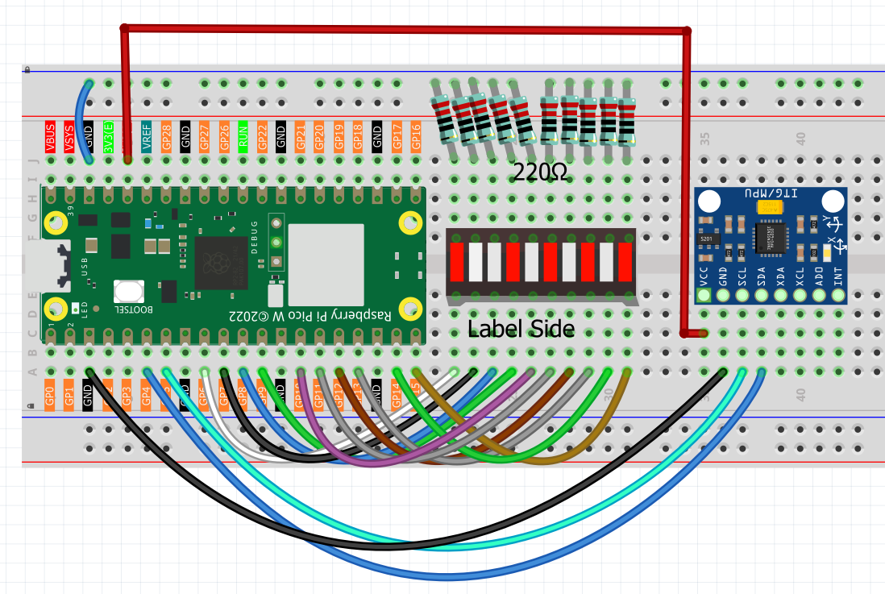

6.7 Digital Spirit Level
=========================
Build your own **high-tech digital spirit level** that's more sensitive and accurate than traditional bubble levels! This isn't just any level - it's a motion-sensing, LED-powered precision instrument that responds instantly to the tiniest tilts.

**🎯 What You'll Create:**
A professional-grade digital level using a 10-LED bar display. Just like the spirit levels that carpenters, builders, and photographers use, but with digital precision and instant visual feedback!

**⚖️ How Traditional vs Digital Levels Work:**
- **Traditional bubble level**: Uses a liquid bubble in a curved tube
- **Your digital level**: Uses a motion sensor and LED indicators for precise tilt detection

**✨ Why Digital is Better:**
- **Instant response**: No waiting for bubbles to settle
- **High precision**: Detects even the smallest tilts
- **Clear indication**: Bright LED shows exact tilt direction
- **No fragile parts**: No glass tubes or liquid to break
- **Works in any light**: LEDs visible even in bright conditions

**🔧 Perfect For:**
Leveling picture frames, checking if tables are stable, calibrating 3D printers, or just impressing friends with your high-tech spirit level!

**🎛️ How Your Digital Level Works:**

**📡 The Motion Sensor:**
The MPU6050 acts as your digital "bubble" - it measures gravity's pull in all directions and calculates exactly how tilted your device is. No liquid needed!

**💡 The LED Indicator System:**
Instead of a traditional LED matrix, this version uses a **10-LED bar** (like a volume meter) where:
- **Middle LED (LED 5)** = Perfectly level! 🎯
- **LEDs 1-4** = Tilted left (more tilt = lower number)
- **LEDs 6-10** = Tilted right (more tilt = higher number)

**🧠 Smart Calibration:**
The system maps tilt angles from -30° to +30° across all 10 LEDs, giving you precise tilt measurement with instant visual feedback!

Component List
^^^^^^^^^^^^^^^
- Raspberry Pi Pico W x1
- MicroUSB cable x1
- 830 Tie-Points Breadboard x1
- MPU6050 Module x1
- LED Bar x1
- Jumper Wire Several

**Note:** This project uses individual LEDs in a bar formation, not a dot matrix, making it easier to build and understand!

Connect
^^^^^^^^^

Code
^^^^^^^
.. note::

    * Open the ``6.7_digital_level.py`` file under the path of ``Ultimate-Starter-Kit-for-Pico-W\Python\1.Project`` or copy this code into Thonny, then click "Run Current Script" or simply press F5 to run it.

    * Don't forget to click on the "MicroPython (Raspberry Pi Pico)" interpreter in the bottom right corner. 

.. 6.7.png

After running the code, prepare to test your **professional digital spirit level**!

**🎯 Getting Started:**
1. **Place on level surface**: Put your breadboard on a flat, level surface
2. **Check calibration**: The middle LED (LED 5) should light up if perfectly level
3. **Start testing**: Tilt the breadboard and watch the LED indicator move!

**📊 How to Read Your Digital Level:**
- **LED 5 (center)**: Perfect! Your surface is level ✅
- **LEDs 1-4**: Tilted left - the lower the number, the more the tilt
- **LEDs 6-10**: Tilted right - the higher the number, the more the tilt
- **LED response**: Instant! No waiting for bubbles to settle

**🧪 Fun Experiments to Try:**
- **Test your table**: Is your desk actually level?
- **Check picture frames**: Make sure they're hanging straight
- **Smartphone comparison**: Compare with your phone's built-in level app
- **Sensitivity test**: See how small a tilt you can detect (it's very sensitive!)
- **Different surfaces**: Test various surfaces around your house

**💡 Pro Tips:**
- The system is calibrated for ±30° range - perfect for most leveling tasks
- If no LED lights up, try gently moving the sensor until one appears
- The LED changes instantly as you tilt - much faster than traditional levels!

You now have a precision digital instrument that rivals professional tools! 🎉

The following is the program code:

.. code-block:: python

    # 6.7_led_bar_level.py
    # Description: A digital spirit level using an MPU6050 sensor and a 10-segment LED bar graph.
    # The lit LED on the bar indicates the angle of tilt.

    import machine
    from machine import I2C, Pin
    import time
    import math
    from imu import MPU6050

    # --- Hardware Configuration ---

    # 1. MPU6050 (GY-521) Sensor Setup
    i2c = I2C(0, sda=Pin(4), scl=Pin(5), freq=400000)
    mpu = MPU6050(i2c)
    print("MPU6050 sensor initialized.")

    # 2. LED Bar Setup (using pins from the chaser light project)
    LED_PINS = [6, 7, 8, 9, 10, 11, 12, 13, 14, 15]
    NUM_LEDS = len(LED_PINS)
    leds = []

    # --- Helper Functions ---

    def initialize_leds():
        """Initialize all LED pins as outputs and store them."""
        global leds
        for pin_id in LED_PINS:
            led = machine.Pin(pin_id, machine.Pin.OUT)
            led.value(0)  # Ensure all LEDs are off initially
            leds.append(led)
        print(f"Initialized {NUM_LEDS}-segment LED bar.")

    def dist(a, b):
        """Calculates the distance between two points, used for angle calculation."""
        return math.sqrt((a * a) + (b * b))

    def get_x_rotation(x, y, z):
        """Calculates the rotation angle around the X-axis from accelerometer data."""
        radians = math.atan2(y, dist(x, z))
        return math.degrees(radians)

    def map_value(x, in_min, in_max, out_min, out_max):
        """Maps a value from one numerical range to another."""
        # Clamp the input value to the specified range
        x = max(in_min, min(x, in_max))
        return (x - in_min) * (out_max - out_min) / (in_max - in_min) + out_min

    # --- Core Logic ---

    def update_led_bar_display(angle):
        """Updates the LED bar to reflect the current tilt angle."""
        
        # Define the sensitivity range. A smaller angle range makes the level more sensitive.
        # e.g., -30 to +30 degrees of tilt will cover the full LED bar.
        SENSITIVITY_RANGE = 30.0
        
        # Map the angle (-SENSITIVITY_RANGE to +SENSITIVITY_RANGE) to an LED index (0 to 9)
        led_index = map_value(angle, -SENSITIVITY_RANGE, SENSITIVITY_RANGE, 0, NUM_LEDS - 1)
        led_index = int(round(led_index))
        
        # Turn all LEDs off, then turn the correct one on.
        for i in range(NUM_LEDS):
            if i == led_index:
                leds[i].value(1)  # Turn on the target LED
            else:
                leds[i].value(0)  # Turn off all other LEDs

    # --- Main Program ---

    def main():
        """Main function to run the digital level."""
        
        initialize_leds()
        
        print("\nDigital Level is active. Tilt the sensor.")
        print("The middle LED indicates a level surface.")
        
        try:
            while True:
                # Read accelerometer data from the sensor
                accel_data = mpu.accel
                
                # Calculate the tilt angle
                x_angle = get_x_rotation(accel_data.x, accel_data.y, accel_data.z)
                
                # Update the LED display based on the angle
                update_led_bar_display(x_angle)
                
                # Optional: print the angle for debugging
                # print(f"Angle: {x_angle:.2f} degrees")
                
                # A short delay to keep the updates smooth
                time.sleep(0.05)
                
        except KeyboardInterrupt:
            print("\nProgram stopped by user.")
        finally:
            # Ensure all LEDs are turned off on exit
            for led in leds:
                led.value(0)
            print("All LEDs turned off. Goodbye!")

    # Run the main program
    if __name__ == "__main__":
        main() 

Phenomenon
^^^^^^^^^^^
.. video:: img/5.phenomenon/6.7.mp4
    :width: 100%