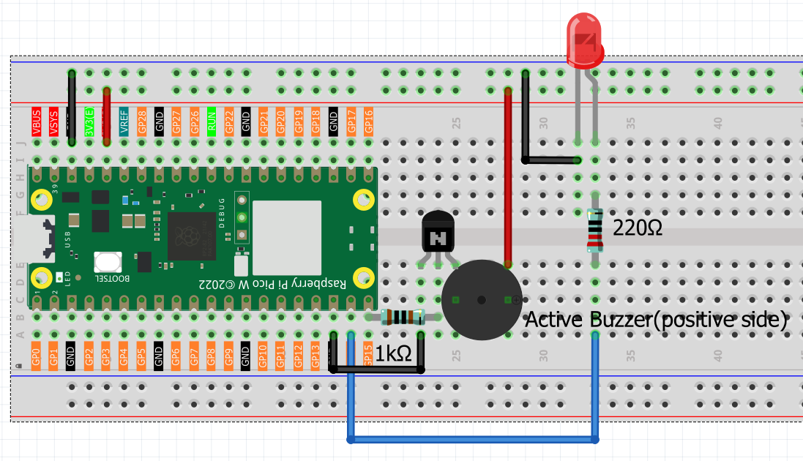

6.8 Morse Code Generator
=========================
Step into the world of **secret communications**! Build your own professional Morse code transmitter that converts any text message into authentic dot-dash signals with both sound and light.

**📡 What is Morse Code?**
Morse code is a time-tested communication method that uses short signals (dots) and long signals (dashes) to represent letters and numbers. It was used by ships, aircraft, and military for over 100 years for long-distance communication!

**✨ Your Personal Telegraph Station:**
This isn't just a simple beeper - it's a sophisticated communication device that:
- **Converts text to Morse**: Type any message and watch it transform into authentic Morse code
- **Dual output**: Both LED flashes and buzzer beeps for complete sensory experience  
- **Interactive interface**: Built-in reference chart and user-friendly prompts
- **Professional timing**: Uses authentic Morse code timing standards

**🎯 Perfect For:**
- Learning Morse code in a fun, interactive way
- Secret messages between friends
- Understanding historical communication methods
- Adding authentic sound effects to projects
- Impressing people with your "telegraph operator" skills!

**🔧 How Morse Code Works:**

**⚡ The Signal System:**
- **Dot (·)**: Short signal (0.15 seconds) - like a quick tap
- **Dash (-)**: Long signal (0.45 seconds) - like a long press  
- **Letter spacing**: Brief pause between dots/dashes in same letter
- **Word spacing**: Longer pause between different words

**🎵 The Audio-Visual Experience:**
- **LED flashes** in sync with the Morse patterns - see your message!
- **Buzzer beeps** with authentic telegraph sounds - hear your message!
- **Perfect timing** follows international Morse code standards

**💡 Smart Features:**
- **Interactive prompts**: Just type and press Enter
- **Reference chart**: Type 'chart' to see the complete Morse code table
- **Error handling**: Skips unsupported characters automatically
- **Professional feedback**: Shows each letter's Morse pattern as it plays

Component List
^^^^^^^^^^^^^^^
- Raspberry Pi Pico W x1
- MicroUSB cable x1
- 830 Tie-Points Breadboard x1
- Transistor S8050 x1
- LED x1
- Resistor 220Ω x1, 1kΩ x1
- Active Buzzer x1
- Jumper Wire Several

Connect
^^^^^^^^^

Code
^^^^^^^
.. note::

    * Open the ``6.8_morse_code_generator.py`` file under the path of ``Ultimate-Starter-Kit-for-Pico-W\Python\1.Project`` or copy this code into Thonny, then click "Run Current Script" or simply press F5 to run it.

    * Don't forget to click on the "MicroPython (Raspberry Pi Pico)" interpreter in the bottom right corner. 

.. 6.8.png

After running the code, get ready to become a **telegraph operator**! Here's your complete guide to using your Morse code station:

**📡 How to Use Your Telegraph:**
1. **Program starts** - You'll see the welcome message and instructions
2. **Type your message** - Enter any text (letters, numbers, punctuation)
3. **Press Enter** - Watch and listen as your message transforms into Morse code!
4. **Special commands**:

   - Type **'chart'** to see the complete Morse code reference table
   - Press **Ctrl+C** to exit the program

**🎮 What You'll Experience:**
- **Visual feedback**: LED flashes show each dot and dash pattern
- **Audio feedback**: Buzzer plays authentic telegraph sounds  
- **Real-time display**: See each letter's Morse pattern as it plays
- **Professional timing**: Authentic spacing between letters and words

**💬 Try These Messages:**
- **"HELLO WORLD"** - Classic first message
- **"SOS"** - Famous distress signal (... --- ...)
- **Your name** - Personalize your telegraph experience
- **"MORSE CODE"** - See how the system handles longer messages

**🎯 Learning Features:**
- Each letter's Morse pattern is displayed as it plays
- Reference chart available anytime by typing 'chart'
- Unsupported characters are automatically skipped
- Perfect for learning Morse code step by step!

Ready to send your first telegraph message? The airwaves await! 📻

The following is the program code:

.. code-block:: python

    # 6.8_morse_code_generator.py
    # A professional, feature-rich Morse code generator for MicroPython,
    # inspired by a well-structured Raspberry Pi example.

    from machine import Pin, PWM
    import time
    import sys

    # --- Configuration ---
    BUZZER_PIN = 15      # Pin for the buzzer
    LED_PIN = 14         # Pin for the LED
    DOT_DURATION = 0.15  # Base time unit for a dot (seconds)

    # --- Morse Code Dictionary (Standard Notation) ---
    MORSE_DICTIONARY = {
        'A': '.-',   'B': '-...', 'C': '-.-.', 'D': '-..', 'E': '.',
        'F': '..-.', 'G': '--.',  'H': '....', 'I': '..',  'J': '.---',
        'K': '-.-',  'L': '.-..', 'M': '--',   'N': '-.',  'O': '---',
        'P': '.--.', 'Q': '--.-', 'R': '.-.',  'S': '...', 'T': '-',
        'U': '..-',  'V': '...-', 'W': '.--',  'X': '-..-', 'Y': '-.--',
        'Z': '--..',
        '0': '-----', '1': '.----', '2': '..---', '3': '...--', '4': '....-',
        '5': '.....', '6': '-....', '7': '--...', '8': '---..', '9': '----.',
        '?': '..--..', '/': '-..-.', ',': '--..--', '.': '.-.-.-',
        ';': '-.-.-.', '!': '-.-.--', '@': '.--.-.', ':': '---...'
    }

    class MorseCodeGenerator:
        """
        A class to handle Morse code generation with LED and Buzzer feedback.
        """
        def __init__(self, led_pin, buzzer_pin, dot_duration):
            """Initializes the generator and hardware."""
            self.dot_duration = dot_duration
            self.dash_duration = dot_duration * 3  # A dash is 3x a dot
            self.symbol_pause = dot_duration       # Pause between dots/dashes is 1x dot
            self.letter_pause = dot_duration * 3   # Pause between letters is 3x dot
            self.word_pause = dot_duration * 7     # Pause between words is 7x dot

            self.led = Pin(led_pin, Pin.OUT)
            self.buzzer = PWM(Pin(buzzer_pin))
            self.buzzer.freq(1000)  # Set a pleasant frequency
            self.cleanup() # Ensure outputs are off

        def signal_on(self):
            """Turns the LED and Buzzer on."""
            self.led.value(1)
            self.buzzer.duty_u16(32768)  # 50% duty cycle for sound

        def signal_off(self):
            """Turns the LED and Buzzer off."""
            self.led.value(0)
            self.buzzer.duty_u16(0)

        def play_signal(self, duration):
            """Plays a signal (dot or dash) for a given duration."""
            self.signal_on()
            time.sleep(duration)
            self.signal_off()
            time.sleep(self.symbol_pause)

        def play_morse_message(self, message):
            """Converts and plays an entire message in Morse code."""
            print(f"\n🎵 Playing Morse code for: \"{message}\"")
            print("--- Morse Code Output ---")
            
            for char in message.upper():
                if char == ' ':
                    print("   (space)")
                    time.sleep(self.word_pause - self.letter_pause) # Account for upcoming letter pause
                    continue

                pattern = MORSE_DICTIONARY.get(char)
                if pattern is None:
                    print(f"⚠️ Character '{char}' not supported, skipping.")
                    continue

                print(f"📡 {char} -> {pattern}")
                for symbol in pattern:
                    if symbol == '.':
                        self.play_signal(self.dot_duration)
                    elif symbol == '-':
                        self.play_signal(self.dash_duration)
                
                time.sleep(self.letter_pause - self.symbol_pause) # Pause between letters

            print("✅ Transmission complete!\n")

        def display_morse_chart(self):
            """Displays a formatted Morse code reference chart."""
            print("\n" + "="*50)
            print("📊 Morse Code Reference Chart:")
            print("="*50)
            
            sorted_items = sorted(MORSE_DICTIONARY.items())
            count = 0
            for char, code in sorted_items:
                print(f"{char}: {code:<8}", end="")
                count += 1
                if count % 5 == 0:
                    print()
            print("\n" + "="*50 + "\n")

        def cleanup(self):
            """Turns off all hardware outputs."""
            print("\n🧹 Shutting down... Turning off signals.")
            self.signal_off()

        def run(self):
            """The main interactive loop for the generator."""
            print("\n🎯 Morse Code Generator is Active!")
            print("   - Type a message and press Enter to play.")
            print("   - Type 'chart' to display the Morse code reference.")
            print("   - Press Ctrl+C to exit.\n")
            
            while True:
                try:
                    message = input("💬 Enter message (or 'chart'): ").strip()
                    if not message:
                        continue
                    
                    if message.lower() == 'chart':
                        self.display_morse_chart()
                    else:
                        self.play_morse_message(message)
                
                except (KeyboardInterrupt, EOFError):
                    break
            
            self.cleanup()
            print("✅ Goodbye!")

    def main():
        """Main function to start the application."""
        print("\n" + "="*30)
        print("=== Morse Code Generator ===")
        print("="*30)
        
        generator = MorseCodeGenerator(
            led_pin=LED_PIN,
            buzzer_pin=BUZZER_PIN,
            dot_duration=DOT_DURATION
        )
        generator.run()

    if __name__ == '__main__':
        main()

Phenomenon
^^^^^^^^^^^
.. video:: img/5.phenomenon/6.8.mp4
    :width: 100%