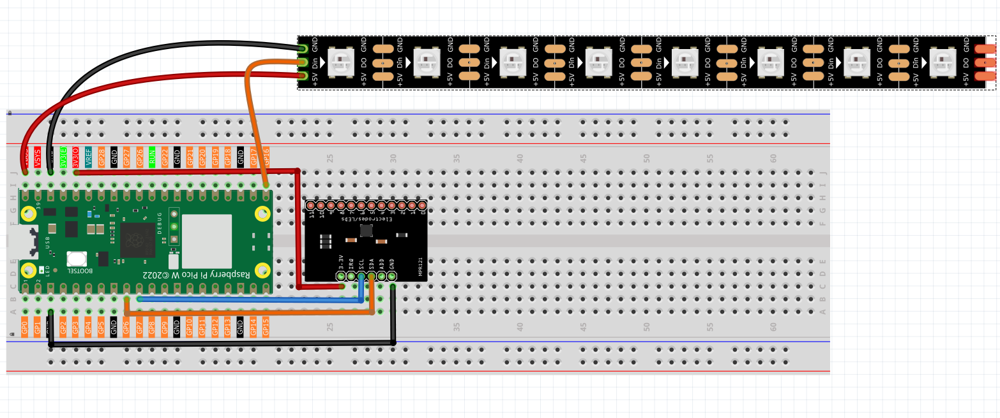

6.9 Touch Keyboard_Chaser
===============================
Create a **mesmerizing interactive light show** that responds to your touch! This project combines capacitive touch sensing with stunning LED animations to create a "ripple effect" that spreads across a colorful LED strip whenever you touch different points.

**✨ What You'll Create:**
An advanced touch-controlled lighting system that creates beautiful **ripple animations** - like throwing stones into a calm pond, but with light! Each touch creates a wave of light that spreads outward from that point across the LED strip.

**🎯 How It Works:**
- **12 Touch Points**: The MPR121 sensor detects touches on 12 different electrodes
- **8-LED Light Strip**: WS2812 addressable LEDs create the visual effects
- **Ripple Animation**: Light waves spread outward from the touch point
- **Smart Mapping**: Touch points 0-7 correspond to LED positions on the strip

**🌊 The Magic Ripple Effect:**
When you touch electrode 0, a light pulse starts at LED 0 and ripples outward. Touch electrode 4, and the wave begins from the center of the strip. Each touch point creates its own unique wave pattern!

**🎨 Perfect For:**
- Interactive art installations
- Touch-responsive decorations  
- Learning about capacitive sensing and LED control
- Creating ambient lighting that responds to presence
- Impressing friends with futuristic touch interfaces

**🔬 The Science Behind Touch Sensing:**

**⚡ Capacitive Touch Technology:**
The MPR121 uses the same technology as smartphone screens! It measures tiny changes in electrical charge when conductive objects (like your finger) get close to or touch the electrodes.

**🌈 LED Strip Magic:**
The WS2812 LED strip contains individually addressable LEDs - each one can display any color and be controlled separately. This allows for complex animations where light "flows" from one LED to the next.

**🎭 Animation Algorithm:**
When you touch electrode 3, the system calculates which LED corresponds to that position, then creates a expanding circle of light that spreads outward at precise timing intervals (65ms between frames).

Component List
^^^^^^^^^^^^^^^^^^^
- Raspberry Pi Pico W x1
- MicroUSB cable x1
- 830 Tie-Points Breadboard x1
- MPR121 Module x1 (12-channel capacitive touch sensor)
- WS2812 LED Strip x1 (8 addressable LEDs)
- Jumper Wire Several

**💡 Touch Interface Setup:**
Instead of fruits, this project uses the MPR121's built-in electrodes as touch points. You can:
- **Touch directly**: Use your finger on the electrode pads
- **Extend electrodes**: Connect wires to create remote touch points
- **Creative conductors**: Attach to metal objects, foil, or even fruits for artistic installations

**🔧 How the MPR121 Works:**
1. **Initialization**: Each electrode gets calibrated to its baseline electrical state
2. **Touch detection**: When you approach/touch an electrode, the electrical field changes
3. **Signal processing**: The MPR121 detects this change and reports which electrode was touched
4. **Animation trigger**: Your Pico receives the touch data and starts the corresponding light animation

**⚠️ Important Setup Tips:**
- Keep electrodes stable during initialization for accurate calibration
- Avoid touching electrodes while the system starts up
- Ensure good electrical connections for reliable touch detection

Connect
^^^^^^^^^

Code
^^^^^^^
.. note::

    * Open the ``6.9_touch_keyboard_chaser.py`` file under the path of ``Ultimate-Starter-Kit-for-Pico-W\Python\1.Project`` or copy this code into Thonny, then click "Run Current Script" or simply press F5 to run it.

    * Don't forget to click on the "MicroPython (Raspberry Pi Pico)" interpreter in the bottom right corner. 

After running the code, get ready for a **stunning interactive light show**! Here's how to experience your touch-controlled ripple effects:

**🚀 Getting Started:**
1. **Wait for initialization** - Don't touch anything while the system calibrates (about 2-3 seconds)
2. **Look for the ready message** - "Ready for touch!" appears when calibration is complete
3. **Start creating ripples** - Touch any electrode (0-7) and watch the magic happen!

**🌊 What You'll Experience:**
- **Touch electrode 0** → Light ripple starts from the first LED and spreads right
- **Touch electrode 4** → Ripple begins from the center and spreads both ways  
- **Touch electrode 7** → Wave starts from the last LED and spreads left
- **Beautiful blue waves** → Each ripple uses a gorgeous blue color (50, 150, 255 RGB)

**🎮 Interactive Features:**
- **Instant response**: Touch detection happens in real-time
- **Smooth animations**: 65ms frame timing creates fluid wave motion
- **Smart mapping**: Only electrodes 0-7 trigger animations (matches 8-LED strip)
- **Wave physics**: Each ripple spreads outward from the touch point like real water waves
- **Auto-reset**: LEDs automatically turn off after each animation completes

**🧪 Fun Experiments:**
- **Try different touch points** - Each creates a unique wave pattern
- **Touch multiple electrodes** - See how the system handles simultaneous touches
- **Timing experiments** - Touch rapidly to see overlapping animations
- **Creative extensions** - Connect wires to electrodes for remote touch points

**💡 Pro Tips:**
- The system only responds to **new touches**, not continuous holding
- Electrodes 8-11 are detected but don't trigger animations (outside LED range)
- For best results, ensure stable electrical connections during setup

Ready to create your own light symphony? Every touch is a new masterpiece! ✨

The following is the program code:

.. code-block:: python

    # 6.9_touch_keyboard_chaser.py
    #
    # This project uses an MPR121 capacitive touch sensor to trigger
    # a "chaser" or "ripple" light effect on a WS2812 LED strip.
    # Touching a key on the sensor creates a light pulse that
    # spreads outwards from that point.
    #
    # Combines logic from:
    # - 3.3_touch_keyboard.py (for MPR121 input)
    # - 6.13_rfid_player.py (for WS2812 output)

    from machine import Pin, I2C
    from mpr121 import MPR121
    from ws2812 import WS2812
    import time

    # --- Configuration ---
    # MPR121 Touch Sensor Config (uses I2C bus 0)
    I2C_SDA_PIN = 6
    I2C_SCL_PIN = 7

    # WS2812 LED Strip Config
    WS2812_PIN = 16  # The GPIO pin connected to the data line of the LED strip
    NUM_LEDS = 8    # The number of LEDs on the strip

    # Animation Config
    ANIMATION_SPEED_MS = 65  # Time in milliseconds between animation frames. Lower is faster.
    ANIMATION_COLOR_RGB = (50, 150, 255) # A nice blue color (R, G, B) for the light effect.

    class TouchChaser:
        """
        Manages the touch sensor and LED strip to create interactive light effects.
        """
        def __init__(self):
            """Initializes all hardware components and state variables."""
            print("Initializing Touch Keyboard Chaser...")

            # 1. Initialize I2C and MPR121 Touch Sensor
            self.i2c = I2C(1, sda=Pin(I2C_SDA_PIN), scl=Pin(I2C_SCL_PIN))
            self.mpr = MPR121(self.i2c)
            
            # 2. Initialize WS2812 LED Strip
            self.led_strip = WS2812(Pin(WS2812_PIN), NUM_LEDS)
            
            # 3. State tracking to detect new presses
            self.last_touched_keys = []
            
            # Convert RGB tuple to a single integer for the ws2812 library
            # The library typically expects colors in Green, Red, Blue (GRB) order.
            r, g, b = ANIMATION_COLOR_RGB
            self.animation_color_int = (g << 16) | (r << 8) | b
            
            self.clear_leds()
            print("Initialization complete. Ready for touch!")

        def clear_leds(self):
            """Turns all LEDs on the strip off."""
            for i in range(NUM_LEDS):
                self.led_strip[i] = 0
            self.led_strip.write()

        def play_ripple_animation(self, origin):
            """
            Plays the light animation, spreading outwards from a given origin point.
            
            Args:
                origin (int): The index of the LED where the animation should start.
            """
            print(f"Animation triggered from key {origin}")
            
            # Calculate how far the ripple needs to spread to cover the whole strip
            max_distance = max(origin, NUM_LEDS - 1 - origin)
            
            for distance in range(max_distance + 1):
                # In each frame, update the entire strip
                for i in range(NUM_LEDS):
                    # Calculate this LED's distance from the origin
                    dist_from_origin = abs(i - origin)
                    
                    # Light up the LED if it's at the current wavefront
                    if dist_from_origin == distance:
                        self.led_strip[i] = self.animation_color_int
                    else:
                        self.led_strip[i] = 0 # Turn all other LEDs off
                
                self.led_strip.write()
                time.sleep_ms(ANIMATION_SPEED_MS)
            
            # Hold the final frame briefly before clearing the strip
            time.sleep_ms(200)
            self.clear_leds()

        def run(self):
            """The main loop that continuously checks for touches and runs animations."""
            while True:
                current_touched_keys = self.mpr.get_all_states()
                
                # A "new touch" is when the current state is not empty and is different from the last state.
                # This triggers the animation only on the initial press, not while holding.
                is_new_touch = bool(current_touched_keys) and (current_touched_keys != self.last_touched_keys)
                
                if is_new_touch:
                    # We use the first key in the list if multiple are touched simultaneously.
                    origin_key = current_touched_keys[0]
                    
                    # Map the 12 keys of the MPR121 to the 8 LEDs on the strip.
                    # We only care about the first 8 keys (0-7).
                    if 0 <= origin_key < NUM_LEDS:
                        self.play_ripple_animation(origin_key)
                    else:
                        print(f"Info: Touched key {origin_key} is outside the LED strip range (0-{NUM_LEDS-1}).")

                # Update the state for the next cycle
                self.last_touched_keys = current_touched_keys
                
                # A small delay to keep the system responsive without overwhelming the CPU
                time.sleep_ms(20)

    def main():
        """The main entry point of the program."""
        try:
            chaser_app = TouchChaser()
            chaser_app.run()
        except KeyboardInterrupt:
            print("\nProgram stopped by user.")
            # Create a temporary object to turn off LEDs on exit
            # This ensures the strip is dark even if the program is stopped mid-animation.
            try:
                temp_led_strip = WS2812(Pin(WS2812_PIN), NUM_LEDS)
                for i in range(NUM_LEDS):
                    temp_led_strip[i] = 0
                temp_led_strip.write()
            except Exception as e:
                print(f"Could not turn off LEDs on exit: {e}")
        except Exception as e:
            print(f"\nAn unexpected error occurred: {e}")
        finally:
            print("Shutting down.")

    if __name__ == "__main__":
        main()

Phenomenon
^^^^^^^^^^^
.. image:: img/5.phenomenon/6.9.mp4
    :width: 100%