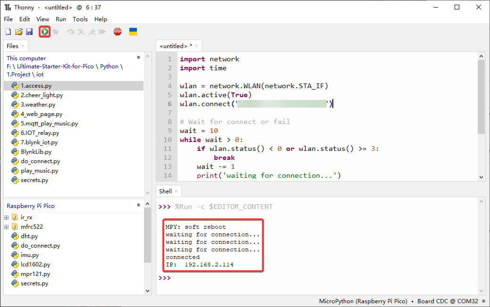
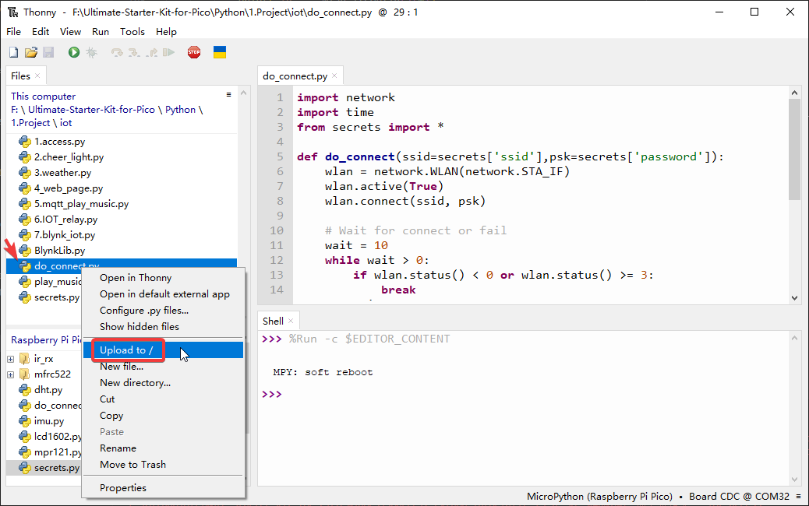
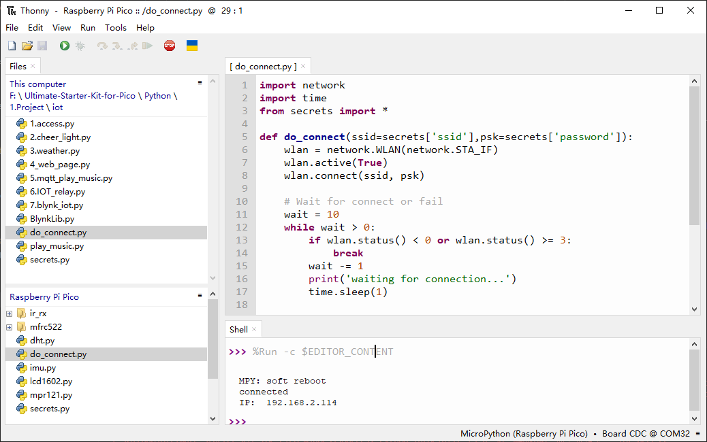

.. _access_network:

7.1 Access to the Network
=========================
Welcome to the **Internet of Things (IoT) world**! 🌐 

The Raspberry Pi Pico W opens up endless possibilities by adding Wi-Fi connectivity to your projects. While it shares the same GPIO pins, microUSB port, and compact size as the regular Pico, the addition of the **CYW43439 2.4GHz Wi-Fi chip** from Infineon transforms it into a powerful IoT device.

**🚀 What This Means for Your Projects:**
- **Connect to the internet** and access web services
- **Send sensor data** to cloud platforms  
- **Control your projects remotely** from anywhere in the world
- **Receive real-time updates** and notifications
- **Build smart home devices** that integrate with existing systems

**📡 In This Chapter:**
You'll learn the fundamental skills for IoT development - how to connect your Pico W to Wi-Fi networks reliably and securely. These techniques form the foundation for all the exciting IoT projects that follow!

Component List
^^^^^^^^^^^^^^^
- Raspberry Pi Pico W x1
- MicroUSB cable x1

1. Connect to the Internet
-----------------------------------------------
**🎯 The Simplest IoT Connection Ever!**

Believe it or not, with just **5 lines of MicroPython code**, your Raspberry Pi Pico W can join the global internet! This is where your IoT journey begins.

**⚡ Quick Start Options:**
- **Interactive mode**: Type these commands directly in the Thonny Shell, pressing ``Enter`` after each line
- **Script mode**: Create a new ``.py`` file and run it as a complete program

.. code-block:: python

    import network
    wlan = network.WLAN(network.STA_IF)
    wlan.active(True)
    wlan.connect("SSID","PASSWORD")
    print(wlan.isconnected())

#. Create a new script by clicking the **New** button on Thonny, and copy and paste the above code, changing the ``SSID`` and ``PASSWORD`` to your own.

    .. image:: img/iot/access1.png

#. To run the script, click the **Run current script** button or press F5. If the connection is successful, ``true`` will be printed. 

    .. note::

        Make sure the Raspberry Pi Pico W is connected to computer via a USB cable, then click on the bottom right corner to select MicroPython (Raspberry Pi Pico).COMXxx as the interpreter.

    .. image:: img/iot/access2.png

2. Professional Connection with Timeout & IP Display
-------------------------------------------------------------
**🔧 Real-World Reliability!**

In the real world, networks aren't always perfect. Let's make our connection code **production-ready** by adding timeout handling and useful feedback.

**✨ Enhanced Features:**
- **Smart timeout**: Won't wait forever if the network is down
- **Status monitoring**: See exactly what's happening during connection
- **IP address display**: Know your device's network identity
- **Error handling**: Gracefully handle connection failures

.. code-block:: python

    import network
    import time

    wlan = network.WLAN(network.STA_IF)
    wlan.active(True)
    wlan.connect("SSID","PASSWORD")

    # Wait for connect or fail
    wait = 10
    while wait > 0:
        if wlan.status() < 0 or wlan.status() >= 3:
            break
        wait -= 1
        print('waiting for connection...')
        time.sleep(1)

    # Handle connection error
    if wlan.status() != 3:
        raise RuntimeError('wifi connection failed')
    else:
        print('connected')
        print('IP: ', wlan.ifconfig()[0])

* ``wlan.status()`` function: Returns the current status of the wireless connection, the return value is shown in the table below.

    .. list-table::
        :widths: 40 10 50

        * - Status
          - Value
          - Description
        * - STAT_IDLE 
          - 0 
          - no connection and no activity,
        * - STAT_CONNECTING 
          - 1 
          - connecting in progress,
        * - STAT_WRONG_PASSWORD 
          - -3 
          - failed due to incorrect password,
        * - STAT_NO_AP_FOUND 
          - -2 
          - failed because no access point replied,
        * - STAT_CONNECT_FAIL 
          - -1 
          - failed due to other problems,
        * - STAT_GOT_IP 
          - 3 
          - connection successful.

* ``wlan.ifconfig()`` function: Obtains IP addresses, subnet masks, gateways, and DNS servers. This method will return a 4-tuple containing the above information when called directly. In this case, we only print the IP address.

*  `class WLAN – MicroPython Docs <https://docs.micropython.org/en/latest/library/network.WLAN.html>`_

.. _create_secrets:

3. Secure Your Credentials with ``secrets.py``
----------------------------------------------------------

**🔒 IoT Security Best Practice!**

When sharing your amazing IoT projects on GitHub or with friends, you definitely don't want to accidentally share your Wi-Fi password or API keys! This is where **security-conscious development** begins.

**🛡️ Why This Matters:**
- **Privacy protection**: Keep your personal network credentials safe
- **Professional development**: Follow industry-standard security practices
- **Future-proofing**: Prepare for projects that use API keys, tokens, and other sensitive data
- **Easy sharing**: Share your code without worrying about exposing private information

You can find this file in Ultimate-Starter-Kit-for-Pico-W/1.Python/iot

#. Note to change ``SSID`` and ``PASSWORD`` to yours.

    .. code-block:: python

        secrets = {
        'ssid': 'SSID',
        'password': 'PASSWORD',
        }

    .. image:: img/iot/access4.png

#. After modifying, right-click to upload it to your Raspberry Pi Pico W

    .. image:: img/iot/access5.png

#. Now you can see this script in your Raspberry Pi Pico W.

    .. image:: img/iot/access6.png

#. In other scripts, you can call it as follows. If you run it, you will see a successful Wi-Fi connection. The ``secrets.py`` file is imported as a library, so we need not worry about leakage of information.

    .. code-block:: python
        :emphasize-lines: 7,22

        """
        Simple WiFi Connection Demo
        This file demonstrates basic WiFi connection for educational purposes
        """
        import network
        import time
        from secrets import secrets

        # Connection configuration constants
        MAX_WAIT_TIME = 10          # Maximum connection wait time in seconds  
        CONNECTED_STATUS = 3        # WiFi connected status code
        RETRY_INTERVAL = 1          # Time between connection checks

        print("Starting WiFi connection demo...")
        print(f"Attempting to connect to: {secrets['ssid']}")

        # Initialize and activate WiFi interface
        wlan = network.WLAN(network.STA_IF)
        wlan.active(True)

        # Start connection attempt
        wlan.connect(secrets['ssid'], secrets['password'])

        # Monitor connection progress with timeout
        remaining_time = MAX_WAIT_TIME
        while remaining_time > 0:
            current_status = wlan.status()
            
            # Check if connection completed (success or failure)
            if current_status < 0 or current_status >= CONNECTED_STATUS:
                break
                
            remaining_time -= 1
            print(f"Establishing connection... {remaining_time}s remaining")
            time.sleep(RETRY_INTERVAL)

        # Display connection result
        if wlan.status() != CONNECTED_STATUS:
            print(f"ERROR: WiFi connection failed with status {wlan.status()}")
            raise RuntimeError("WiFi connection failed")
        else:
            ip_address = wlan.ifconfig()[0]
            print("SUCCESS: WiFi connection established")
            print(f"Device IP Address: {ip_address}")
            print("Connection demo completed successfully")

            
    .. image:: img/iot/access7.png

.. _do_connect:

4. Reusable Connection Module - ``do_connect.py``
--------------------------------------------------------------

**🔧 Professional Code Organization!**

As your IoT projects grow more complex, you'll want to **reuse your Wi-Fi connection code** across multiple projects. The ``do_connect.py`` module is a clean, professional solution that makes connecting to Wi-Fi as simple as calling a single function.

**💡 Why Use a Separate Module:**
- **Code reusability**: Write once, use everywhere
- **Clean project structure**: Keep your main code focused on the core functionality
- **Easy maintenance**: Update connection logic in one place
- **Professional practice**: Follow modular programming principles

You can find this file in Ultimate-Starter-Kit-for-Pico-W/1.Python/iot, and we need to upload it to the Pico W.

#. Calling it in other scripts by the following will allow the Raspberry Pi Pico W to connect to the network.

    .. code-block:: python

        from do_connect import *
        do_connect()
