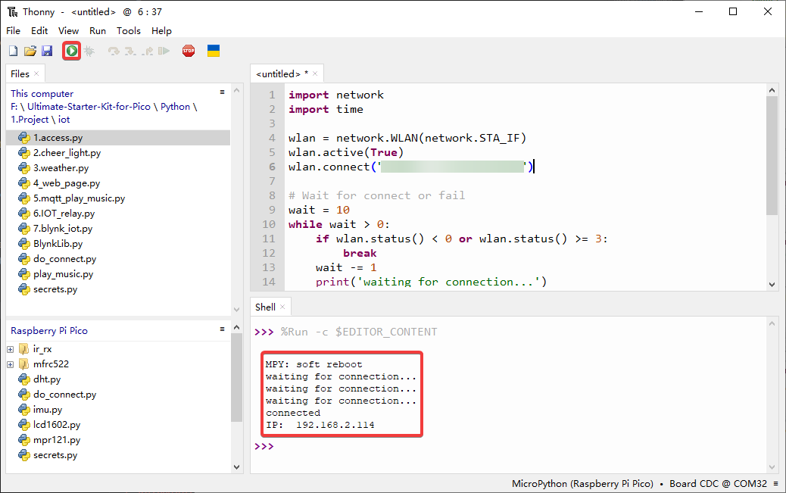
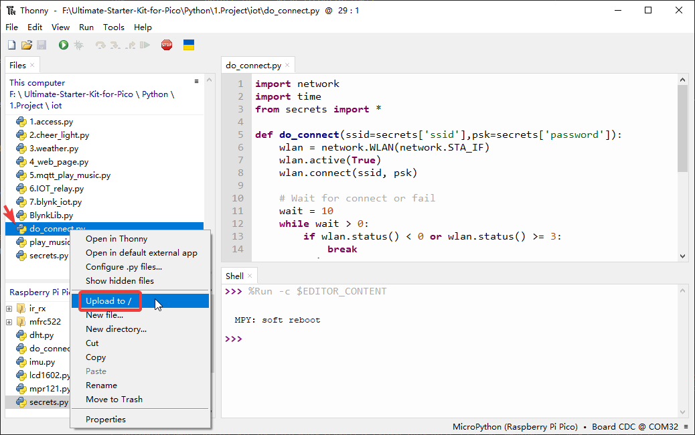
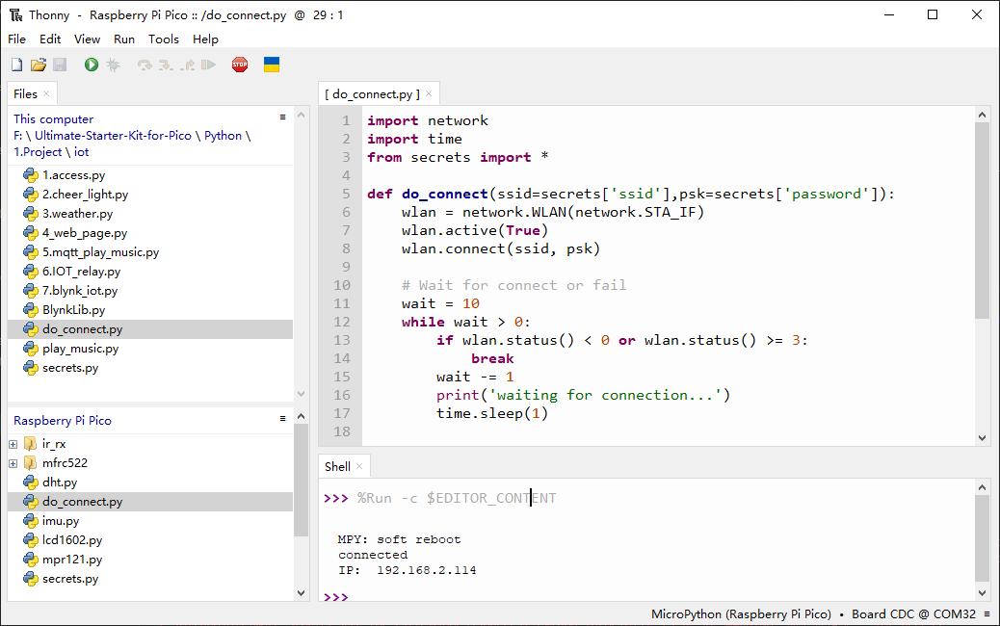

.. _access_network:

7.1 Access to the Network
=========================
Raspberry Pi Pico W is very similar to Raspberry Pi Pico, with the same GPIO, mi
croUSB port, and size. The only difference is the addition of the CYW43439 2.4-G
Hz Wi-Fi chip from Infineon. Now let's see how it connects to our Wi-Fi network.

Component List
^^^^^^^^^^^^^^^
- Raspberry Pi Pico W x1
- MicroUSB cable x1

1.Connect to the Internet
-----------------------------------------------
With just five lines of MicroPython, our Raspberry Pi Pico W is happily connected to the Internet.

These 5 lines of code can be run directly from the Shell, pressing the ``Enter`` after you typing.
Or refer to the following method and create a new ``.py`` file to run it.

.. code-block:: python

    import network
    wlan = network.WLAN(network.STA_IF)
    wlan.active(True)
    wlan.connect("SSID","PASSWORD")
    print(wlan.isconnected())

#. Create a new script by clicking the **New** button on Thonny, and copy and paste the above code, changing the ``SSID`` and ``PASSWORD`` to your own.

    .. image:: img/iot/access1.png

#. To run the script, click the **Run current script** button or press F5. If the connection is successful, ``true`` will be printed. 

    .. note::

        Make sure the Raspberry Pi Pico W is connected to computer via a USB cable, then click on the bottom right corner to select MicroPython (Raspberry Pi Pico).COMXxx as the interpreter.

    .. image:: img/iot/access2.png

2. Timeout Judgment and Show IP
-----------------------------------------------

Considering some poor network conditions, let's add some timeout judgment to the code.

If the connection is successful, the IP of Pico W will be displayed after copying and running the script.

.. code-block:: python

    import network
    import time

    wlan = network.WLAN(network.STA_IF)
    wlan.active(True)
    wlan.connect("SSID","PASSWORD")

    # Wait for connect or fail
    wait = 10
    while wait > 0:
        if wlan.status() < 0 or wlan.status() >= 3:
            break
        wait -= 1
        print('waiting for connection...')
        time.sleep(1)

    # Handle connection error
    if wlan.status() != 3:
        raise RuntimeError('wifi connection failed')
    else:
        print('connected')
        print('IP: ', wlan.ifconfig()[0])

* ``wlan.status()`` function: Returns the current status of the wireless connection, the return value is shown in the table below.

    .. list-table::
        :widths: 40 10 50

        * - Status
          - Value
          - Description
        * - STAT_IDLE 
          - 0 
          - no connection and no activity,
        * - STAT_CONNECTING 
          - 1 
          - connecting in progress,
        * - STAT_WRONG_PASSWORD 
          - -3 
          - failed due to incorrect password,
        * - STAT_NO_AP_FOUND 
          - -2 
          - failed because no access point replied,
        * - STAT_CONNECT_FAIL 
          - -1 
          - failed due to other problems,
        * - STAT_GOT_IP 
          - 3 
          - connection successful.

* ``wlan.ifconfig()`` function: Obtains IP addresses, subnet masks, gateways, and DNS servers. This method will return a 4-tuple containing the above information when called directly. In this case, we only print the IP address.

*  `class WLAN – MicroPython Docs <https://docs.micropython.org/en/latest/library/network.WLAN.html>`_

.. _create_secrets:

3. Save private information to ``secrets.py``
----------------------------------------------------------

When you share your Pico W project, you should not want others to see your Wi-Fi password or API key.
For good security, we can create a ``secrets.py`` file to store your private information.

You can find this file in Ultimate-Starter-Kit-for-Pico-W/1.Python/iot

#. Note to change ``SSID`` and ``PASSWORD`` to yours.

    .. code-block:: python

        secrets = {
        'ssid': 'SSID',
        'password': 'PASSWORD',
        }

    .. image:: img/iot/access4.png

#. 修改完成之后右键上传到你的树莓派PICO W中

    .. image:: img/iot/access5.png

#. Now you can see this script in your Raspberry Pi Pico W.

    .. image:: img/iot/access6.png

#. In other scripts, you can call it as follows. If you run it, you will see a successful Wi-Fi connection. The ``secrets.py`` file is imported as a library, so we need not worry about leakage of information.

    .. code-block:: python
        :emphasize-lines: 3,7

        import network
        import time
        from secrets import secrets

        wlan = network.WLAN(network.STA_IF)
        wlan.active(True)
        wlan.connect(secrets['ssid'], secrets['password'])

        # Wait for connect or fail
        wait = 10
        while wait > 0:
            if wlan.status() < 0 or wlan.status() >= 3:
                break
            wait -= 1
            print('waiting for connection...')
            time.sleep(1)

        # Handle connection error
        if wlan.status() != 3:
            raise RuntimeError('wifi connection failed')
        else:
            print('connected')
            print('IP: ', wlan.ifconfig()[0])
            
    .. image:: img/iot/access7.png

.. _do_connect:

1. Connect to the Internet via ``do_connect.py``
--------------------------------------------------------------
``do_connect.py`` is a simple script that uses the WLAN object to connect to a WiFi network. We keep it as a separate file so we can easily import and use it whenever needed.

You can find this file in Ultimate-Starter-Kit-for-Pico-W/1.Python/iot, and we need to upload it to the Pico W.

#. Calling it in other scripts by the following will allow the Raspberry Pi Pico W to connect to the network.

    .. code-block:: python

        from do_connect import *
        do_connect()
