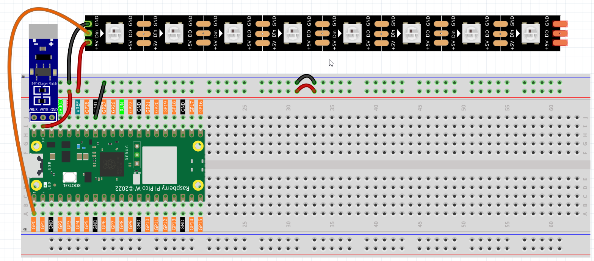

7.2 Sync Global Lights @CheerLights
=======================================

This is a romantic project, join the `CheerLights <https://x.com/cheerlights/>`_ LED color-changing community, which allows LEDs all over the world to change colors simultaneously.

You can place it in a corner of your office to remind yourself that you are not alone.

You can tweeting @cheerlights and including the color name in the tweet. This will change the LEDs around the world to the color you specify.

Component List
^^^^^^^^^^^^^^^
- Raspberry Pi Pico W x1
- MicroUSB cable x1
- 830 Tie-Points Breadboard x1
- Li-po Charger Module x1
- Battery Holder x1
- Jumper Wire Several

Connect
^^^^^^^^^
.. warning:: 
    Make sure your Li-po Charger Module is connected as shown in the diagram. Otherwise, a short circuit will likely damage your battery and circuitry.

Code
^^^^^^^^^
#. Switch the path to the folder where you downloaded the `code package <https://github.com/lafvintech/Ultimate-Starter-Kit-for-Pico-W/archive/refs/heads/main.zip>`_ before and open the ``7.2cheer_light.py`` file under the path of ``Ultimate-Starter-Kit-for-Pico-W/Python/iot``.

#. To run the script, click the **Run current script** button or press F5, then you will see the connected prompt, the IP and the color (0xff0000 is red) in the Shell.

    .. note::

        Before running the code, you need to make sure you have ``do_connect.py`` and ``secrets.py`` scripts in your Pico W.

    .. image:: img/4.software/7.2.png

#. After the script runs, the WS2812 RGB strip will show a color, sometimes the color will change.

#. If you want to run this script on boot, you need to save it to the Raspberry Pi Pico W as ``main.py``, as follows.

    * Stop the script from running and click **File** -> **Save as**.

        .. image:: img/4.software/7.2-1.png

    * Select **Raspberry Pi Pico** in the popup window that appears.

        .. image:: img/4.software/7.2-2.png

    * Set the file name to ``main.py``. A prompt will appear if the same file already exists on your Pico W.

        .. image:: img/4.software/7.2-3.png
    
    * You can now unplug the USB cable and use the Li-po Charger Module to power the Raspberry Pi Pico W. Put it in a corner and it will work automatically.

**How it works?**

The Raspberry Pi Pico W accesses the internet through the scripts ``do_connect.py`` and ``secrets.py``. For more details, see :ref:`access_network`.

.. code-block:: python

    from do_connect import *
    do_connect()

Set WS2812 RGB strip, please refer to :ref:`py_neopixel` for its usage details. 

.. code-block:: python

    import machine
    from ws2812 import WS2812
    ws = WS2812(machine.Pin(18), 8)

Now, we need a way to get the color of @CheerLights. There is a back-end system that takes the color changes from Twitter
and posts them in JSON format to the URL: http://api.thingspeak.com/channels/1417/field/2/last.json.

If you open this URL directly in your browser, you will see something like the following. All we need is the ``field2`` data, which is a hexadecimal color-coded string.

.. code-block:: 

    {"created_at":"2022-08-16T06:12:44Z","entry_id":870488,"field2":"#ff00ff"}

We need to use the ``urequests`` module to get this data and the ``json`` module to convert this character into a python dictionary.
The following code gets the latest @CheerLights color from the url and returns a color value that can be used by WS2812.

.. code-block:: python

    def get_colour():
        url = "http://api.thingspeak.com/channels/1417/field/2/last.json"
        try:
            r = urequests.get(url)
            if r.status_code > 199 and r.status_code < 300:
                cheerlights = json.loads(r.content.decode('utf-8'))
                print(cheerlights['field2'])
                colour = int('0x'+cheerlights['field2'][1:7])#Convert from String to Integer
                r.close()
                return colour
            else:
                return None
        except Exception as e:
            print(e)
            return None

Finally, use a loop to make the ws2812 work once per minute.

.. code-block:: python

    while True:
        colour = get_colour()
        if colour is not None:
            ws.write_all(colour)
        time.sleep(60)
