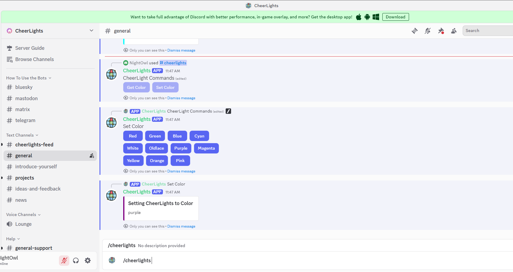

7.2 Global Light Synchronization - CheerLights Project
============================================================

**🌍 Connect Your LEDs to the World!**

Join the magical **CheerLights community** - a global network where thousands of LED lights around the world change colors together in perfect synchronization! This isn't just a project; it's a way to feel connected to people everywhere.

**✨ What Makes This Special:**
- **Global synchronization**: Your LEDs change with lights in homes, offices, and makerspaces worldwide
- **Real-time interaction**: When someone changes the color, everyone sees it within seconds
- **Community spirit**: Place it in your workspace as a reminder that you're part of a global maker community
- **Always evolving**: The colors change throughout the day as people around the world participate

**🎨 How to Participate:**
- **Twitter**: Tweet @cheerlights with a color name (like "red", "blue", "green")
- **Discord**: Use the `/cheerlights` command in the community Discord server
- **Just watch**: Enjoy the spontaneous color changes created by the global community

**💡 Perfect For:**
- Office ambiance that connects you to the world
- Learning about IoT, APIs, and global data synchronization
- Creating a conversation piece that tells a story
- Understanding how thousands of devices can work together seamlessly

Component List
^^^^^^^^^^^^^^^
- Raspberry Pi Pico W x1
- MicroUSB cable x1
- 830 Tie-Points Breadboard x1
- RGB 8 LED Strip x1
- Li-po Charger Module x1
- Battery Holder x1
- Jumper Wire Several

Connect
^^^^^^^^^
.. warning:: 
    Make sure your Li-po Charger Module is connected as shown in the diagram. Otherwise, a short circuit will likely damage your battery and circuitry.

Code
^^^^^^^^^
#. Switch the path to the folder where you downloaded the `code package <https://github.com/lafvintech/Ultimate-Starter-Kit-for-Pico-W/archive/refs/heads/main.zip>`_ before and open the ``2cheer_light.py`` file under the path of ``Ultimate-Starter-Kit-for-Pico-W/1.Python/iot``.

#. To run the script, click the **Run current script** button or press F5, then you will see the connected prompt, the IP and the color (0xffC0CB is Pink) in the Shell.

    .. note::

        Before running the code, you need to make sure you have ``do_connect.py`` and ``secrets.py`` scripts in your Pico W.

    .. image:: img/4.software/7.2.png

#. After the script runs, the WS2812 RGB strip will show a color, sometimes the color will change.

#. If you want to run this script on boot, you need to save it to the Raspberry Pi Pico W as ``main.py``, as follows.

    * Stop the script from running and click **File** -> **Save as**.

        .. image:: img/4.software/7.2-1.png

    * Select **Raspberry Pi Pico** in the popup window that appears.

        .. image:: img/4.software/7.2-2.png

    * Set the file name to ``main.py``. A prompt will appear if the same file already exists on your Pico W.

        .. image:: img/4.software/7.2-3.png
    
    * You can now unplug the USB cable and use the Li-po Charger Module to power the Raspberry Pi Pico W. Put it in a corner and it will work automatically.

**🔧 How the Global Synchronization Works**

**🌐 Step 1: Internet Connection**
The Pico W connects to your Wi-Fi using the professional connection modules from Chapter 7.1:

.. code-block:: python

    from do_connect import do_connect
    do_connect()

**💡 Step 2: LED Strip Setup**
Configure the WS2812 RGB strip for beautiful color displays:

.. code-block:: python

    from ws2812 import WS2812
    import machine
    led_strip = WS2812(machine.Pin(0), 8)  # Pin 0, 8 LEDs

**📡 Step 3: The CheerLights API Magic**
The global CheerLights system uses a ThingSpeak API that provides real-time color data in JSON format:

**API URL:** `http://api.thingspeak.com/channels/1417/field/2/last.json`

**Example Response:**
.. code-block:: json

    {"created_at":"2024-01-15T14:30:22Z","entry_id":912456,"field2":"#ff00ff"}

The ``field2`` contains the current global color in hexadecimal format (like ``#ff00ff`` for magenta).

**⚡ Step 4: Professional Color Fetching Function**
The improved code includes robust error handling and timeout protection:

.. code-block:: python

    def get_color():
        """Get current CheerLights color with professional error handling"""
        response = None
        try:
            print("Getting new color...")
            response = urequests.get(API_URL, timeout=10)
            
            if response.status_code == 200:
                data = json.loads(response.content.decode('utf-8'))
                hex_color = data['field2']
                print(f"New color: {hex_color}")
                
                # Convert hex string to integer (remove # symbol)
                color = int('0x' + hex_color[1:7], 16)
                return color
            else:
                print(f"HTTP error: status {response.status_code}")
                return None
                
        except OSError as e:
            print(f"Network error: {e}")
            return None
        except Exception as e:
            print(f"Unexpected error: {e}")
            return None
        finally:
            # Always clean up resources
            if response:
                try:
                    response.close()
                except:
                    pass

**🔄 Step 5: Intelligent Main Loop**
The system runs continuously with smart error recovery:

.. code-block:: python

    # Main loop with error recovery
    consecutive_errors = 0
    MAX_ERRORS = 3

    while True:
        try:
            color = get_color()
            
            if color is not None:
                led_strip.write_all(color)  # Update all LEDs
                print("LEDs updated!")
                consecutive_errors = 0
            else:
                consecutive_errors += 1
                # Auto-reconnect WiFi after multiple failures
                if consecutive_errors >= MAX_ERRORS:
                    print("Attempting WiFi reconnect...")
                    do_connect()
                    consecutive_errors = 0
            
            time.sleep(10)  # Check every 10 seconds
            
        except KeyboardInterrupt:
            break
        except Exception as e:
            print(f"Error: {e}")
            time.sleep(10)

**✨ Key Improvements in This Version:**
- **Faster updates**: Checks every 10 seconds instead of 60
- **Timeout protection**: Prevents hanging on slow networks
- **Auto-recovery**: Automatically reconnects WiFi after failures
- **Resource management**: Properly closes HTTP connections
- **Error tracking**: Counts consecutive failures for smart recovery
- **Professional logging**: Clear status messages for debugging

**🎮 How to Control Global Lights via Discord**

Want to change the color of thousands of LEDs around the world? Here's how to join the interactive community:

**Step 1: Join the CheerLights Discord Community**

1. **Open the invitation link**: https://discord.com/invite/uFDt7xNFKP
2. **Accept the invitation** to join the global CheerLights community (works on both computer and mobile)

**Step 2: Use the CheerLights Command**

1. **Enter the community** and click on the **"General"** channel
2. **Type `/cheerlights`** in the chat box

**Step 3: Choose Your Global Color**

1. **Select "set color"** from the popup menu
2. **Pick your favorite color** from the available options
3. **Wait a few moments** - you'll see the color change on your LED strip!

.. image:: img/iot/7.2-2.png

**🌍 The Magic Moment:**
Within seconds of your selection, **every CheerLights-connected LED around the world** will change to your chosen color! You're now part of a global light orchestra, conducting colors across continents.

**🎨 Available Colors:**
The CheerLights community supports these colors: red, green, blue, cyan, white, warmwhite, purple, magenta, yellow, orange, pink, and more!

**💫 Community Impact:**
Every time you change the color, you're creating a moment of global synchronization - thousands of people around the world will see your color choice light up their spaces. It's a beautiful way to feel connected to the global maker community!

