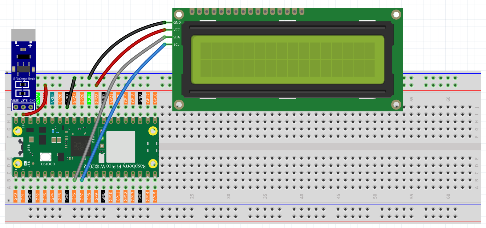

7.3 Smart Weather Station with LCD Display
===========================================

**🌤️ Your Personal Weather Command Center!**

Build a professional weather station that displays real-time weather information and local time on an LCD screen. This isn't just a simple clock - it's a sophisticated meteorological device that connects to global weather networks and brings the world's weather data right to your desk!

**✨ What You're Building:**
- **Smart Weather Display**: Real-time temperature, humidity, and weather conditions
- **Auto-Time Sync**: Automatically synchronizes with global time servers  
- **Local Time Display**: Shows accurate local time with timezone correction
- **Global Weather Access**: Connects to OpenWeatherMap's worldwide weather network
- **Professional Reliability**: Built-in error recovery and WiFi reconnection
- **Portable Design**: Battery-powered operation for placement anywhere

**🎯 Perfect For:**
- Desktop weather monitoring
- Learning IoT and API integration  
- Understanding time synchronization protocols
- Building professional embedded systems
- Creating useful everyday devices

Component List
^^^^^^^^^^^^^^^
- Raspberry Pi Pico W x1
- MicroUSB cable x1
- LCD1602
- Li-po Charger Module x1
- Battery Holder x1
- Jumper Wire Several

Connect
^^^^^^^^^

.. warning:: 
        
    Make sure your Li-po Charger Module is connected as shown in the diagram. Otherwise, a short circuit will likely damage your battery and circuitry.

Code
^^^^^^^^^

`OpenWeatherMap <https://openweathermap.org/>`_ is an online service, owned by OpenWeather Ltd, that provides global weather data via API, including current weather data, forecasts, nowcasts and historical weather data for any geographical location.

#. Visit `OpenWeatherMap website <https://home.openweathermap.org/users/sign_in>`_  to log in/create an account.

    .. image:: img/iot/OWM1.png

#. Click into the ``API`` page from the navigation bar.

    .. image:: img/iot/OWM2.png

#. Scroll down to find **Current Weather Data** and click **Subscribe**.

    .. image:: img/iot/OWM3.png

#. Scroll down to find **Free Access** and click **Get API key**. The free plan is perfect for our project.

   .. image:: img/iot/OWM4.png

#. After clicking **Get API key**, click on **My API keys** from the dropdown menu in the top-right corner to view your API key.

   .. image:: img/iot/OWM5.png
    
   .. image:: img/iot/OWM6.png

#. Copy it to the ``secrets.py`` script in Raspberry Pi Pico W.

    .. image:: img/iot/OWM7.png

    .. note::

        If you don't have ``do_connect.py`` and ``secrets.py`` scripts in your Pico W, please refer to :ref:`access_network` to create them.

    .. code-block:: python
        :emphasize-lines: 4

        secrets = {
        'ssid': 'SSID',
        'password': 'PASSWORD',
        'openweather_api_key':'OPENWEATHERMAP_API_KEY'
        }

**4. Run the Script**

#. Open the ``3_weather.py`` file under the path of ``Ultimate-Starter-Kit-for-Pico-W/1.Python/iot``, click the **Run current script** button or press F5 to run it.

    .. image:: img/iot/OWM8.png

#. After the script runs, you will see the time and weather information of your location on the I2C LCD1602.

    .. note:: 

        When the code is running, if the screen is blank, you can turn the potentiometer on the back of the module to increase the contrast.

#. If you want this script to be able to boot up, you can save it to the Raspberry Pi Pico W as ``main.py``.

.. code-block:: python

    """
    Weather Station with LCD Display
    Displays real-time weather information and local time on LCD screen
    """
    import urequests
    import time
    import ntptime
    from machine import I2C, Pin
    from lcd1602 import LCD
    from secrets import secrets
    from do_connect import do_connect

    # Hardware configuration constants
    LCD_SDA_PIN = 6                # I2C SDA pin for LCD
    LCD_SCL_PIN = 7                # I2C SCL pin for LCD  
    I2C_FREQUENCY = 400000         # I2C bus frequency
    I2C_BUS = 1                    # I2C bus number

    # Display timing constants
    LCD_CLEAR_DELAY = 200          # LCD clear delay in milliseconds
    UPDATE_INTERVAL = 30           # Weather update interval in seconds
    NTP_RETRY_DELAY = 2            # Delay between NTP sync attempts

    # Weather API constants
    DEFAULT_CITY = "Shenzhen"        # Default city for weather
    DEFAULT_UNITS = "metric"       # Default measurement units
    API_TIMEOUT = 10               # HTTP request timeout in seconds

    print("Starting Weather Station...")

    # Connect to WiFi
    print("Connecting to WiFi...")
    do_connect()

    # Sync time with NTP server
    print("Synchronizing time...")
    ntp_attempts = 0
    MAX_NTP_ATTEMPTS = 5

    while ntp_attempts < MAX_NTP_ATTEMPTS:
        try:
            ntptime.settime()
            print("Time synchronized successfully")
            break
        except OSError as e:
            ntp_attempts += 1
            print(f"Time sync attempt {ntp_attempts}/{MAX_NTP_ATTEMPTS}...")
            time.sleep(NTP_RETRY_DELAY)

    if ntp_attempts >= MAX_NTP_ATTEMPTS:
        print("WARNING: Time sync failed, using local time")

    # Initialize LCD display
    print(f"Initializing LCD on I2C bus {I2C_BUS}")
    try:
        i2c = I2C(I2C_BUS, sda=Pin(LCD_SDA_PIN), scl=Pin(LCD_SCL_PIN), freq=I2C_FREQUENCY)
        lcd = LCD(i2c)
        lcd.clear()
        time.sleep_ms(LCD_CLEAR_DELAY)
        lcd.message("Weather Station\nInitializing...")
        print("LCD initialized successfully")
    except Exception as e:
        print(f"ERROR: LCD initialization failed - {e}")
        raise

    # OpenWeather API unit definitions
    TEMPERATURE_UNITS = {
        "standard": "K",      # Kelvin
        "metric": "°C",       # Celsius  
        "imperial": "°F",     # Fahrenheit
    }

    SPEED_UNITS = {
        "standard": "m/s",    # Meters per second
        "metric": "m/s",      # Meters per second
        "imperial": "mph",    # Miles per hour
    }

    def get_weather_data(city=DEFAULT_CITY, api_key=None, units=DEFAULT_UNITS, lang='zh_cn'):
        """
        Fetch weather data from OpenWeatherMap API
        
        Args:
            city: City name for weather lookup
            api_key: OpenWeatherMap API key
            units: Measurement units (metric/imperial/standard)
            lang: Language for weather descriptions
        
        Returns:
            dict: Weather data or None if failed
        """
        if not api_key:
            print("ERROR: No API key provided")
            return None
            
        try:
            # Build API URL
            url = f"https://api.openweathermap.org/data/2.5/weather?q={city}&appid={api_key}&units={units}&lang={lang}"
            print(f"Fetching weather for {city}...")
            
            # Make HTTP GET request with timeout
            response = urequests.get(url, timeout=API_TIMEOUT)
            
            if response.status_code == 200:
                weather_data = response.json()
                response.close()
                print("Weather data retrieved successfully")
                return weather_data
            else:
                print(f"API error: HTTP {response.status_code}")
                response.close()
                return None
                
        except OSError as e:
            print(f"Network error: {e}")
            return None
        except Exception as e:
            print(f"Weather fetch error: {e}")
            return None

    def display_weather_debug(weather_data, units=DEFAULT_UNITS):
        """Print detailed weather information for debugging"""
        if not weather_data:
            print("No weather data to display")
            return
            
        try:
            timezone_hours = int(weather_data["timezone"] / 3600)
            sunrise = time.localtime(weather_data['sys']['sunrise'] + weather_data["timezone"])
            sunset = time.localtime(weather_data['sys']['sunset'] + weather_data["timezone"])
            
            print(f'=== Weather Details ===')
            print(f'City: {weather_data["name"]}, {weather_data["sys"]["country"]}')
            print(f'Coordinates: [{weather_data["coord"]["lon"]}, {weather_data["coord"]["lat"]}]')
            print(f'Timezone: UTC{timezone_hours:+d}')
            print(f'Sunrise: {sunrise[3]:02d}:{sunrise[4]:02d}')
            print(f'Sunset: {sunset[3]:02d}:{sunset[4]:02d}')
            print(f'Weather: {weather_data["weather"][0]["main"]}')
            print(f'Temperature: {weather_data["main"]["temp"]:.1f}{TEMPERATURE_UNITS[units]}')
            print(f'Feels like: {weather_data["main"]["feels_like"]:.1f}{TEMPERATURE_UNITS[units]}')
            print(f'Humidity: {weather_data["main"]["humidity"]}%')
            print(f'Pressure: {weather_data["main"]["pressure"]}hPa')
            
            if "wind" in weather_data:
                print(f'Wind: {weather_data["wind"]["speed"]}{SPEED_UNITS[units]}')
            if "visibility" in weather_data:
                print(f'Visibility: {weather_data["visibility"]}m')
                
        except KeyError as e:
            print(f"Missing weather data field: {e}")
        except Exception as e:
            print(f"Error displaying weather: {e}")

    def update_lcd_display(lcd, weather_data, units=DEFAULT_UNITS):
        """Update LCD with current time and weather information"""
        try:
            if not weather_data:
                lcd.clear()
                lcd.message("Weather Station\nNo Data")
                return
                
            # Extract weather information
            weather_condition = weather_data["weather"][0]["main"]
            temperature = weather_data["main"]["temp"]
            humidity = weather_data["main"]["humidity"]
            
            # Calculate local time with timezone offset
            timezone_offset = int(weather_data["timezone"] / 3600)
            local_time = time.localtime()
            hours = (local_time[3] + timezone_offset) % 24
            minutes = local_time[4]
            
            # Format display strings
            line1 = f"{hours:02d}:{minutes:02d} {weather_condition}"
            line2 = f"{temperature:.1f}{TEMPERATURE_UNITS[units]} {humidity}%rh"
            
            # Update LCD display
            lcd.clear()
            time.sleep_ms(LCD_CLEAR_DELAY)
            lcd.message(f"{line1}\n{line2}")
            
            print(f"Display updated: {line1} | {line2}")
            
        except Exception as e:
            print(f"LCD update error: {e}")
            lcd.clear()
            lcd.message("Display Error\nCheck Connection")    

    # Main weather monitoring loop
    print("Starting weather monitoring...")
    print(f"Update interval: {UPDATE_INTERVAL} seconds")

    consecutive_errors = 0
    MAX_ERRORS = 3

    # Show loading message
    lcd.clear()
    lcd.message("Weather Station\nLoading...")

    while True:
        try:
            # Fetch weather data
            weather_data = get_weather_data(
                city=DEFAULT_CITY,
                api_key=secrets['openweather_api_key'],
                units=DEFAULT_UNITS
            )
            
            if weather_data:
                # Update LCD display with weather info
                update_lcd_display(lcd, weather_data, DEFAULT_UNITS)
                
                # Reset error counter on success
                consecutive_errors = 0
                
                # Optional: Print detailed debug info (uncomment to enable)
                # display_weather_debug(weather_data, DEFAULT_UNITS)
                
            else:
                # Handle weather fetch failure
                consecutive_errors += 1
                print(f"Weather fetch failed ({consecutive_errors}/{MAX_ERRORS})")
                
                # Show error on LCD
                lcd.clear()
                lcd.message(f"Weather Error\nRetry {consecutive_errors}/{MAX_ERRORS}")
                
                # Try to reconnect WiFi after multiple failures
                if consecutive_errors >= MAX_ERRORS:
                    print("Too many consecutive errors, attempting WiFi reconnect...")
                    try:
                        do_connect()
                        consecutive_errors = 0
                        print("WiFi reconnected successfully")
                        lcd.clear()
                        lcd.message("WiFi Reconnected\nResuming...")
                        time.sleep(2)
                    except Exception as e:
                        print(f"WiFi reconnect failed: {e}")
            
            # Wait before next update
            print(f"Next update in {UPDATE_INTERVAL} seconds...")
            time.sleep(UPDATE_INTERVAL)
            
        except KeyboardInterrupt:
            print("Weather station stopped by user")
            lcd.clear()
            lcd.message("Weather Station\nStopped")
            break
            
        except Exception as e:
            print(f"Unexpected error in main loop: {e}")
            consecutive_errors += 1
            lcd.clear()
            lcd.message("System Error\nCheck Console")
            time.sleep(UPDATE_INTERVAL)

**🔧 How the Professional Weather Station Works**

**🌐 Step 1: Network Connection & Configuration**
The system uses professional configuration constants and establishes WiFi connectivity:

.. code-block:: python

    # Hardware configuration constants
    LCD_SDA_PIN = 6                # I2C SDA pin for LCD
    LCD_SCL_PIN = 7                # I2C SCL pin for LCD  
    UPDATE_INTERVAL = 30           # Weather update interval in seconds
    DEFAULT_CITY = "Shenzhen"      # Default city for weather

    # Connect to WiFi using professional modules
    from do_connect import do_connect
    do_connect()

**Key Features:**
- **Configurable constants**: Easy customization of hardware pins and timing
- **Professional connection**: Uses the robust WiFi connection modules from Chapter 7.1
- **Error handling**: Built-in connection retry mechanisms

**⏰ Step 2: Intelligent Time Synchronization**
The system synchronizes with global NTP servers with retry logic:

.. code-block:: python

    # Sync time with NTP server with professional retry logic
    ntp_attempts = 0
    MAX_NTP_ATTEMPTS = 5

    while ntp_attempts < MAX_NTP_ATTEMPTS:
        try:
            ntptime.settime()
            print("Time synchronized successfully")
            break
        except OSError as e:
            ntp_attempts += 1
            print(f"Time sync attempt {ntp_attempts}/{MAX_NTP_ATTEMPTS}...")
            time.sleep(2)

    if ntp_attempts >= MAX_NTP_ATTEMPTS:
        print("WARNING: Time sync failed, using local time")

**Smart Features:**
- **Retry mechanism**: Attempts up to 5 times with delays
- **Graceful degradation**: Continues operation even if time sync fails
- **Clear status reporting**: Detailed logging of sync attempts

**📺 Step 3: Professional LCD Initialization**
The LCD display is configured with proper I2C settings and error handling:

.. code-block:: python

    # Initialize LCD with professional error handling
    try:
        i2c = I2C(I2C_BUS, sda=Pin(LCD_SDA_PIN), scl=Pin(LCD_SCL_PIN), freq=400000)
        lcd = LCD(i2c)
        lcd.clear()
        lcd.message("Weather Station\nInitializing...")
        print("LCD initialized successfully")
    except Exception as e:
        print(f"ERROR: LCD initialization failed - {e}")
        raise

**Professional Features:**
- **Hardware abstraction**: Configurable pin assignments
- **Error detection**: Immediate failure detection and reporting
- **User feedback**: Clear initialization status messages

**🌤️ Step 4: Advanced Weather Data Fetching**
The improved weather function includes comprehensive error handling and timeout protection:

.. code-block:: python

    def get_weather_data(city="Shenzhen", api_key=None, units="metric", lang='zh_cn'):
        """Fetch weather data with professional error handling"""
        if not api_key:
            print("ERROR: No API key provided")
            return None
            
        try:
            # Build API URL with all parameters
            url = f"https://api.openweathermap.org/data/2.5/weather?q={city}&appid={api_key}&units={units}&lang={lang}"
            
            # Make HTTP GET request with timeout protection
            response = urequests.get(url, timeout=10)
            
            if response.status_code == 200:
                weather_data = response.json()
                response.close()  # Always clean up resources
                return weather_data
            else:
                print(f"API error: HTTP {response.status_code}")
                response.close()
                return None
                
        except OSError as e:
            print(f"Network error: {e}")
            return None
        except Exception as e:
            print(f"Weather fetch error: {e}")
            return None

**Advanced Features:**
- **Timeout protection**: Prevents hanging on slow networks
- **Resource management**: Properly closes HTTP connections
- **Multiple error types**: Handles network, API, and general errors
- **Flexible parameters**: Configurable city, units, and language

**📊 Step 5: Smart Display Management**
The LCD display system includes timezone calculations and professional formatting:

.. code-block:: python

    def update_lcd_display(lcd, weather_data, units="metric"):
        """Update LCD with time and weather using professional formatting"""
        try:
            # Extract weather information
            weather_condition = weather_data["weather"][0]["main"]
            temperature = weather_data["main"]["temp"]
            humidity = weather_data["main"]["humidity"]
            
            # Calculate local time with timezone offset
            timezone_offset = int(weather_data["timezone"] / 3600)
            local_time = time.localtime()
            hours = (local_time[3] + timezone_offset) % 24
            minutes = local_time[4]
            
            # Format display with professional layout
            line1 = f"{hours:02d}:{minutes:02d} {weather_condition}"
            line2 = f"{temperature:.1f}°C {humidity}%rh"
            
            # Update LCD with proper timing
            lcd.clear()
            time.sleep_ms(200)  # LCD clear delay
            lcd.message(f"{line1}\n{line2}")
            
        except Exception as e:
            print(f"LCD update error: {e}")
            lcd.message("Display Error\nCheck Connection")

**Professional Features:**
- **Timezone handling**: Automatic local time calculation
- **Formatted output**: Professional temperature and humidity display
- **Error recovery**: Graceful handling of display errors
- **User-friendly layout**: Optimized for 16x2 LCD format

**🔄 Step 6: Intelligent Main Loop with Auto-Recovery**
The main monitoring loop includes smart error tracking and WiFi reconnection:

.. code-block:: python

    # Main loop with professional error recovery
    consecutive_errors = 0
    MAX_ERRORS = 3

    while True:
        try:
            # Fetch weather data
            weather_data = get_weather_data(
                city="Shenzhen",
                api_key=secrets['openweather_api_key'],
                units="metric"
            )
            
            if weather_data:
                update_lcd_display(lcd, weather_data, "metric")
                consecutive_errors = 0  # Reset on success
            else:
                consecutive_errors += 1
                lcd.message(f"Weather Error\nRetry {consecutive_errors}/3")
                
                # Auto-reconnect WiFi after multiple failures
                if consecutive_errors >= MAX_ERRORS:
                    print("Attempting WiFi reconnect...")
                    do_connect()
                    consecutive_errors = 0
            
            # Wait 30 seconds before next update
            time.sleep(30)
            
        except KeyboardInterrupt:
            lcd.message("Weather Station\nStopped")
            break
        except Exception as e:
            print(f"Unexpected error: {e}")
            lcd.message("System Error\nCheck Console")

**Smart Recovery Features:**
- **Error counting**: Tracks consecutive failures
- **Auto-reconnection**: Automatically reconnects WiFi after 3 failures
- **Status display**: Shows error status on LCD
- **Graceful shutdown**: Proper cleanup on user interruption
- **System monitoring**: Logs all errors for debugging

**✨ Key Improvements in This Professional Version:**
- **30-second updates**: Regular weather monitoring
- **Timezone accuracy**: Displays correct local time for any city
- **Resource management**: Proper HTTP connection cleanup
- **Error resilience**: Continues operation despite temporary failures
- **Professional logging**: Detailed status and error reporting
- **Configurable parameters**: Easy customization for different cities and units
- **Hardware abstraction**: Clean separation of configuration and logic