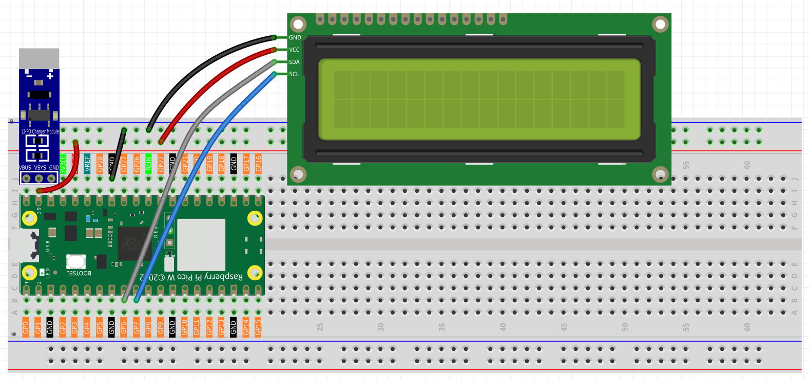

7.3 Real-time Weather From @OpenWeatherMap 
===========================================

This project involves making a smart clock that prints the weather in your city along with the time on the LCD.

Component List
^^^^^^^^^^^^^^^
- Raspberry Pi Pico W x1
- MicroUSB cable x1
- LCD1602
- Li-po Charger Module x1
- Battery Holder x1
- Jumper Wire Several

Connect
^^^^^^^^^

.. warning:: 
        
    Make sure your Li-po Charger Module is connected as shown in the diagram. Otherwise, a short circuit will likely damage your battery and circuitry.

Code
^^^^^^^^^

`OpenWeatherMap <https://openweathermap.org/>`_ is an online service, owned by OpenWeather Ltd, that provides global weather data via API, including current weather data, forecasts, nowcasts and historical weather data for any geographical location.

#. Visit `OpenWeatherMap website <https://home.openweathermap.org/users/sign_in>`_  to log in/create an account.

    .. image:: img/iot/OWM1.png

#. Click into the ``API`` page from the navigation bar.

    .. image:: img/iot/OWM2.png

#. 向下滚动找到 **Current Weather Data** and click Subscribe.

    .. image:: img/iot/OWM3.png

#. 向下滚动找到 **Free Access**, 点击get api. In our project, Free is good enough.

   .. image:: img/iot/OWM4.png

#. 点击get api之后,点击右上角弹出菜单中的My API keys查看你的api

   .. image:: img/iot/OWM5.png
    
   .. image:: img/iot/OWM6.png

#. Copy it to the ``secrets.py`` script in Raspberry Pi Pico W.

    .. image:: img/iot/OWM7.png

    .. note::

        If you don't have ``do_connect.py`` and ``secrets.py`` scripts in your Pico W, please refer to :ref:`access_network` to create them.

    .. code-block:: python
        :emphasize-lines: 4

        secrets = {
        'ssid': 'SSID',
        'password': 'PASSWORD',
        'openweather_api_key':'OPENWEATHERMAP_API_KEY'
        }

**4. Run the Script**

#. Open the ``3_weather.py`` file under the path of ``Ultimate-Starter-Kit-for-Pico-W/1.Python/iot``, click the **Run current script** button or press F5 to run it.

    .. image:: img/iot/OWM8.png

#. After the script runs, you will see the time and weather information of your location on the I2C LCD1602.

    .. note:: 

        When the code is running, if the screen is blank, you can turn the potentiometer on the back of the module to increase the contrast.

#. If you want this script to be able to boot up, you can save it to the Raspberry Pi Pico W as ``main.py``.

.. code-block:: python

    import urequests
    import time
    from machine import I2C, Pin
    from lcd1602 import LCD

    # connect the network       
    from secrets import *
    from do_connect import *
    do_connect()

    # syncing the time
    import ntptime
    while True:
        try:
            ntptime.settime()
            print('Time Set Successfully')
            break
        except OSError:
            print('Time Setting...')
            continue

    # init LCD
    i2c = I2C(1, sda=Pin(6), scl=Pin(7), freq=400000)
    lcd=LCD(i2c)

    lcd.clear() 
    string = 'Loading...'
    lcd.message(string)

    # Open Weather
    TEMPERATURE_UNITS = {
        "standard": "K",
        "metric": "°C",
        "imperial": "°F",
    }

    SPEED_UNITS = {
        "standard": "m/s",
        "metric": "m/s",
        "imperial": "mph",
    }

    units = "metric"

    def get_weather(city, api_key, units='metric', lang='en'):
        '''
        Get weather data from openweathermap.org
            city: City name, state code and country code divided by comma, Please, refer to ISO 3166 for the state codes or country codes. https://www.iso.org/obp/ui/#search
            api_key: Your unique API key (you can always find it on your openweather account page under the "API key" tab https://home.openweathermap.org/api_keys)
            unit: Units of measurement. standard, metric and imperial units are available. If you do not use the units parameter, standard units will be applied by default. More: https://openweathermap.org/current#data
            lang: You can use this parameter to get the output in your language. More: https://openweathermap.org/current#multi
        '''
        url = f"https://api.openweathermap.org/data/2.5/weather?q={city}&appid={api_key}&units={units}&lang={lang}"
        print(url)
        res = urequests.post(url)
        return res.json()

    def print_weather(weather_data):
        print(f'Timezone: {int(weather_data["timezone"] / 3600)}')
        sunrise = time.localtime(weather_data['sys']['sunrise']+weather_data["timezone"])
        sunset = time.localtime(weather_data['sys']['sunset']+weather_data["timezone"])
        print(f'Sunrise: {sunrise[3]}:{sunrise[4]}')
        print(f'Sunset: {sunset[3]}:{sunset[4]}')   
        print(f'Country: {weather_data["sys"]["country"]}')
        print(f'City: {weather_data["name"]}')
        print(f'Coordination: [{weather_data["coord"]["lon"]}, {weather_data["coord"]["lat"]}')
        print(f'Visibility: {weather_data["visibility"]}m')
        print(f'Weather: {weather_data["weather"][0]["main"]}')
        print(f'Temperature: {weather_data["main"]["temp"]}{TEMPERATURE_UNITS[units]}')
        print(f'Temperature min: {weather_data["main"]["temp_min"]}{TEMPERATURE_UNITS[units]}')
        print(f'Temperature max: {weather_data["main"]["temp_max"]}{TEMPERATURE_UNITS[units]}')
        print(f'Temperature feels like: {weather_data["main"]["feels_like"]}{TEMPERATURE_UNITS[units]}')
        print(f'Humidity: {weather_data["main"]["humidity"]}%')
        print(f'Pressure: {weather_data["main"]["pressure"]}hPa')
        print(f'Wind speed: {weather_data["wind"]["speed"]}{SPEED_UNITS[units]}')
        print(f'Wind gust: {weather_data["wind"]["gust"]}{SPEED_UNITS[units]}')
        print(f'Wind direction: {weather_data["wind"]["deg"]}°')
        if "clouds" in weather_data:
            print(f'Cloudiness: {weather_data["clouds"]["all"]}%')
        elif "rain" in weather_data:
            print(f'Rain volume in 1 hour: {weather_data["rain"]["1h"]}mm')
            print(f'Rain volume in 3 hour: {weather_data["rain"]["3h"]}mm')
        elif "snow" in weather_data:
            print(f'Snow volume in 1 hour: {weather_data["snow"]["1h"]}mm')
            print(f'Snow volume in 3 hour: {weather_data["snow"]["3h"]}mm')    

    while True:
        # get weather
        weather_data = get_weather('shenzhen', secrets['openweather_api_key'], units=units)
        weather=weather_data["weather"][0]["main"]
        t=weather_data["main"]["temp"]
        rh=weather_data["main"]["humidity"]

        # get time (+24 allows for western hemisphere)
        # if negative, add 24
        # hours = time.localtime()[3] + int(weather_data["timezone"] / 3600) + 24  #only for west hemisphere
        
        hours=time.localtime()[3]+int(weather_data["timezone"] / 3600)
        mins=time.localtime()[4]

        # LCD print
        lcd.clear() 
        time.sleep_ms(200)
        string = f'{hours:02d}:{mins:02d} {weather}\n'
        lcd.message(string)
        string = f'{t}{TEMPERATURE_UNITS[units]} {rh}%rh'
        lcd.message(string)

        # shell print
        # print_weather(weather_data)

        # refresh every 30s
        time.sleep(30)

Principle
----------

1. The Pico W connects to the network using the ``secrets.py`` and ``do_connect.py`` files.

    .. code-block:: python

        # connect the network       
        from secrets import *
        from do_connect import *
        do_connect()

- ``secrets.py`` stores sensitive information such as the Wi-Fi network's SSID and password.
- ``do_connect.py`` contains the logic to connect to the Wi-Fi network, ensuring that the Pico W can access the internet.

2. The system time of Pico W is synchronized to Greenwich Mean Time (UTC) using the ``ntptime`` module.

    .. code-block:: python

        import ntptime
        while True:
        try:
            ntptime.settime()
            print('Time Set Successfully')
            break
        except OSError:
            print('Time Setting...')
            continue

- The ``ntptime.settime()`` method is used to get the current time from an NTP server and set the system time of Pico W.
- If time synchronization fails (e.g., due to network issues), the program will keep trying until it succeeds.

3. The LCD1602 screen is initialized and cleared, and a loading message is displayed.

    .. code-block:: python

        from lcd1602 import LCD
        lcd=LCD()
        lcd.clear()
        string = 'Loading...'
        lcd.message(string)

- The LCD screen is initialized using the I2C protocol, specifying the SDA and SCL pins.
- The screen content is cleared, and the message ``Loading...`` is displayed to indicate that the program is starting.

4. The ``get_weather`` function is defined to retrieve weather data from the OpenWeatherMap API.

    .. code-block:: python

        def get_weather(city, api_key, units='metric', lang='en'):
        '''
        Get weather data from openweathermap.org
            city: City name, state code and country code divided by comma, Please, refer to ISO 3166 for the state codes or country codes. https://www.iso.org/obp/ui/#search
            api_key: Your unique API key (you can always find it on your openweather account page under the "API key" tab https://home.openweathermap.org/api_keys)
            unit: Units of measurement. standard, metric and imperial units are available. If you do not use the units parameter, standard units will be applied by default. More: https://openweathermap.org/current#data
            lang: You can use this parameter to get the output in your language. More: https://openweathermap.org/current#multi
        '''
        url = f"https://api.openweathermap.org/data/2.5/weather?q={city}&appid={api_key}&units={units}&lang={lang}"
        print(url)
        res = urequests.post(url)
        return res.json()

- The request URL is constructed with parameters including city name, API key, unit system, and language.
- A GET request is sent to the OpenWeatherMap API, and the response is returned in JSON format.

5. In the loop, you can specify your city name in ``city``, and OpenWeatherMap will return the weather information for that city. For example, the following code retrieves the weather data for London:

    .. code-block:: python

        while True:
        # get weather
        weather_data = get_weather('city', secrets['openweather_api_key'], units=units)
        #weather_data = get_weather('London', secrets['openweather_api_key'], units=units)
        weather=weather_data["weather"][0]["main"]
        t=weather_data["main"]["temp"]
        rh=weather_data["main"]["humidity"]

2. Finally, the program will display the weather information and time on the LCD1602, updating every 30 seconds.

    .. code-block:: python
        
        lcd.clear()
        time.sleep_ms(200)
        string = f'{hours:02d}:{mins:02d} {weather}\n'
        lcd.message(string)
        string = f'{t}{TEMPERATURE_UNITS[units]} {rh}%rh'
        lcd.message(string)