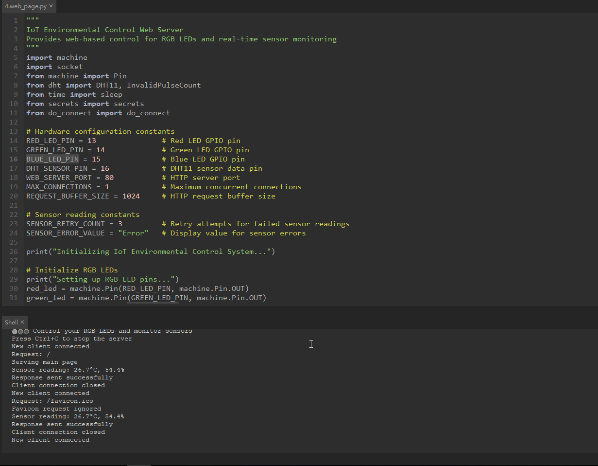
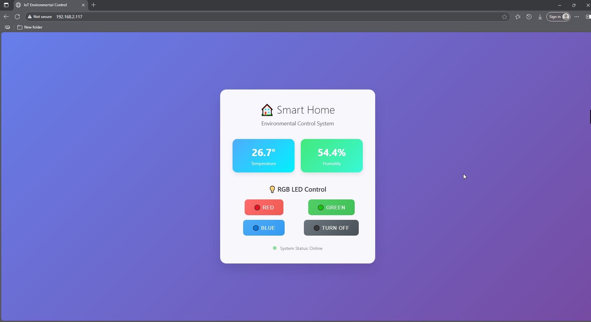

7.4 Professional IoT Web Server
==================================

**🌐 Build Your Own Smart Home Dashboard!**

Transform your Pico W into a powerful web server that creates a beautiful, responsive web interface for controlling devices and monitoring sensors. This isn't just a simple webpage - it's a professional IoT dashboard that you can access from any device on your network!

**✨ What You're Building:**
- **Beautiful Web Interface**: Modern, responsive design that works on phones, tablets, and computers
- **Real-time Sensor Monitoring**: Live temperature and humidity readings from DHT11 sensor
- **Remote LED Control**: Control RGB LEDs from any web browser on your network
- **Professional Styling**: CSS gradients, animations, and modern UI design
- **Robust Error Handling**: Smart sensor retry logic and connection management
- **Mobile-Responsive**: Optimized layout for all screen sizes

**🎯 Perfect For:**
- Learning web development and IoT integration
- Creating smart home control interfaces
- Understanding HTTP protocols and web servers
- Building professional embedded web applications
- Remote monitoring and control systems

Component List
^^^^^^^^^^^^^^^
- Raspberry Pi Pico W x1
- MicroUSB cable x1
- 830 Tie-Points Breadboard x1
- DHT11 Module x1
- Resistor 220Ω x3
- RGB-LED x1
- Li-po Charger Module x1
- Battery Holder x1
- Jumper Wire Several

.. warning:: 
    
    Modification of electrical appliances comes with great danger, do not try it 
    lightly, please do it under the guidance of professionals.

Connect
^^^^^^^^^
.. warning:: 
    Make sure your Li-po Charger Module is connected as shown in the diagram. Otherwise, a short circuit will likely damage your battery and circuitry.

.. image:: img/3.connect/7.4.png

Code
^^^^^^^
.. note::

    * Open the ``4_web_server.py`` file under the path of ``Ultimate-Starter-Kit-for-Pico-W/Python/iot`` or copy this code into Thonny, then click "Run Current Script" or simply press F5 to run it.

    * Don't forget to click on the "MicroPython (Raspberry Pi Pico)" interpreter in the bottom right corner. 
    
    * Before running the code, you need to make sure you have ``do_connect.py`` and ``secrets.py`` scripts in your Pico W, if not please refer to :ref:`access_network` to create them.

Click 'Run current script'. After a successful connection, the shell will display the IP address of the Pico W. You can then enter the IP address in your browser to see the webpage, where you can change the RGB light color using the buttons above and view the temperature and humidity.

If you want this script to be able to boot up, you can save it to the Raspberry Pi Pico W as ``main.py``.

The following is the program code:

.. code-block:: python

    """
    IoT Environmental Control Web Server
    Provides web-based control for RGB LEDs and real-time sensor monitoring
    """
    import machine
    import socket
    from machine import Pin
    from dht import DHT11, InvalidPulseCount
    from time import sleep
    from secrets import secrets
    from do_connect import do_connect

    # Hardware configuration constants
    RED_LED_PIN = 13               # Red LED GPIO pin
    GREEN_LED_PIN = 14             # Green LED GPIO pin  
    BLUE_LED_PIN = 15              # Blue LED GPIO pin
    DHT_SENSOR_PIN = 16            # DHT11 sensor data pin
    WEB_SERVER_PORT = 80           # HTTP server port
    MAX_CONNECTIONS = 1            # Maximum concurrent connections
    REQUEST_BUFFER_SIZE = 1024     # HTTP request buffer size

    # Sensor reading constants
    SENSOR_RETRY_COUNT = 3         # Retry attempts for failed sensor readings
    SENSOR_ERROR_VALUE = "Error"   # Display value for sensor errors

    print("Initializing IoT Environmental Control System...")

    # Initialize RGB LEDs
    print("Setting up RGB LED pins...")
    red_led = machine.Pin(RED_LED_PIN, machine.Pin.OUT)
    green_led = machine.Pin(GREEN_LED_PIN, machine.Pin.OUT)
    blue_led = machine.Pin(BLUE_LED_PIN, machine.Pin.OUT)

    # Initialize DHT11 sensor
    print(f"Initializing DHT11 sensor on pin {DHT_SENSOR_PIN}")
    sensor_pin = Pin(DHT_SENSOR_PIN, Pin.IN)
    dht_sensor = DHT11(sensor_pin)

    def read_sensor_data():
        """
        Read temperature and humidity from DHT11 sensor with retry logic
        
        Returns:
            tuple: (temperature, humidity) or (None, None) if failed
        """
        for attempt in range(SENSOR_RETRY_COUNT):
            try:
                dht_sensor.measure()
                temperature = dht_sensor.temperature
                humidity = dht_sensor.humidity
                
                # Validate sensor readings
                if temperature is not None and humidity is not None:
                    print(f"Sensor reading: {temperature}°C, {humidity}%")
                    return temperature, humidity
                else:
                    print(f"Invalid sensor reading on attempt {attempt + 1}")
                    
            except (OSError, InvalidPulseCount) as e:
                print(f"Sensor read attempt {attempt + 1} failed: {e}")
                
            except Exception as e:
                print(f"Unexpected sensor error on attempt {attempt + 1}: {e}")
                
            # Small delay before retry
            if attempt < SENSOR_RETRY_COUNT - 1:
                sleep(0.1)
        
        print("All sensor read attempts failed")
        return None, None

    def control_led(color):
        """
        Control RGB LED based on color selection
        
        Args:
            color: LED color ('red', 'green', 'blue', 'off')
        """
        # Turn off all LEDs first
        red_led.off()
        green_led.off()
        blue_led.off()
        
        # Turn on requested LED
        if color == 'red':
            red_led.on()
            print("LED: Red ON")
        elif color == 'green':
            green_led.on()
            print("LED: Green ON")
        elif color == 'blue':
            blue_led.on()
            print("LED: Blue ON")
        elif color == 'off':
            print("LED: All OFF")
        else:
            print(f"Unknown LED color: {color}")

    def create_beautiful_webpage(temperature, humidity):
        """
        Generate a modern, responsive webpage with beautiful CSS styling
        
        Args:
            temperature: Current temperature reading
            humidity: Current humidity reading
            
        Returns:
            str: Complete HTML page with embedded CSS
        """
        html = f"""<!DOCTYPE html>
    <html lang="en">
    <head>
        <meta charset="UTF-8">
        <meta name="viewport" content="width=device-width, initial-scale=1.0">
        <title>IoT Environmental Control</title>
        
    </head>
    <body>
        

            <h1>🏠 Smart Home</h1>
            
Environmental Control System

            
            

                

                    
{temperature}°

                    
Temperature

                

                

                    
{humidity}%

                    
Humidity

                

            

            
            

                <h3 class="section-title">💡 RGB LED Control</h3>
                

                    <form action="./red" method="get">
                        <button type="submit" class="control-btn btn-red">🔴 Red</button>
                    </form>
                    <form action="./green" method="get">
                        <button type="submit" class="control-btn btn-green">🟢 Green</button>
                    </form>
                    <form action="./blue" method="get">
                        <button type="submit" class="control-btn btn-blue">🔵 Blue</button>
                    </form>
                    <form action="./off" method="get">
                        <button type="submit" class="control-btn btn-off">⚫ Turn Off</button>
                    </form>
                

            

            
            

                
                System Status: Online
            

        

    </body>
    </html>"""
        return html

    def handle_web_request(connection):
        """
        Handle incoming HTTP requests and serve web pages
        
        Args:
            connection: Socket connection object
        """
        while True:
            client = None
            try:
                # Accept client connection
                client = connection.accept()[0]
                print("New client connected")
                
                # Receive HTTP request
                request_data = client.recv(REQUEST_BUFFER_SIZE)
                request_str = str(request_data)
                
                # Parse request path
                try:
                    request_path = request_str.split()[1]
                    print(f"Request: {request_path}")
                except (IndexError, ValueError):
                    request_path = "/"
                    print("Invalid request format, defaulting to root")
                
                # Process LED control commands
                if request_path == '/off' or request_path == '/off?':
                    control_led('off')
                elif request_path == '/red' or request_path == '/red?':
                    control_led('red')
                elif request_path == '/green' or request_path == '/green?':
                    control_led('green')  
                elif request_path == '/blue' or request_path == '/blue?':
                    control_led('blue')
                elif request_path == '/' or request_path == '/index.html':
                    # Root path - just display the main page (no LED change)
                    print("Serving main page")
                elif request_path == '/favicon.ico':
                    # Ignore favicon requests
                    print("Favicon request ignored")
                else:
                    print(f"Unknown request path: {request_path}")
                
                # Read sensor data
                temperature, humidity = read_sensor_data()
                
                # Format sensor values for display
                if temperature is None or humidity is None:
                    temp_display = SENSOR_ERROR_VALUE
                    hum_display = SENSOR_ERROR_VALUE
                    print("Using error values for sensor display")
                else:
                    temp_display = f"{temperature:.1f}"
                    hum_display = f"{humidity:.1f}"
                
                # Generate and send webpage
                html_content = create_beautiful_webpage(temp_display, hum_display)
                
                # Send HTTP response headers
                response_headers = "HTTP/1.1 200 OK\r\nContent-Type: text/html\r\nConnection: close\r\n\r\n"
                client.send(response_headers.encode('utf-8'))
                client.send(html_content.encode('utf-8'))
                
                print("Response sent successfully")
                
            except OSError as e:
                print(f"Network error handling request: {e}")
                
            except Exception as e:
                print(f"Unexpected error handling request: {e}")
                
            finally:
                # Always close client connection
                if client:
                    try:
                        client.close()
                        print("Client connection closed")
                    except:
                        pass

    def create_web_server(ip_address):
        """
        Create and configure web server socket
        
        Args:
            ip_address: IP address to bind server to
            
        Returns:
            socket: Configured server socket
        """
        try:
            server_address = (ip_address, WEB_SERVER_PORT)
            server_socket = socket.socket()
            server_socket.bind(server_address)
            server_socket.listen(MAX_CONNECTIONS)
            
            print(f"Web server created successfully")
            print(f"Server Address: http://{ip_address}:{WEB_SERVER_PORT}")
            print(f"Max connections: {MAX_CONNECTIONS}")
            
            return server_socket
            
        except OSError as e:
            print(f"Failed to create web server: {e}")
            raise
        except Exception as e:
            print(f"Unexpected error creating web server: {e}")
            raise

    # Main program execution
    print("Starting main program...")

    try:
        # Connect to WiFi
        print("Connecting to WiFi network...")
        ip_address = do_connect()
        
        if ip_address is not None:
            print(f"WiFi connected successfully. IP: {ip_address}")
            
            # Create web server
            print("Creating web server...")
            server_connection = create_web_server(ip_address)
            
            # Start serving requests
            print("🌐 Web server is running!")
            print(f"📱 Open your browser and go to: http://{ip_address}")
            print("🔴🟢🔵 Control your RGB LEDs and monitor sensors")
            print("Press Ctrl+C to stop the server")
            
            handle_web_request(server_connection)
            
        else:
            print("ERROR: Failed to obtain IP address")
            
    except KeyboardInterrupt:
        print("\\nWeb server stopped by user")
        print("Shutting down system...")
        
        # Turn off all LEDs before exit
        try:
            control_led('off')
        except:
            pass
            
        machine.reset()
        
    except Exception as e:
        print(f"Critical error: {e}")
        print("System will restart...")
        machine.reset()

**🔧 How the Professional Web Server Works**

**🌐 Step 1: Hardware Configuration & Constants**
The system uses professional configuration constants for easy customization:

.. code-block:: python

    # Hardware configuration constants
    RED_LED_PIN = 13               # Red LED GPIO pin
    GREEN_LED_PIN = 14             # Green LED GPIO pin  
    BLUE_LED_PIN = 15              # Blue LED GPIO pin
    DHT_SENSOR_PIN = 16            # DHT11 sensor data pin
    WEB_SERVER_PORT = 80           # HTTP server port
    REQUEST_BUFFER_SIZE = 1024     # HTTP request buffer size

**Professional Features:**
- **Centralized configuration**: All hardware settings in one place
- **Easy customization**: Change pins and settings easily
- **Standard port usage**: Uses HTTP port 80 for easy access

**📊 Step 2: Smart Sensor Reading with Retry Logic**
The improved sensor function includes comprehensive error handling:

.. code-block:: python

    def read_sensor_data():
        """Read temperature and humidity with professional retry logic"""
        for attempt in range(SENSOR_RETRY_COUNT):
            try:
                dht_sensor.measure()
                temperature = dht_sensor.temperature
                humidity = dht_sensor.humidity
                
                # Validate sensor readings
                if temperature is not None and humidity is not None:
                    return temperature, humidity
                else:
                    print(f"Invalid sensor reading on attempt {attempt + 1}")
                    
            except (OSError, InvalidPulseCount) as e:
                print(f"Sensor read attempt {attempt + 1} failed: {e}")
                
            # Small delay before retry
            if attempt < SENSOR_RETRY_COUNT - 1:
                sleep(0.1)

**Smart Features:**
- **Retry mechanism**: Up to 3 attempts with delays
- **Error categorization**: Handles different DHT11 error types
- **Graceful degradation**: Returns None values if all attempts fail
- **Clear logging**: Detailed error reporting for debugging

**💡 Step 3: RGB LED Control System**
Professional LED control with status feedback:

.. code-block:: python

    def control_led(color):
        """Control RGB LED with professional state management"""
        # Turn off all LEDs first (prevents mixed colors)
        red_led.off()
        green_led.off()
        blue_led.off()
        
        # Turn on requested LED with status logging
        if color == 'red':
            red_led.on()
            print("LED: Red ON")
        elif color == 'green':
            green_led.on()
            print("LED: Green ON")
        # ... (similar for blue and off)

**Professional Features:**
- **State management**: Always clears previous state first
- **Status logging**: Clear feedback on LED changes
- **Error prevention**: Prevents multiple colors simultaneously

**🎨 Step 4: Beautiful Modern Web Interface**
The web interface includes professional CSS styling and responsive design:

.. code-block:: python

    def create_beautiful_webpage(temperature, humidity):
        """Generate modern, responsive webpage with beautiful styling"""
        html = f'''<!DOCTYPE html>
        <html lang="en">
        <head>
            
        </head>
        <!-- ...responsive HTML structure... -->
        '''

**Modern Design Features:**
- **Gradient backgrounds**: Beautiful color transitions
- **Backdrop filters**: Modern glass-morphism effects
- **Responsive grid**: Works on all screen sizes
- **Hover animations**: Interactive button effects
- **Status indicators**: Live system status display
- **Mobile optimization**: Touch-friendly interface

**🔄 Step 5: Robust HTTP Request Handling**
Professional web server with error recovery:

.. code-block:: python

    def handle_web_request(connection):
        """Handle HTTP requests with professional error management"""
        while True:
            client = None
            try:
                # Accept client connection
                client = connection.accept()[0]
                print("New client connected")
                
                # Parse HTTP request safely
                request_data = client.recv(REQUEST_BUFFER_SIZE)
                request_str = str(request_data)
                
                try:
                    request_path = request_str.split()[1]
                    print(f"Request: {request_path}")
                except (IndexError, ValueError):
                    request_path = "/"
                    print("Invalid request format, defaulting to root")
                
                # Process LED control commands
                if request_path == '/red':
                    control_led('red')
                # ... (handle other commands)
                
                # Generate and send response
                html_content = create_beautiful_webpage(temp_display, hum_display)
                response_headers = "HTTP/1.1 200 OK\\r\\nContent-Type: text/html\\r\\n\\r\\n"
                client.send(response_headers.encode('utf-8'))
                client.send(html_content.encode('utf-8'))
                
            except Exception as e:
                print(f"Error handling request: {e}")
            finally:
                # Always clean up connections
                if client:
                    client.close()

**Professional Web Server Features:**
- **Connection management**: Proper socket handling and cleanup
- **Request parsing**: Safe HTTP request processing
- **Error recovery**: Continues operation despite client errors
- **Resource cleanup**: Always closes connections properly
- **Status logging**: Detailed request and error logging

**🚀 Step 6: Server Creation and Main Program**
Professional server setup with comprehensive error handling:

.. code-block:: python

    def create_web_server(ip_address):
        """Create and configure web server with error handling"""
        try:
            server_address = (ip_address, WEB_SERVER_PORT)
            server_socket = socket.socket()
            server_socket.bind(server_address)
            server_socket.listen(MAX_CONNECTIONS)
            
            print(f"Web server created successfully")
            print(f"Server Address: http://{ip_address}:{WEB_SERVER_PORT}")
            return server_socket
            
        except OSError as e:
            print(f"Failed to create web server: {e}")
            raise

    # Main program with graceful shutdown
    try:
        ip_address = do_connect()
        server_connection = create_web_server(ip_address)
        
        print("🌐 Web server is running!")
        print(f"📱 Open your browser and go to: http://{ip_address}")
        
        handle_web_request(server_connection)
        
    except KeyboardInterrupt:
        print("Web server stopped by user")
        control_led('off')  # Clean shutdown
        machine.reset()

**✨ Key Improvements in This Professional Version:**
- **Modern UI Design**: Beautiful gradients, animations, and responsive layout
- **Smart Error Handling**: Comprehensive retry logic and graceful degradation
- **Professional Logging**: Detailed status and error reporting
- **Resource Management**: Proper connection cleanup and memory management
- **Mobile Responsive**: Works perfectly on phones, tablets, and computers
- **Status Feedback**: Real-time system status and error indicators
- **Clean Shutdown**: Proper cleanup on exit with LED reset

**📱 Web Interface Features:**
- **Real-time Updates**: Live sensor data with each page refresh
- **Touch-Friendly**: Large buttons optimized for mobile devices
- **Visual Feedback**: Animated buttons with hover effects
- **Status Indicators**: Live system status with pulsing animation
- **Professional Layout**: Clean, modern design with proper spacing

Phenomenon
^^^^^^^^^^^
