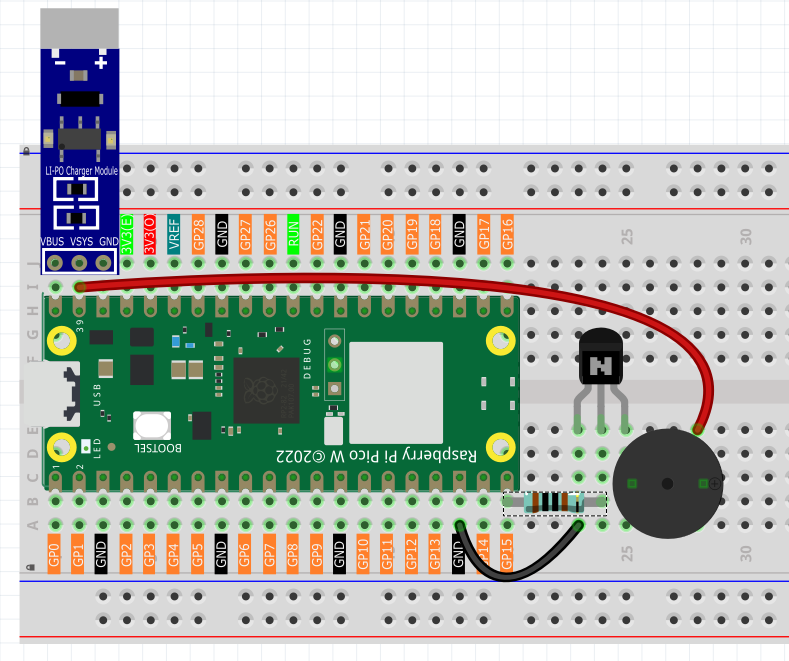
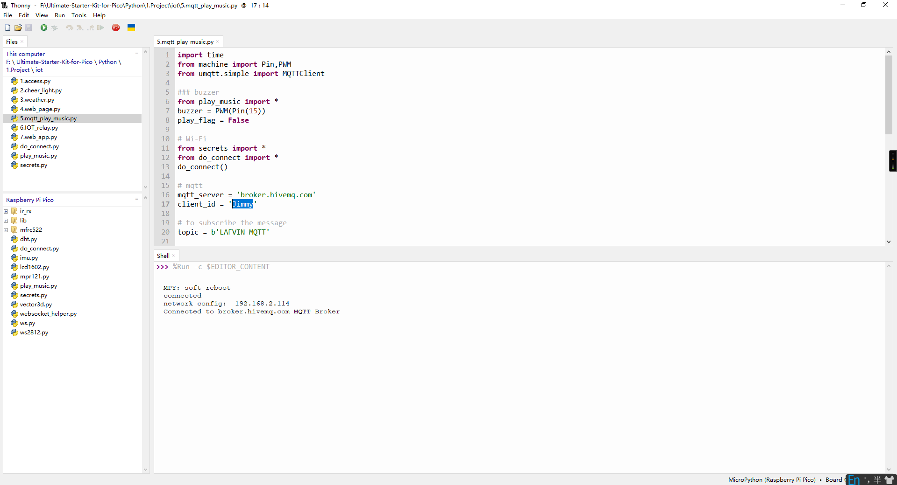

7.5.Cloud Player @MQTT
=======================
Message Queuing Telemetry Transport (MQTT) is a simple messaging protocol. It is also the most common messaging protocol for the Internet of Things (IoT).

MQTT protocols define the way IoT devices transfer data. They are event-driven and interconnected using the Pub/Sub model. The sender (Publisher) and the receiver (Subscriber) communicate via Topics. A device publishes a message on a specific topic, and all devices subscribed to that topic receive the message.

In this project, Pico W will act as a subscriber and receive the song name under the topic. If the song name is already in the code, Pico W will make the buzzer play the song.

Component List
^^^^^^^^^^^^^^^
- Raspberry Pi Pico W x1
- MicroUSB cable x1
- 830 Tie-Points Breadboard x1
- Resistor 1kΩ x1
- Transistor S8050 x1
- Passive Buzzer x1
- Li-po Charger Module x1
- Battery Holder x1
- Jumper Wire Several

Connect
^^^^^^^^^
.. warning:: 
    Make sure your Li-po Charger Module is connected as shown in the diagram. Otherwise, a short circuit will likely damage your battery and circuitry.

    
Seting MQTT
^^^^^^^^^^^
HiveMQ is an MQTT broker and client-based messaging platform that enables fast, efficient and reliable data transfer to IoT devices.

1. Open `HiveMQ Web Client <https://www.hivemq.com/demos/websocket-client/>`_ in your browser.
2. Connects the client to the default public proxy.

   .. image:: img/iot/mqtt-1.png

3. Click on **Add New Topic Subscription**.

   .. image:: img/iot/mqtt-2.png

4. Fill in the topics you want to follow and click **Subscribe**. The topics set here should be more personal to avoid getting messages from other users, and pay attention to case sensitive.

   .. image:: img/iot/mqtt-3.png

Code
^^^^^^^
Upload the ``play_music.py`` file under the path of ``Ultimate-Starter-Kit-for-Pico-W\iot`` to the Raspberry Pi Pico W.

.. note::

    * Open the ``7.5.py`` file under the path of ``Ultimate-Starter-Kit-for-Pico-W\Python\1.Project\iot`` or copy this code into Thonny, then click "Run Current Script" or simply press F5 to run it.

    * Don't forget to click on the "MicroPython (Raspberry Pi Pico)" interpreter in the bottom right corner. 
    
    * Before running the code, you need to make sure you have ``do_connect.py`` and ``secrets.py`` scripts in your Pico W, if not please refer to 8.1 Access to the Network to create them.

Click “Run current script” and the shell will print information. You can connect the PICO W to an MQTT platform and then send a song name to make the PICO W play the corresponding song.

The following is the program code:

.. code-block:: python

    import time
    from machine import Pin,PWM
    from umqtt.simple import MQTTClient

    ### buzzer
    from play_music import *
    buzzer = PWM(Pin(15))
    play_flag = False

    # Wi-Fi
    from do_connect import *
    do_connect()

    # mqtt
    mqtt_server = 'broker.hivemq.com'
    client_id = 'Jimmy'

    # to subscribe the message
    topic = b'LAFVIN MQTT MUSIC'

    def callback(topic, message):
        print("New message on topic {}".format(topic.decode('utf-8')))
        message = message.decode('utf-8')
        print(message)
        if message in song.keys():
            global melody,play_flag
            melody = song[message]
            play_flag = True

    try:
        client = MQTTClient(client_id, mqtt_server, keepalive=60)
        client.set_callback(callback)
        client.connect()
        print('Connected to %s MQTT Broker'%(mqtt_server))
    except OSError as e:
        print('Failed to connect to MQTT Broker. Reconnecting...')
        time.sleep(5)
        machine.reset()
        
        
    while True:
        client.subscribe(topic)
        time.sleep(1)
        if play_flag is True:
            play(buzzer,melody)
            play_flag = False

Phenomenon
^^^^^^^^^^^
.. video:: img/5.phenomenon/6.13.mp4
    :width: 100%