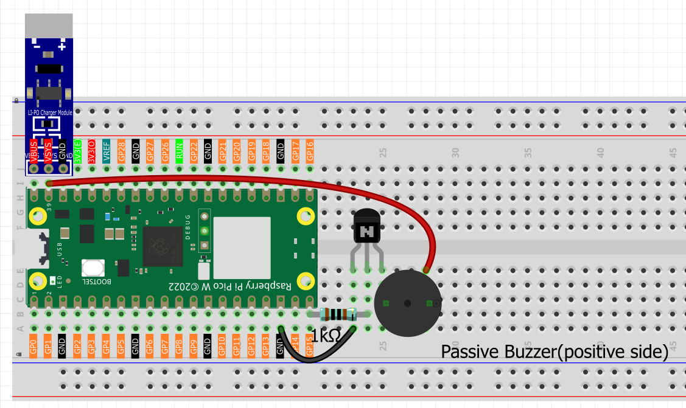

7.5 MQTT Jukebox
==============================

**🎵 Build Your Own IoT Jukebox!**

Create a smart music player that responds to commands from anywhere in the world! This project demonstrates the power of **MQTT (Message Queuing Telemetry Transport)** - the backbone protocol of modern IoT systems.

**🌐 What is MQTT?**
MQTT is a lightweight messaging protocol designed for IoT devices. It uses a **Publisher-Subscriber** model where devices communicate through **Topics**:

- **Publisher**: Sends messages to a specific topic
- **Subscriber**: Receives messages from topics they're interested in  
- **Broker**: Central server that routes messages between publishers and subscribers
- **Topics**: Named channels for organizing different types of messages

**✨ What You're Building:**
- **IoT Music Player**: Remote-controlled buzzer that plays melodies on command
- **MQTT Integration**: Real-time communication using industry-standard protocol
- **Global Accessibility**: Control your device from anywhere with internet
- **Song Library**: Pre-programmed melodies including Nokia, Star Wars, and more
- **Professional Error Handling**: Robust connection management and graceful shutdown
- **Resource Management**: Proper cleanup of MQTT connections and hardware

**🎼 Available Songs:**
- **"nokia"** - Classic Nokia ringtone
- **"starwars"** - Star Wars main theme
- **"nevergonnagiveyouup"** - Rick Astley classic
- **"imperialmarch"** - Darth Vader's theme

**🎯 Perfect For:**
- Learning MQTT protocol and IoT messaging
- Understanding publish-subscribe architecture
- Building remote control systems
- Creating IoT entertainment devices
- Exploring global device communication

Component List
^^^^^^^^^^^^^^^
- Raspberry Pi Pico W x1
- MicroUSB cable x1
- 830 Tie-Points Breadboard x1
- Resistor 1kΩ x1
- Transistor S8050 x1
- Passive Buzzer x1
- Li-po Charger Module x1
- Battery Holder x1
- Jumper Wire Several

Connect
^^^^^^^^^
.. warning:: 
    Make sure your Li-po Charger Module is connected as shown in the diagram. Otherwise, a short circuit will likely damage your battery and circuitry.

    
Setting Up MQTT Broker
^^^^^^^^^^^^^^^^^^^^^^^^^^^^^^^^^
HiveMQ is an MQTT broker and client-based messaging platform that enables fast, efficient and reliable data transfer to IoT devices.

1. Open `HiveMQ Web Client <https://www.hivemq.com/demos/websocket-client/>`_ in your browser.
2. Connects the client to the default public proxy.

   .. image:: img/iot/mqtt-1.png

3. Click on **Add New Topic Subscription**.

   .. image:: img/iot/mqtt-2.png

4. Fill in the topics you want to follow and click **Subscribe**. The topics set here should be more personal to avoid getting messages from other users, and pay attention to case sensitive.

   .. image:: img/iot/mqtt-3.png

Code
^^^^^^^
Upload the ``play_music.py`` file under the path of ``Ultimate-Starter-Kit-for-Pico-W/Python/iot`` to the Raspberry Pi Pico W.

.. note::

    * Open the ``5_mqtt_jukebox.py`` file under the path of ``Ultimate-Starter-Kit-for-Pico-W/Python/iot`` or copy this code into Thonny, then click "Run Current Script" or simply press F5 to run it.

    * Don't forget to click on the "MicroPython (Raspberry Pi Pico)" interpreter in the bottom right corner. 
    
    * Before running the code, you need to make sure you have ``do_connect.py`` and ``secrets.py`` scripts in your Pico W, if not please refer to :ref:`access_network` to create them.

1. Before running the project, we need to connect to the network to download the ``umqtt`` module. Ensure that your ``do_connect.py`` and ``secrets.py`` scripts are in your Pico W.

2. Then run the following code in the shell, and your IP address will be displayed:
   .. code-block:: python

        from do_connect import *
        do_connect()

3. After a successful network connection, import the ``mip`` module in the shell and use ``mip`` to install the ``umqtt.simple`` module, which is a simplified MQTT client for MicroPython.
   .. code-block:: python

        import mip
        mip.install('umqtt.simple')

4. You will see that the ``umqtt`` module is installed under the ``/lib/`` path of Pico W after completion.

Click “Run current script” and the shell will print information. You can connect the PICO W to an MQTT platform and then send a song name to make the PICO W play the corresponding song.

The following is the program code:

.. code-block:: python

      """
      MQTT Music Player with Keyboard Control

      This program connects to an MQTT broker and plays predefined melodies
      based on received messages. It includes graceful exit functionality
      using keyboard interrupt (Ctrl+C).

      Hardware Requirements:
      - ESP32/ESP8266 with MicroPython
      - Buzzer connected to GPIO 15

      Supported Songs:
      - "nokia" - Nokia ringtone
      - "starwars" - Star Wars theme
      - "nevergonnagiveyouup" - Rick Astley
      - "imperialmarch" - Imperial March (Darth Vader theme)

      Usage:
      - Send song name to MQTT topic 'LAFVIN MQTT'
      - Use Ctrl+C to exit gracefully
      """

      import time
      import sys
      from machine import Pin, PWM
      from umqtt.simple import MQTTClient

      # Buzzer setup
      from play_music import *
      buzzer = PWM(Pin(15))
      play_flag = False

      # Wi-Fi connection
      from secrets import *
      from do_connect import *
      do_connect()

      # MQTT configuration
      mqtt_server = 'broker.hivemq.com'
      client_id = 'Jimmy'

      # MQTT topic to subscribe for music commands
      topic = b'LAFVIN MQTT'

      # Global variables for resource management
      client = None
      running = True
      melody = None

      def cleanup_resources():
          """
          Clean up all resources including MQTT connection and buzzer
          """
          global client, buzzer
          print("\nCleaning up resources...")
          
          try:
              # Stop buzzer
              if buzzer:
                  buzzer.duty_u16(0)  # Stop PWM output
                  print("✓ Buzzer stopped")
          except Exception as e:
              print(f"Error cleaning buzzer: {e}")
          
          try:
              # Disconnect MQTT
              if client:
                  client.disconnect()
                  print("✓ MQTT connection closed")
          except Exception as e:
              print(f"Error disconnecting MQTT: {e}")
          
          print("✓ Resource cleanup completed")

      def callback(topic, message):
          print("New message on topic {}".format(topic.decode('utf-8')))
          message = message.decode('utf-8')
          print(message)
          if message in song.keys():
              global melody,play_flag
              melody = song[message]
              play_flag = True

      # Main program
      def main():
          """
          Main program entry point with graceful exit handling
          """
          global client, running, play_flag, melody
          
          try:
              # Initialize MQTT client
              client = MQTTClient(client_id, mqtt_server, keepalive=60)
              client.set_callback(callback)
              client.connect()
              print(f'✓ Successfully connected to MQTT server: {mqtt_server}')
              print(f'✓ Client ID: {client_id}')
              print(f'✓ Subscribed topic: {topic.decode("utf-8")}')
              print("✓ Music player started - Press Ctrl+C to exit")
              print("-" * 50)
              
              # Main loop
              while running:
                  try:
                      client.subscribe(topic)
                      client.check_msg()  # Check for new messages
                      
                      # Play music if requested
                      if play_flag:
                          print(f"🎵 Starting music playback...")
                          play(buzzer, melody)
                          play_flag = False
                          print("🎵 Music playback completed")
                      
                      time.sleep(0.1)  # Reduce CPU usage
                      
                  except KeyboardInterrupt:
                      # Catch Ctrl+C
                      print("\nUser interrupt detected, shutting down...")
                      break
                  except Exception as e:
                      print(f"Error in main loop: {e}")
                      time.sleep(1)  # Brief delay after error
                      
          except OSError as e:
              print(f'❌ Failed to connect to MQTT server: {e}')
              print('Try restarting device or check network connection...')
              cleanup_resources()
              return
          except Exception as e:
              print(f'❌ Program initialization failed: {e}')
              cleanup_resources()
              return
          finally:
              # Ensure resources are cleaned up
              running = False
              cleanup_resources()

      # Run main program
      if __name__ == "__main__":
          try:
              main()
          except Exception as e:
              print(f"Program terminated with exception: {e}")
              cleanup_resources()

**🔧 How the Professional MQTT Music Player Works**

**🌐 Step 1: WiFi Connection and MQTT Dependencies**
The system starts by establishing internet connectivity and installing required libraries:

.. code-block:: python

    # WiFi connection using professional modules
    from secrets import *
    from do_connect import *
    do_connect()

    # Install MQTT library (run once)
    import mip
    mip.install('umqtt.simple')

**Professional Setup:**
- **Secure credentials**: Uses `secrets.py` for WiFi credentials
- **Automated connection**: Leverages `do_connect.py` for reliable WiFi setup
- **Package management**: Uses MicroPython's `mip` for library installation
- **Dependency isolation**: MQTT library installed in `/lib/` directory

**🎵 Step 2: Hardware and Music System Initialization**
Professional hardware setup with imported music library:

.. code-block:: python

    # Buzzer setup with PWM control
    from machine import Pin, PWM
    from play_music import *  # Import song library
    buzzer = PWM(Pin(15))
    play_flag = False

    # MQTT configuration constants
    mqtt_server = 'broker.hivemq.com'
    client_id = 'Jimmy'
    topic = b'LAFVIN MQTT'

**Smart Features:**
- **PWM control**: Precise frequency control for melody playback
- **Modular music**: External `play_music.py` contains song definitions
- **Global flags**: Thread-safe communication between MQTT and music systems
- **Standard broker**: Uses HiveMQ's free public MQTT broker

**🔄 Step 3: Professional Resource Management**
Comprehensive cleanup system for safe shutdown:

.. code-block:: python

    def cleanup_resources():
        """Clean up all resources including MQTT connection and buzzer"""
        global client, buzzer
        print("\\nCleaning up resources...")
        
        try:
            # Stop buzzer
            if buzzer:
                buzzer.duty_u16(0)  # Stop PWM output
                print("✓ Buzzer stopped")
        except Exception as e:
            print(f"Error cleaning buzzer: {e}")
        
        try:
            # Disconnect MQTT
            if client:
                client.disconnect()
                print("✓ MQTT connection closed")
        except Exception as e:
            print(f"Error disconnecting MQTT: {e}")
        
        print("✓ Resource cleanup completed")

**Professional Cleanup Features:**
- **Safe PWM shutdown**: Stops buzzer output to prevent noise
- **MQTT disconnection**: Properly closes broker connection
- **Exception handling**: Continues cleanup even if individual steps fail
- **Status reporting**: Clear feedback on cleanup progress

**📡 Step 4: MQTT Message Handling**
Smart callback function for processing incoming music commands:

.. code-block:: python

    def callback(topic, message):
        """Process incoming MQTT messages for music playback"""
        print("New message on topic {}".format(topic.decode('utf-8')))
        message = message.decode('utf-8')
        print(message)
        
        # Check if received song name exists in song library
        if message in song.keys():
            global melody, play_flag
            melody = song[message]
            play_flag = True  # Signal main loop to play music

**Smart Message Processing:**
- **UTF-8 decoding**: Properly handles text messages
- **Song validation**: Only plays songs that exist in the library
- **Thread-safe signaling**: Uses global flags for inter-thread communication
- **Clear logging**: Reports all received messages and actions

**🎼 Step 5: Professional Main Program Loop**
Robust main loop with comprehensive error handling:

.. code-block:: python

    def main():
        """Main program with graceful exit handling"""
        global client, running, play_flag, melody
        
        try:
            # Initialize MQTT client with keepalive
            client = MQTTClient(client_id, mqtt_server, keepalive=60)
            client.set_callback(callback)
            client.connect()
            
            print(f'✓ Successfully connected to MQTT server: {mqtt_server}')
            print(f'✓ Client ID: {client_id}')
            print(f'✓ Subscribed topic: {topic.decode("utf-8")}')
            print("✓ Music player started - Press Ctrl+C to exit")
            
            # Main loop
            while running:
                try:
                    client.subscribe(topic)
                    client.check_msg()  # Check for new MQTT messages
                    
                    # Play music if requested
                    if play_flag:
                        print(f"🎵 Starting music playback...")
                        play(buzzer, melody)  # Play the melody
                        play_flag = False
                        print("🎵 Music playback completed")
                    
                    time.sleep(0.1)  # Reduce CPU usage
                    
                except KeyboardInterrupt:
                    print("\\nUser interrupt detected, shutting down...")
                    break
                except Exception as e:
                    print(f"Error in main loop: {e}")
                    time.sleep(1)

**Professional Main Loop Features:**
- **Keepalive mechanism**: Maintains stable MQTT connection
- **Subscription management**: Continuously maintains topic subscription
- **Non-blocking message check**: Uses `check_msg()` for real-time responsiveness
- **Music playback control**: Thread-safe music triggering system
- **CPU optimization**: Sleep reduces processor load
- **Graceful interruption**: Clean shutdown on Ctrl+C
- **Error recovery**: Continues operation despite temporary errors

**🛡️ Step 6: Comprehensive Error Handling and Program Entry**
Professional program structure with multiple error handling layers:

.. code-block:: python

    # Run main program with full error protection
    if __name__ == "__main__":
        try:
            main()
        except Exception as e:
            print(f"Program terminated with exception: {e}")
            cleanup_resources()

    # Alternative error handling in main()
    except OSError as e:
        print(f'❌ Failed to connect to MQTT server: {e}')
        print('Try restarting device or check network connection...')
        cleanup_resources()
        return
    except Exception as e:
        print(f'❌ Program initialization failed: {e}')
        cleanup_resources()
        return
    finally:
        # Ensure resources are cleaned up
        running = False
        cleanup_resources()

**✨ Key Improvements in This Professional Version:**

**🔧 Technical Improvements:**
- **Resource management**: Comprehensive cleanup of MQTT connections and PWM
- **Error categorization**: Different handling for network vs. general errors
- **Graceful shutdown**: Clean exit on Ctrl+C with proper resource cleanup
- **Status reporting**: Detailed feedback on connection status and operations
- **CPU optimization**: Efficient main loop with appropriate sleep timing

**🎵 Music System Features:**
- **Song library integration**: Modular music system with external song definitions
- **Thread-safe playback**: Safe communication between MQTT and music systems
- **Playback status**: Clear feedback on music playback start and completion
- **Error resilience**: Continues operation even if individual songs fail

**📡 MQTT Features:**
- **Stable connections**: Keepalive mechanism maintains broker connection
- **Topic management**: Proper subscription handling and message processing
- **Message validation**: Only responds to valid song names
- **Global accessibility**: Can be controlled from anywhere with MQTT client

**🛡️ Reliability Features:**
- **Multi-layer error handling**: Handles initialization, runtime, and shutdown errors
- **Resource protection**: Always cleans up hardware and network resources
- **Restart guidance**: Clear instructions for troubleshooting connection issues
- **Professional logging**: Detailed status messages for debugging

Phenomenon
^^^^^^^^^^^
