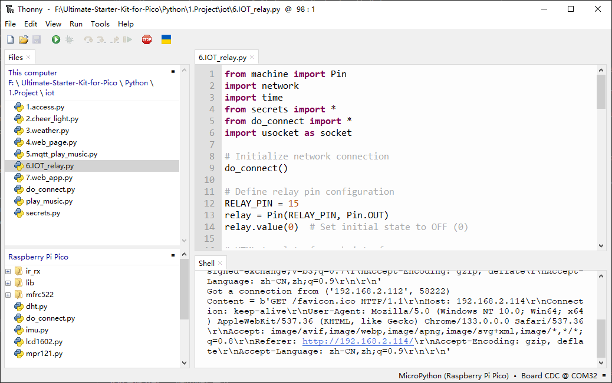
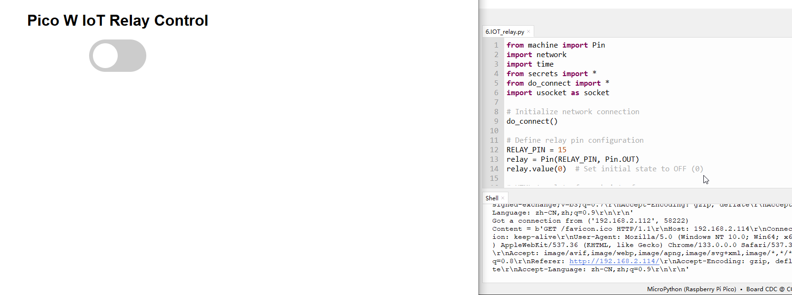

7.6 IoT Controlled Relay
==================================
In this project, we will build an IoT Relay using Raspberry Pi Pico W WiFi and control the Relay via a Web Server. We will use Thonny IDE to program the Raspberry Pi Pico W using MicroPython Code. It’s a great way to build a Wi-Fi switch to turn on and off any electrical device spending very little money.

This DIY IoT Relay based on the Raspberry Pi Pico W Wi  Fi + Bluetooth module can be used to control High Power Devices like Water Pumps, Air Conditioners, Heaters, and other High Ampere loads. The best thing about this IoT Relay is that it can be controlled remotely in a local network using WiFi technology. The cell phone or any web application can be used to access the Web Server. Using the web page, you can turn ON/OFF any appliances at your home.

Component List
^^^^^^^^^^^^^^^
- Raspberry Pi Pico W x1
- MicroUSB cable x1
- 830 Tie-Points Breadboard x1
- Resistor 220Ω x1
- LED x1
- Relay Module x1
- Jumper Wire Several

.. warning:: 
    
    Modification of electrical appliances comes with great danger, do not try it 
    lightly, please do it under the guidance of professionals.

Connect
^^^^^^^^^
.. image:: img/3.connect/1.16.png

This circuit is based on 1.16 Circuit Control with Relay.

Code
^^^^^^^
.. note::

    * Open the ``6.IOT_relay.py`` file under the path of ``Ultimate-Starter-Kit-for-Pico-W\Python\1.Project\iot`` or copy this code into Thonny, then click "Run Current Script" or simply press F5 to run it.

    * Don't forget to click on the "MicroPython (Raspberry Pi Pico)" interpreter in the bottom right corner. 
    
    * Before running the code, you need to make sure you have do_connect.py and secrets.py scripts in your Pico W, if not please refer to 8.1 Access to the Network to create them.

Click 'Run current script'. After a successful connection, the shell will display the IP address of the Pico W. You can then enter the IP address in your browser to see the webpage, where you can use the switch above to control the relay and thus turn the LED light on and off.

If you want this script to be able to boot up, you can save it to the Raspberry Pi Pico W as ``main.py``.

The following is the program code:

.. code-block:: python

    from machine import Pin
    import network
    import time
    from secrets import *
    from do_connect import *
    import usocket as socket

    # Initialize network connection
    do_connect()

    # Define relay pin configuration
    RELAY_PIN = 15
    relay = Pin(RELAY_PIN, Pin.OUT)
    relay.value(0)  # Set initial state to OFF (0)

    # HTML template for web interface
    # Contains CSS for switch styling and JavaScript for AJAX requests
    HTML_TEMPLATE = """<html>
    <head>
    <meta name="viewport" content="width=device-width, initial-scale=1">
    
    
    </head>
    <body>
    <h1>Pico W IoT Relay Control</h1>
    <label class="switch">
    <input type="checkbox" onchange="toggleCheckbox(this)" {state}>
    
    </label>
    </body>
    </html>"""

    def web_server():
        """
        Generate HTML response based on current relay state
        Returns: HTML content with current relay state
        """
        relay_state = 'checked' if relay.value() == 1 else ''
        return HTML_TEMPLATE.format(state=relay_state)

    def handle_request(conn):
        """
        Handle incoming HTTP requests
        Args:
            conn: Socket connection object
        """
        # Receive and process HTTP request
        request = conn.recv(1024)
        request = str(request)
        print('Content = %s' % request)
        
        # Process relay control commands
        if '/?relay=on' in request:
            print('RELAY ON')
            relay.value(1)
        elif '/?relay=off' in request:
            print('RELAY OFF')
            relay.value(0)

        # Send HTTP response
        response = web_server()
        conn.send(b'HTTP/1.1 200 OK\n')
        conn.send(b'Content-Type: text/html\n')
        conn.send(b'Connection: close\n\n')
        conn.sendall(response.encode('utf-8'))
        conn.close()

    # Initialize socket server
    s = socket.socket(socket.AF_INET, socket.SOCK_STREAM)
    s.bind(('', 80))  # Bind to port 80
    s.listen(5)       # Listen for up to 5 connections

    print('Server started, waiting for connections...')

    # Main loop to handle incoming connections
    while True:
        try:
            # Accept new connection
            conn, addr = s.accept()
            print('Got a connection from %s' % str(addr))
            handle_request(conn)
        except OSError as e:
            print('Connection closed: %s' % e)

Phenomenon
^^^^^^^^^^^
