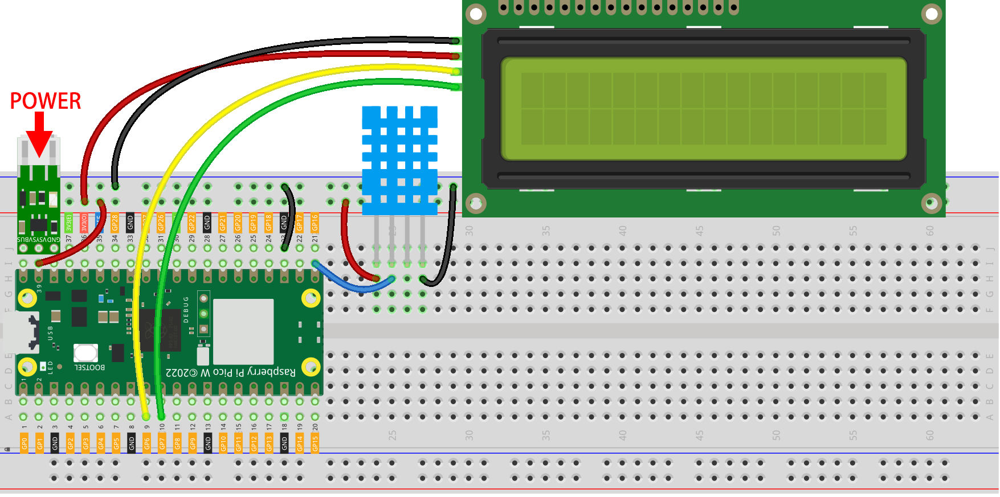
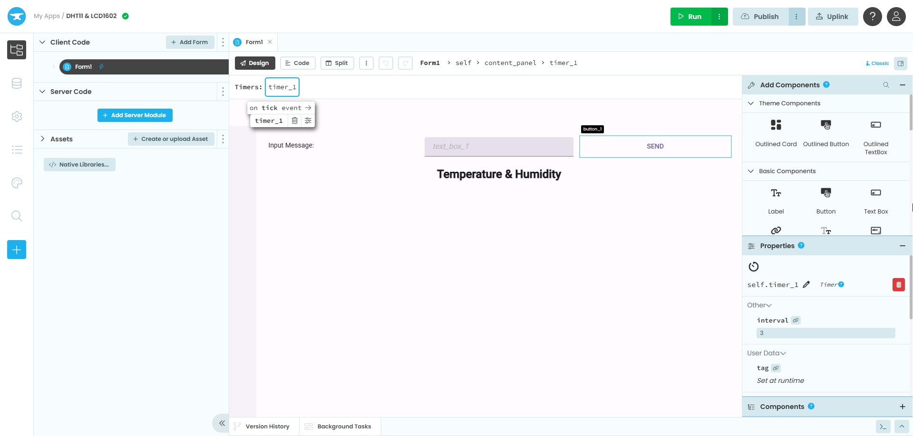
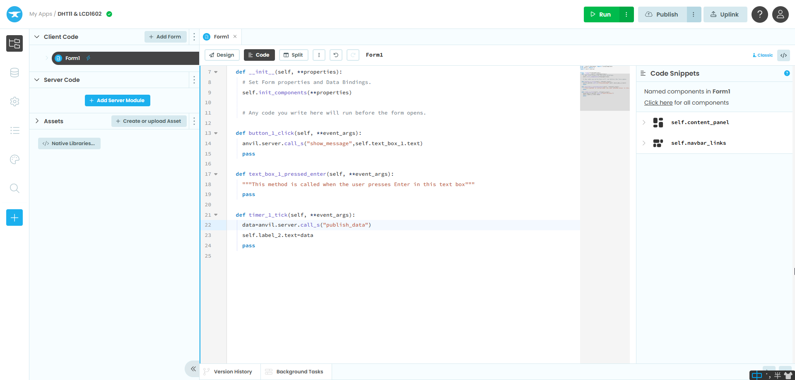
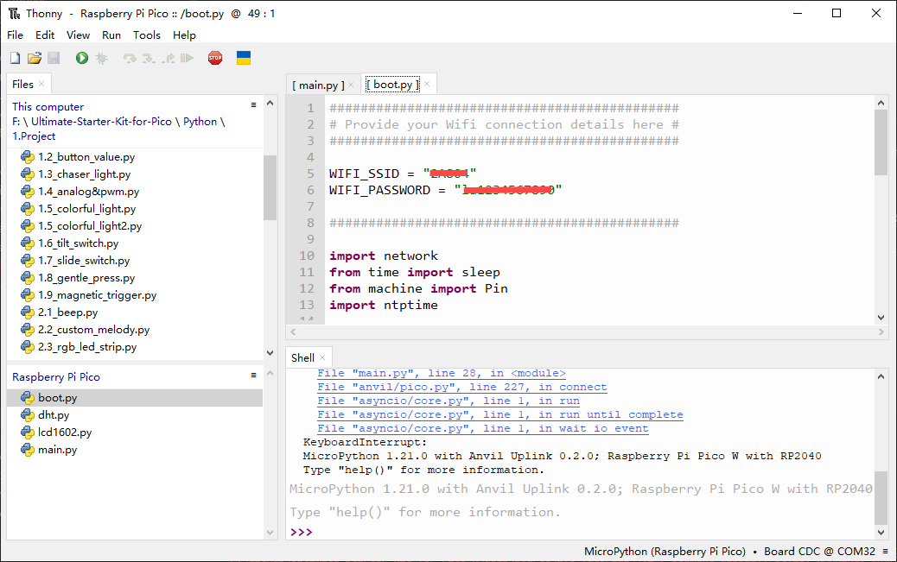
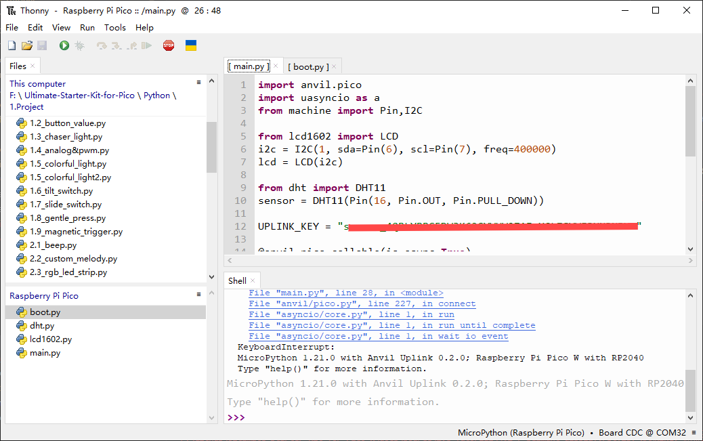
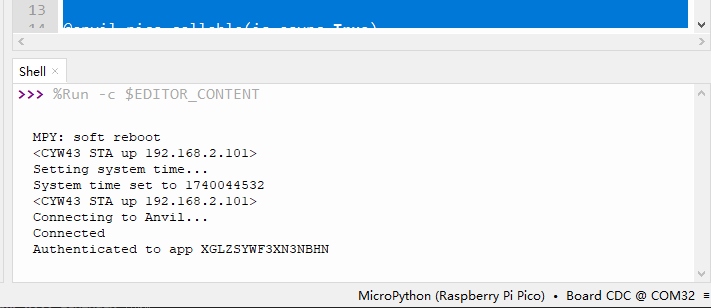
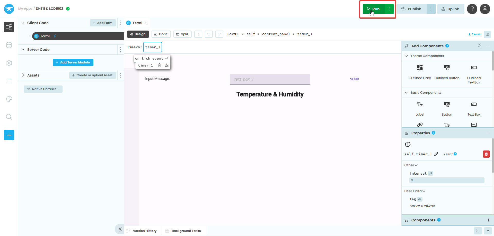
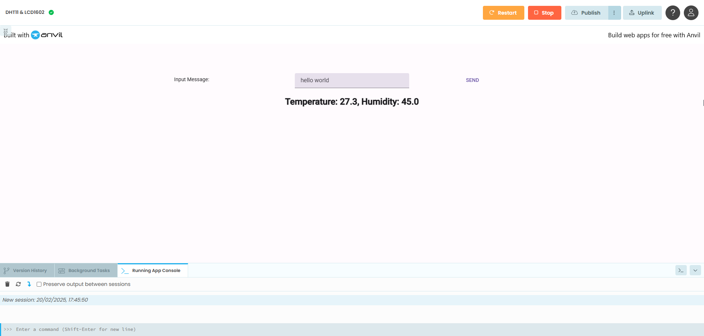

7.7 WEB APP @Anvil
=========================

Component List
^^^^^^^^^^^^^^^
- Raspberry Pi Pico W x1
- MicroUSB cable x1
- 830 Tie-Points Breadboard x1
- LCD1602 x1
- DHT11 Module x1
- Jumper Wire Several

Connect
^^^^^^^^^
.. warning:: 
    Make sure your Li-po Charger Module is connected as shown in the diagram. Otherwise, a short circuit will likely damage your battery and circuitry.

Anvil Setting
^^^^^^^^^^^^^^

1. **Go to the Anvil website** `Anvil <https://anvil.works/>`_ and click on **Start building**.

   .. image:: img/iot/anvil-1.png

2. **Sign in or Sign up**.

   .. image:: img/iot/anvil-2.png

   .. note::

      After signing up, you can open this link to clone the prepared project: `Clone Project <https://anvil.works/build#clone:XGLZSYWF3XN3NBHN=WHPCUEZP5D3LY6ZS65LZFTNC>`_. Alternatively, you can follow the steps below to build the web app from scratch. If you choose to clone the project, you can skip directly to step 14.

3. **Create a New App**.

   .. image:: img/iot/anvil-3.png

4. **Select Material Design 3 Theme**.

   .. image:: img/iot/anvil-4.png

5. **You are now on the app editing page**.

   .. image:: img/iot/anvil-4-1.png

6. **From the Toolbox, drag a Label tool and place it on "Drop title here"**.

   .. image:: img/iot/anvil-5.png

7. **Fill in the label text in the text field under the Properties menu**.

   .. image:: img/iot/anvil-5-2.png

8. **Similarly, drag a TextBox to the right**.

   .. image:: img/iot/anvil-6.png

9. **Drag a Button to the far right and modify the text field**. This button will be used to "send" a message to the Raspberry Pi Pico W.

   .. image:: img/iot/anvil-7.png

   .. image:: img/iot/anvil-8.png

10. **Drag another Label component and place it below the previous elements**. This label will display the DHT11 sensor data from the Pico W.

   .. image:: img/iot/anvil-9.png

11. **In the Toolbox, click on More Components and drag the Timer into the form**.

   .. image:: img/iot/anvil-10.png

12. **Using the Properties, set the timer interval to 3 seconds**. This interval is used to update the screen with our sensor data.

13. **After completing the steps above, you will have the following components in your app: `label_1`, `label_2`, `text_box_1`, `button_1`, and `timer_1`**. Click on **Code** next to **Design**, and paste the following 
code:

.. code-block:: 

    from ._anvil_designer import Form1Template
    from anvil import *
    import anvil.server

    class Form1(Form1Template):
    def __init__(self, **properties):
        # Set Form properties and Data Bindings.
        self.init_components(**properties)

        # Any code you write here will run before the form opens.

    def button_1_click(self, **event_args):
        anvil.server.call_s("show_message",self.text_box_1.text)
        pass

    def text_box_1_pressed_enter(self, **event_args):
        """This method is called when the user presses Enter in this text box"""
        pass

    def timer_1_tick(self, **event_args):
        data=anvil.server.call_s("publish_data")
        self.label_2.text=data
        pass

14. **Click on the Uplink option in the app settings, enable the server uplink, and copy the server uplink key**.

    .. image:: img/iot/anvil-11.png

    .. image:: img/iot/anvil-12.png

    .. image:: img/iot/anvil-13.png

At this point, the Anvil configuration is complete.

Next, we need to flash the Anvil firmware onto the Pico W.

.. warning::

    Before reinstalling the firmware, make a backup of all important files stored on your Pico W.

Power off the Pico W, then push and hold the **BOOTSEL** button on the Pico W. Connect it to your computer using a Micro USB cable, and release **BOOTSEL** once the drive **RPI-RP2** appears on your computer.

You can find a `.uf2` firmware file in the path ``Ultimate-Starter-Kit-for-Pico-W/Python/3.Firmware``. Drag and drop this `.uf2` file into the **RPI-RP2** drive. After a short while, you should see ``main.py`` and ``boot.py`` appear on the drive.

Select **MicroPython (Raspberry Pi Pico).COMXX** as the interpreter in Thonny IDE. After clicking **View -> Files**, you will see both the local drive and the drive of the Raspberry Pi Pico.

Modify the ``boot.py`` script to include your WiFi name (SSID) and password.

Click **Run current script**.

Upload ``dht.py`` and ``lcd1602.py`` from the path ``kepler-kit-main/libs`` to the Raspberry Pi Pico W.

Replace ``main.py`` with the following code, and insert your Uplink key where indicated:

.. code-block:: python

    import anvil.pico
    import uasyncio as a
    from machine import Pin, I2C

    from lcd1602 import LCD
    i2c = I2C(1, sda=Pin(6), scl=Pin(7), freq=400000)
    lcd = LCD(i2c)

    from dht import DHT11
    sensor = DHT11(Pin(16, Pin.OUT, Pin.PULL_DOWN))

    UPLINK_KEY = "your_uplink_key"

    @anvil.pico.callable(is_async=True)
    async def show_message(text):
        print(f"show anvil's input message: {text}")
        lcd.clear()
        lcd.message(text)
        return

    @anvil.pico.callable(is_async=True)
    async def publish_data():
        sensor.measure()
        return "Temperature: {}, Humidity: {}".format(sensor.temperature, sensor.humidity)

    # Connect the Anvil Uplink. In MicroPython, this call will block forever.
    anvil.pico.connect(UPLINK_KEY)

    # There's lots more you can do with Anvil on your Pico W.
    # See `Anvil on the Pico W <https://anvil.works/pico>`_ for more information.

Click **Run** to execute the code. If you see the prompt shown in the image below, the process is complete.

Return to Anvil and click **RUN**. You should now be able to see the temperature and humidity data from the DHT11 module, as well as send messages to the LCD1602.

