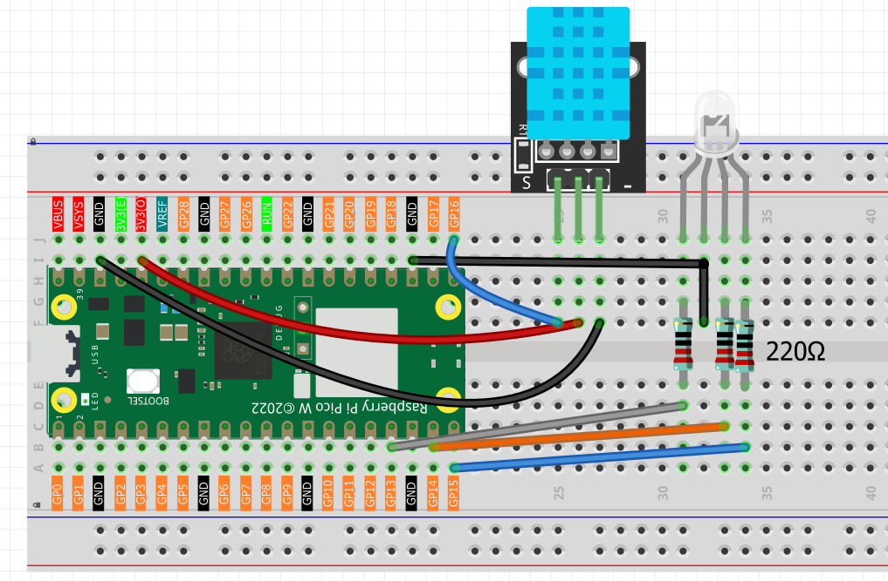
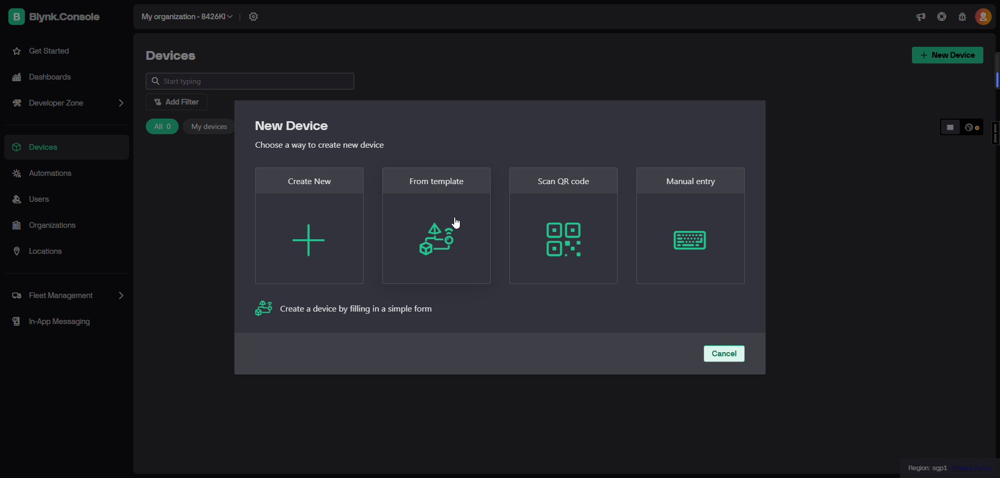

7.7 Professional Blynk IoT Platform
====================================

**📱 Build Your Own Mobile IoT Dashboard!**

Create a professional mobile application to control and monitor your IoT devices using **Blynk**, the world's most popular IoT platform. This project transforms your smartphone into a powerful IoT control center with real-time monitoring and remote device control capabilities.

**✨ What You're Building:**
- **Professional Mobile App**: Custom iOS/Android app for your IoT project
- **Real-time Monitoring**: Live temperature and humidity readings on your phone
- **Remote RGB Control**: Precise brightness control with smooth sliders
- **Cloud Integration**: Global access to your device from anywhere
- **Professional Dashboard**: Beautiful, customizable mobile interface
- **Zero Coding Mobile App**: No mobile development skills required

**🔗 Circuit Compatibility:**
This project uses the **same circuit as Chapter 7.4**, making it easy to switch between web browser control and mobile app control for the same hardware.

**🎯 Why Blynk vs. Web Server?**
- **Native Mobile Experience**: Optimized for smartphones and tablets
- **Global Access**: Control from anywhere with internet connection
- **Push Notifications**: Get alerts and notifications on your phone
- **Widget Library**: Professional UI components (sliders, graphs, buttons)
- **Cloud Storage**: Historical data storage and analysis
- **Multi-device Support**: Control multiple IoT devices from one app

Component List
^^^^^^^^^^^^^^^
- Raspberry Pi Pico W x1
- MicroUSB cable x1
- 830 Tie-Points Breadboard x1
- DHT11 Module x1
- Resistor 220Ω x3
- RGB-LED x1
- Li-po Charger Module x1
- Battery Holder x1
- Jumper Wire Several

Connect
^^^^^^^^^
.. warning:: 
    Make sure your Li-po Charger Module is connected as shown in the diagram. Otherwise, a short circuit will likely damage your battery and circuitry.

**🛠️ Setting Up Blynk Cloud Platform**

**Step 1: Create Blynk Account and Template**

1. **Register and Login** to `Blynk Cloud <https://blynk.cloud>`_
2. **Create a New Template** for your IoT device

**Step 2: Configure Data Streams (Virtual Pins)**

Set up 5 virtual pins for complete device control and monitoring:

**Virtual Pin Configuration:**
- **V0**: Red LED Brightness (Integer, 0-100)
- **V1**: Green LED Brightness (Integer, 0-100) 
- **V2**: Blue LED Brightness (Integer, 0-100)
- **V3**: Temperature Display (Double, Read Only)
- **V4**: Humidity Display (Double, Read Only)

Your completed datastreams should look like this:

**Step 3: Create Device from Template**

1. **Create a new device** from your template - this automatically imports all datastream settings
2. **Name your device** "Pico W" for easy identification

**Step 4: Get Your Authentication Token**

1. **Click on your device**, then select **"Developer Tools"**
2. **Copy the BLYNK_AUTH_TOKEN** from the **Firmware Configuration** section

3. **Paste this token** into line 136 of your MicroPython code (replace "YOUR_BLYNK_TOKEN_HERE")

**📱 Setting Up the Mobile App**

**Step 1: Download Blynk App**

Download the official Blynk app:
- **iOS**: Search "Blynk IoT" in App Store
- **Android**: Search "Blynk IoT" in Google Play Store
- **Direct Link**: https://blynk.io/no-code-iot-mobile-apps

**Step 2: Login and Access Your Device**

1. **Login** with your Blynk account credentials
2. You'll see your **"Pico W"** device in the main dashboard
3. **Tap on the device** to enter the control interface

**Step 3: Add Control Widgets**

1. **Tap the wrench icon** (top-right corner) to enter edit mode
2. **Tap the green plus (+) button** to add widgets

**Required Widgets:**
- **3x Slider Widgets** (for RGB brightness control)
- **2x Value Display Widgets** (for temperature and humidity)

**Step 4: Configure Widget Datastreams**

For each widget, **tap to configure** and **assign the correct datastream**:

**RGB Sliders:**
- **Red Slider** → Datastream V0
- **Green Slider** → Datastream V1  
- **Blue Slider** → Datastream V2

**Step 5: Customize Widget Appearance**

**Tap "Design"** to customize widget titles and colors:

**Temperature and Humidity Displays:**
- **Temperature Display** → Datastream V3
- **Humidity Display** → Datastream V4

**Step 6: Final Mobile Dashboard**

Your completed mobile dashboard should look like this:

**Step 7: Test Your IoT System**

1. **Save your mobile app layout**
2. **Run your MicroPython program** in Thonny
3. **Watch real-time updates** - temperature and humidity values will appear on your phone
4. **Control RGB LEDs** using the sliders for instant brightness adjustment

The following is the program code:

.. code-block:: python

      """
      Blynk Smart Environmental Control System
      MicroPython version with DHT11 sensor and RGB LED control

      This program connects to Blynk IoT platform and provides:
      - Environmental monitoring (temperature & humidity)
      - RGB LED control via mobile app
      - Real-time sensor data updates

      Hardware Requirements:
      - ESP32/ESP8266 with MicroPython
      - DHT11 sensor connected to GPIO 16
      - RGB LEDs: Red(GPIO 13), Green(GPIO 14), Blue(GPIO 15)

      Blynk Virtual Pin Setup:
      - V0: Red LED brightness (Slider 0-100)
      - V1: Green LED brightness (Slider 0-100)  
      - V2: Blue LED brightness (Slider 0-100)
      - V3: Temperature display (Value Display)
      - V4: Humidity display (Value Display)

      Setup Requirements:
      1. Create account at blynk.cloud
      2. Create new template and device
      3. Add virtual pins V0-V4 with appropriate widgets
      4. Copy device auth token
      5. Configure BLYNK_TOKEN below
      """

      import time
      import machine
      import urequests as requests
      from machine import Pin, PWM
      from do_connect import do_connect
      from dht import DHT11, InvalidPulseCount

      # =====================================
      # Configuration (modify as needed)
      # =====================================
      BLYNK_TOKEN = "YOUR_BLYNK_TOKEN_HERE"  # Replace with your actual token from blynk.cloud

      # Hardware pin configuration (matching 4.web_page.py)
      RED_LED_PIN = 13        # Red LED GPIO pin
      GREEN_LED_PIN = 14      # Green LED GPIO pin  
      BLUE_LED_PIN = 15       # Blue LED GPIO pin
      DHT_SENSOR_PIN = 16     # DHT11 sensor data pin

      # Sensor configuration
      SENSOR_RETRY_COUNT = 3         # Retry attempts for failed sensor readings
      SENSOR_UPDATE_INTERVAL = 10    # Send sensor data every 10 seconds
      CONTROL_CHECK_INTERVAL = 1     # Check control commands every 1 second

      # =====================================
      # Hardware Initialization
      # =====================================

      # Initialize RGB LEDs with PWM for brightness control
      print("Setting up RGB LED PWM pins...")
      red_led = PWM(Pin(RED_LED_PIN))
      green_led = PWM(Pin(GREEN_LED_PIN))
      blue_led = PWM(Pin(BLUE_LED_PIN))

      # Set PWM frequency (1000 Hz is good for LEDs)
      red_led.freq(1000)
      green_led.freq(1000)
      blue_led.freq(1000)

      # Turn off all LEDs initially (0% brightness)
      red_led.duty_u16(0)
      green_led.duty_u16(0)
      blue_led.duty_u16(0)

      # Initialize DHT11 sensor
      print(f"Initializing DHT11 sensor on pin {DHT_SENSOR_PIN}")
      sensor_pin = Pin(DHT_SENSOR_PIN, Pin.IN)
      dht_sensor = DHT11(sensor_pin)

      # =====================================
      # Blynk API Functions
      # =====================================

      def blynk_write(token, pin, value):
          """
          Write value to Blynk virtual pin
          
          Args:
              token: Blynk authentication token
              pin: Virtual pin name (e.g., "V0")
              value: Value to write
          
          Returns:
              bool: True if successful, False otherwise
          """
          try:
              api_url = f"https://blynk.cloud/external/api/update?token={token}&{pin}={value}"
              response = requests.get(api_url)
              
              if response.status_code == 200:
                  print(f"✓ Successfully updated {pin} = {value}")
                  response.close()
                  return True
              else:
                  print(f"❌ Failed to update {pin}. Status: {response.status_code}")
                  response.close()
                  return False
                  
          except Exception as e:
              print(f"❌ Error writing to Blynk: {e}")
              return False

      def blynk_read(token, pin):
          """
          Read value from Blynk virtual pin
          
          Args:
              token: Blynk authentication token
              pin: Virtual pin name (e.g., "V0")
          
          Returns:
              str: Pin value or None if error
          """
          try:
              api_url = f"https://blynk.cloud/external/api/get?token={token}&{pin}"
              response = requests.get(api_url)
              
              if response.status_code == 200:
                  value = response.text.strip()
                  response.close()
                  return value
              else:
                  print(f"❌ Failed to read {pin}. Status: {response.status_code}")
                  response.close()
                  return None
                  
          except Exception as e:
              print(f"❌ Error reading from Blynk: {e}")
              return None

      # =====================================
      # Sensor Functions
      # =====================================

      def read_sensor_data():
          """
          Read temperature and humidity from DHT11 sensor with retry logic
          
          Returns:
              tuple: (temperature, humidity) or (None, None) if failed
          """
          for attempt in range(SENSOR_RETRY_COUNT):
              try:
                  dht_sensor.measure()
                  temperature = dht_sensor.temperature
                  humidity = dht_sensor.humidity
                  
                  # Validate sensor readings
                  if temperature is not None and humidity is not None:
                      print(f"📊 Sensor reading: {temperature}°C, {humidity}%")
                      return temperature, humidity
                  else:
                      print(f"⚠️  Invalid sensor reading on attempt {attempt + 1}")
                      
              except (OSError, InvalidPulseCount) as e:
                  print(f"⚠️  Sensor read attempt {attempt + 1} failed: {e}")
                  
              except Exception as e:
                  print(f"❌ Unexpected sensor error on attempt {attempt + 1}: {e}")
                  
              # Small delay before retry
              if attempt < SENSOR_RETRY_COUNT - 1:
                  time.sleep(0.1)
          
          print("❌ All sensor read attempts failed")
          return None, None

      # =====================================
      # RGB LED Control Functions
      # =====================================

      def brightness_to_pwm(brightness_percent):
          """
          Convert brightness percentage (0-100) to PWM duty cycle (0-65535)
          
          Args:
              brightness_percent: Brightness value from 0-100
              
          Returns:
              int: PWM duty cycle value (0-65535)
          """
          if brightness_percent < 0:
              brightness_percent = 0
          elif brightness_percent > 100:
              brightness_percent = 100
          
          # Map 0-100 to 0-65535
          return int((brightness_percent / 100.0) * 65535)

      def set_rgb_brightness(red_brightness=0, green_brightness=0, blue_brightness=0):
          """
          Set RGB LED brightness using PWM control
          
          Args:
              red_brightness: Red LED brightness (0-100)
              green_brightness: Green LED brightness (0-100)
              blue_brightness: Blue LED brightness (0-100)
          """
          # Convert percentages to PWM values
          red_pwm = brightness_to_pwm(red_brightness)
          green_pwm = brightness_to_pwm(green_brightness)
          blue_pwm = brightness_to_pwm(blue_brightness)
          
          # Set PWM duty cycles
          red_led.duty_u16(red_pwm)
          green_led.duty_u16(green_pwm)
          blue_led.duty_u16(blue_pwm)
          
          # Display status
          active_colors = []
          if red_brightness > 0:
              active_colors.append(f"Red({red_brightness}%)")
          if green_brightness > 0:
              active_colors.append(f"Green({green_brightness}%)")
          if blue_brightness > 0:
              active_colors.append(f"Blue({blue_brightness}%)")
          
          if active_colors:
              print(f"🌈 RGB LEDs: {', '.join(active_colors)}")
          else:
              print("💡 All RGB LEDs: OFF (0%)")

      def turn_off_all_leds():
          """Turn off all RGB LEDs (set brightness to 0%)"""
          red_led.duty_u16(0)
          green_led.duty_u16(0)
          blue_led.duty_u16(0)
          print("💡 All RGB LEDs turned OFF (0%)")

      # =====================================
      # Main Program
      # =====================================

      def main():
          """Main program loop for Smart Environmental Control System"""
          
          print("🚀 Starting Blynk Smart Environmental Control System")
          print("=" * 55)
          
          # Check configuration
          if BLYNK_TOKEN == "YOUR_BLYNK_TOKEN_HERE":
              print("❌ ERROR: Please configure your BLYNK_TOKEN")
              print("   Get your token from: https://blynk.cloud")
              print("   Edit this file and replace BLYNK_TOKEN value")
              return
          
          # Connect to WiFi
          print("📶 Connecting to WiFi...")
          try:
              do_connect()
              print("✓ WiFi connected successfully")
          except Exception as e:
              print(f"❌ WiFi connection failed: {e}")
              return
          
          print("🏠 Smart Environmental Control System Ready!")
          print(f"🔑 Using token: {BLYNK_TOKEN[:8]}...")
          print("📊 DHT11 sensor monitoring temperature & humidity")
          print("🔴🟢🔵 RGB LEDs controlled via Blynk app")
          print("📱 Virtual Pins: V0=Red, V1=Green, V2=Blue, V3=Temp, V4=Hum")
          print("⏹️  Press Ctrl+C to exit")
          print("-" * 55)
          
          # Initialize state tracking for RGB brightness values
          previous_rgb_brightness = {"red": None, "green": None, "blue": None}
          last_sensor_update = 0
          error_count = 0
          max_errors = 5
          
          try:
              while True:
                  current_time = time.time()
                  
                  try:
                      # ===== Control RGB LEDs based on Blynk slider values =====
                      
                      # Read RGB brightness sliders (0-100)
                      red_brightness = blynk_read(BLYNK_TOKEN, "V0")
                      green_brightness = blynk_read(BLYNK_TOKEN, "V1") 
                      blue_brightness = blynk_read(BLYNK_TOKEN, "V2")
                      
                      # Process RGB brightness controls
                      rgb_changed = False
                      
                      # Check for brightness changes
                      if red_brightness != previous_rgb_brightness["red"] and red_brightness is not None:
                          previous_rgb_brightness["red"] = red_brightness
                          rgb_changed = True
                      
                      if green_brightness != previous_rgb_brightness["green"] and green_brightness is not None:
                          previous_rgb_brightness["green"] = green_brightness  
                          rgb_changed = True
                          
                      if blue_brightness != previous_rgb_brightness["blue"] and blue_brightness is not None:
                          previous_rgb_brightness["blue"] = blue_brightness
                          rgb_changed = True
                      
                      # Update RGB LEDs if any brightness changed
                      if rgb_changed:
                          try:
                              # Convert string values to integers
                              red_val = int(red_brightness) if red_brightness is not None else 0
                              green_val = int(green_brightness) if green_brightness is not None else 0
                              blue_val = int(blue_brightness) if blue_brightness is not None else 0
                              
                              # Set LED brightness
                              set_rgb_brightness(red_val, green_val, blue_val)
                              
                          except ValueError as e:
                              print(f"⚠️  Invalid brightness value: {e}")
                              # Set to safe default values
                              set_rgb_brightness(0, 0, 0)
                      
                      # ===== Read and Send Sensor Data =====
                      
                      # Send sensor data every SENSOR_UPDATE_INTERVAL seconds
                      if current_time - last_sensor_update >= SENSOR_UPDATE_INTERVAL:
                          temperature, humidity = read_sensor_data()
                          
                          if temperature is not None and humidity is not None:
                              # Send temperature and humidity to Blynk
                              temp_success = blynk_write(BLYNK_TOKEN, "V3", str(temperature))
                              hum_success = blynk_write(BLYNK_TOKEN, "V4", str(humidity))
                              
                              if temp_success and hum_success:
                                  print(f"✅ Sensor data sent: {temperature}°C, {humidity}%")
                              else:
                                  print("⚠️  Failed to send sensor data to Blynk")
                          else:
                              # Send error values to Blynk
                              blynk_write(BLYNK_TOKEN, "V3", "Error")
                              blynk_write(BLYNK_TOKEN, "V4", "Error")
                              print("❌ Sensor error - sent error values to Blynk")
                          
                          last_sensor_update = current_time
                      
                      # Reset error count on successful operation
                      error_count = 0
                      
                      # Wait before next control check
                      time.sleep(CONTROL_CHECK_INTERVAL)
                      
                  except KeyboardInterrupt:
                      print("\n🛑 Program stopped by user")
                      break
                      
                  except Exception as e:
                      print(f"❌ Loop error: {e}")
                      error_count += 1
                      
                      if error_count >= max_errors:
                          print("❌ Too many errors. Restarting device...")
                          time.sleep(2)
                          machine.reset()
                      else:
                          time.sleep(2)  # Wait before retry
          
          except Exception as e:
              print(f"❌ Fatal error: {e}")
          
          finally:
              # Cleanup
              print("🧹 Cleaning up...")
              turn_off_all_leds()  # Sets all RGB LEDs to 0% brightness
              print("✓ Hardware cleanup completed")

      # =====================================
      # Program Entry Point
      # =====================================

      if __name__ == "__main__":
          main()

**🔧 How the Professional Blynk System Works**

**🌐 Step 1: Blynk Cloud Architecture Understanding**
The Blynk platform uses a sophisticated cloud-based architecture:

.. code-block:: python

    # Configuration with secure token authentication
    BLYNK_TOKEN = "YOUR_BLYNK_TOKEN_HERE"  # Unique device identifier
    
    # Virtual Pin Mapping for IoT Control
    # V0: Red LED brightness (Slider 0-100)
    # V1: Green LED brightness (Slider 0-100)
    # V2: Blue LED brightness (Slider 0-100) 
    # V3: Temperature display (Value Display)
    # V4: Humidity display (Value Display)

**Cloud Platform Features:**
- **Global Access**: Control devices from anywhere with internet
- **Secure Authentication**: Token-based device security
- **Real-time Communication**: Instant updates between app and device
- **Virtual Pins**: Abstracted I/O that works across platforms

**⚡ Step 2: Professional PWM LED Control**
Advanced RGB control with smooth brightness adjustment:

.. code-block:: python

    def brightness_to_pwm(brightness_percent):
        """Convert brightness percentage (0-100) to PWM duty cycle (0-65535)"""
        if brightness_percent < 0:
            brightness_percent = 0
        elif brightness_percent > 100:
            brightness_percent = 100
        
        # Map 0-100 to 0-65535 (16-bit PWM)
        return int((brightness_percent / 100.0) * 65535)

    def set_rgb_brightness(red_brightness=0, green_brightness=0, blue_brightness=0):
        """Set RGB LED brightness using PWM control"""
        # Convert percentages to PWM values
        red_pwm = brightness_to_pwm(red_brightness)
        green_pwm = brightness_to_pwm(green_brightness)
        blue_pwm = brightness_to_pwm(blue_brightness)
        
        # Set PWM duty cycles for smooth brightness control
        red_led.duty_u16(red_pwm)
        green_led.duty_u16(green_pwm) 
        blue_led.duty_u16(blue_pwm)

**Professional PWM Features:**
- **16-bit Resolution**: 65,536 brightness levels for smooth transitions
- **Percentage Mapping**: User-friendly 0-100% control
- **Input Validation**: Prevents invalid brightness values
- **Multi-color Support**: Independent control of each RGB channel

**📡 Step 3: Blynk API Communication**
Professional HTTP-based communication with Blynk cloud:

.. code-block:: python

    def blynk_write(token, pin, value):
        """Write value to Blynk virtual pin with error handling"""
        try:
            api_url = f"https://blynk.cloud/external/api/update?token={token}&{pin}={value}"
            response = requests.get(api_url)
            
            if response.status_code == 200:
                print(f"✓ Successfully updated {pin} = {value}")
                response.close()
                return True
            else:
                print(f"❌ Failed to update {pin}. Status: {response.status_code}")
                response.close()
                return False
        except Exception as e:
            print(f"❌ Error writing to Blynk: {e}")
            return False

    def blynk_read(token, pin):
        """Read value from Blynk virtual pin with error handling"""
        try:
            api_url = f"https://blynk.cloud/external/api/get?token={token}&{pin}"
            response = requests.get(api_url)
            
            if response.status_code == 200:
                value = response.text.strip()
                response.close()
                return value
            else:
                response.close()
                return None
        except Exception as e:
            print(f"❌ Error reading from Blynk: {e}")
            return None

**API Communication Features:**
- **RESTful API**: Standard HTTP GET requests for IoT communication
- **Error Handling**: Comprehensive exception management
- **Resource Management**: Proper HTTP connection cleanup
- **Status Validation**: HTTP status code checking

**📊 Step 4: Smart Sensor Integration**
Professional sensor reading with retry logic (same as 7.4):

.. code-block:: python

    def read_sensor_data():
        """Read temperature and humidity from DHT11 with retry logic"""
        for attempt in range(SENSOR_RETRY_COUNT):
            try:
                dht_sensor.measure()
                temperature = dht_sensor.temperature
                humidity = dht_sensor.humidity
                
                # Validate sensor readings
                if temperature is not None and humidity is not None:
                    print(f"📊 Sensor reading: {temperature}°C, {humidity}%")
                    return temperature, humidity
                else:
                    print(f"⚠️  Invalid sensor reading on attempt {attempt + 1}")
                    
            except (OSError, InvalidPulseCount) as e:
                print(f"⚠️  Sensor read attempt {attempt + 1} failed: {e}")
                
            # Small delay before retry
            if attempt < SENSOR_RETRY_COUNT - 1:
                time.sleep(0.1)

**Smart Sensor Features:**
- **Retry Logic**: Up to 3 attempts for reliable readings
- **Error Categorization**: Handles different DHT11 error types
- **Validation**: Checks for valid temperature and humidity values
- **Graceful Degradation**: Continues operation despite sensor failures

**🔄 Step 5: Intelligent Main Control Loop**
Professional main loop with state management and error recovery:

.. code-block:: python

    def main():
        """Main program loop with change detection and error handling"""
        
        # Initialize state tracking for RGB brightness values
        previous_rgb_brightness = {"red": None, "green": None, "blue": None}
        last_sensor_update = 0
        error_count = 0
        max_errors = 5
        
        while True:
            current_time = time.time()
            
            try:
                # ===== Smart RGB Control with Change Detection =====
                red_brightness = blynk_read(BLYNK_TOKEN, "V0")
                green_brightness = blynk_read(BLYNK_TOKEN, "V1")
                blue_brightness = blynk_read(BLYNK_TOKEN, "V2")
                
                # Check for brightness changes (prevents unnecessary updates)
                rgb_changed = False
                if red_brightness != previous_rgb_brightness["red"] and red_brightness is not None:
                    previous_rgb_brightness["red"] = red_brightness
                    rgb_changed = True
                
                # Update RGB LEDs only if brightness changed
                if rgb_changed:
                    red_val = int(red_brightness) if red_brightness is not None else 0
                    green_val = int(green_brightness) if green_brightness is not None else 0
                    blue_val = int(blue_brightness) if blue_brightness is not None else 0
                    set_rgb_brightness(red_val, green_val, blue_val)
                
                # ===== Periodic Sensor Data Updates =====
                if current_time - last_sensor_update >= SENSOR_UPDATE_INTERVAL:
                    temperature, humidity = read_sensor_data()
                    
                    if temperature is not None and humidity is not None:
                        # Send sensor data to Blynk cloud
                        temp_success = blynk_write(BLYNK_TOKEN, "V3", str(temperature))
                        hum_success = blynk_write(BLYNK_TOKEN, "V4", str(humidity))
                        
                        if temp_success and hum_success:
                            print(f"✅ Sensor data sent: {temperature}°C, {humidity}%")
                    else:
                        # Send error values to mobile app
                        blynk_write(BLYNK_TOKEN, "V3", "Error")
                        blynk_write(BLYNK_TOKEN, "V4", "Error")
                    
                    last_sensor_update = current_time
                
                # Reset error count on successful operation
                error_count = 0
                time.sleep(CONTROL_CHECK_INTERVAL)
                
            except Exception as e:
                error_count += 1
                if error_count >= max_errors:
                    print("❌ Too many errors. Restarting device...")
                    machine.reset()

**Professional Main Loop Features:**
- **Change Detection**: Only updates LEDs when brightness values change
- **State Management**: Tracks previous values to prevent unnecessary operations
- **Timed Updates**: Sensor data sent every 10 seconds, controls checked every 1 second
- **Error Recovery**: Automatic device restart after multiple consecutive errors
- **Resource Optimization**: Efficient polling and minimal API calls

**🛡️ Step 6: Professional Error Handling and Cleanup**
Comprehensive error management and resource cleanup:

.. code-block:: python

    try:
        # Main program execution
        main()
    except KeyboardInterrupt:
        print("\\n🛑 Program stopped by user")
    except Exception as e:
        print(f"❌ Fatal error: {e}")
    finally:
        # Cleanup hardware resources
        print("🧹 Cleaning up...")
        turn_off_all_leds()  # Sets all RGB LEDs to 0% brightness
        print("✓ Hardware cleanup completed")

**✨ Key Advantages of Blynk vs. Web Server (Chapter 7.4):**

**📱 Mobile-First Design:**
- **Native App Experience**: Optimized for touchscreens and mobile interaction
- **Offline Capabilities**: App retains last known state when offline
- **Push Notifications**: Real-time alerts and status updates
- **Professional Widgets**: Sliders, graphs, buttons designed for mobile

**☁️ Cloud Infrastructure:**
- **Global Accessibility**: Control from anywhere with internet connection
- **Scalability**: Easily add more devices to your dashboard
- **Data Storage**: Historical data logging and analysis
- **Multi-platform**: Same backend supports iOS, Android, and web

**🔧 Development Benefits:**
- **No Mobile Coding**: Create professional mobile apps without programming skills
- **Rapid Prototyping**: Quick setup and iteration of IoT interfaces
- **Professional UI**: Beautiful, responsive interface components
- **Cross-platform**: Works on any smartphone or tablet

**⚡ Performance Features:**
- **Efficient Communication**: Optimized HTTP API calls
- **Change Detection**: Only updates when values actually change
- **Error Recovery**: Robust error handling and automatic restart
- **Resource Management**: Proper cleanup and memory management

This Blynk implementation demonstrates **professional IoT development practices** suitable for commercial applications, combining mobile-first design with robust backend communication!

