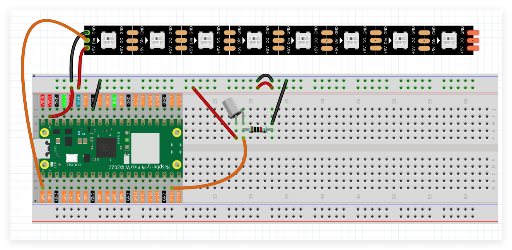
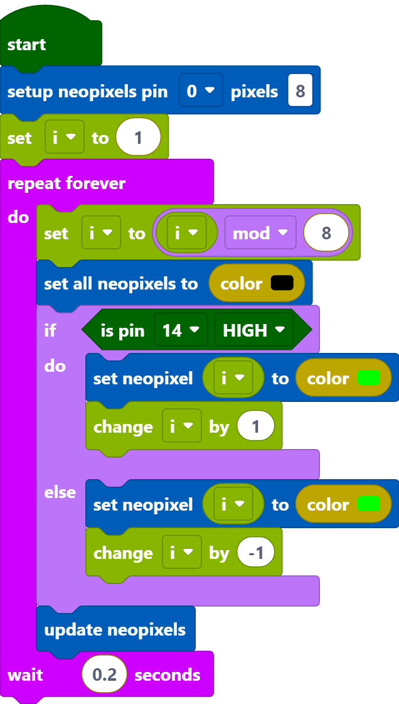
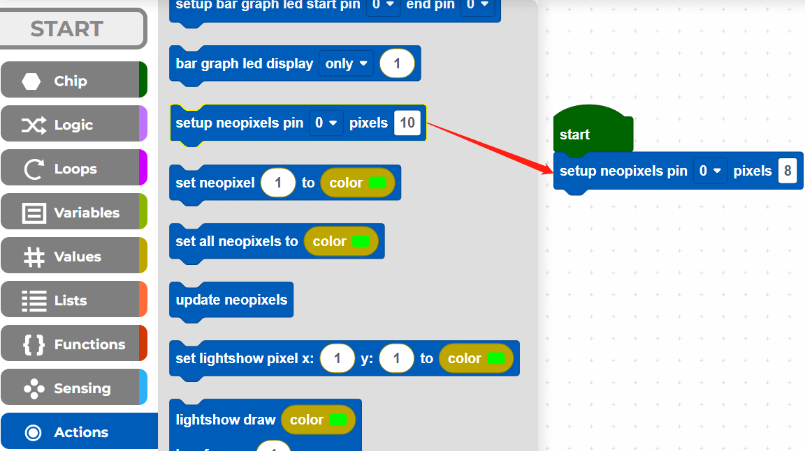
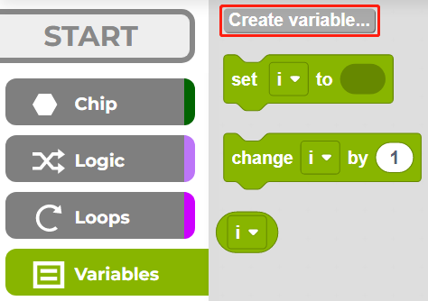
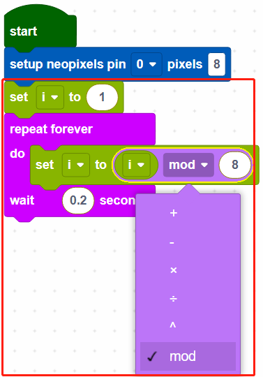
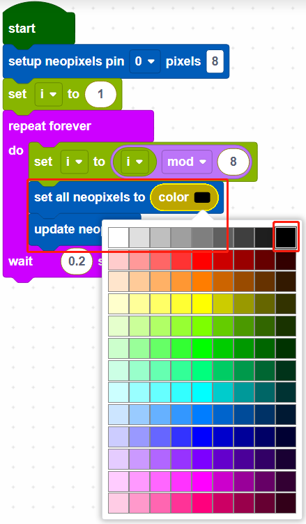
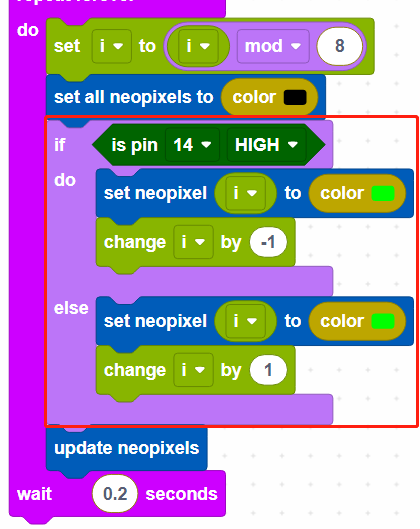

.. _rgb_light_strip:

2.10 Programmable LED Strip Display
===================================

This project demonstrates the creation of dynamic color patterns using individually addressable WS2812 RGB LED strips for vibrant visual effects.

WS2812 LEDs are intelligent RGB lighting elements featuring integrated control circuits that enable individual pixel addressing. Each LED contains an embedded microcontroller allowing data reception and serial transmission to subsequent LEDs in the chain configuration.

Required Components
^^^^^^^^^^^^^^^^^^^
- Raspberry Pi Pico W x1
- MicroUSB cable x1
- 830 Tie-Points Breadboard x1
- WS2812 RGB 8 LEDs Strip x1
- Tilt Switch x1 x1
- Resistor 10kΩ x1
- Jumper Wire Several
  

Circuit Configuration
^^^^^^^^^^^^^^^^^^^^^

* WS2812 RGB LED strip data input connects to digital pin GP15.
* Power supply terminal links to VBUS rail.
* Ground reference connects to GND terminal.

Programming Implementation
^^^^^^^^^^^^^^^^^^^^^^^^^^

.. note::

    * Follow the visual programming guide below using drag-and-drop techniques. 
    * Load ``2.10_RGB_Light_Strip.png`` from the directory ``Ultimate-Starter-Kit-for-Pico-W\Piper_Make``. For comprehensive guidance, see :ref:`import_code_piper`.

Upon Pico W connection, press the **Start** button to begin program execution. The addressable LED strip will generate a spectrum rainbow pattern with colors transitioning smoothly across the visible light range.

Programming
^^^^^^^^^^^^^^^^^^^^^^^^

**Step 1**: Use the [setup neopixel pin() pixels()] block in the **Actions** palette to initialize the WS2812 RGB LED Strip. **0** means the connected pin is GP0 and **8** means there are 8 RGB LEDs on the WS2812 RGB LED Strip.

**Step 2**: In the **Variables** palette, click the **Create variable** button to create a variable called **i** to represent the LEDs on the WS2812 RGB LED Strip. 

**Step 3**: Set the initial value of variable **i** to 1 (the LED near the wires), then in [repeat forever] block, use [() mod ()] to set the value of i from 0 to 7. e.g. 1 mod 8 = 1... 8 mod 8 =0, 9 mod 8 =1, etc.

* [() mod ()]: This is the modulo operator block, from the **Loops** palette, drop down [() = ()] to select **mod**.

**Step 4**: Set all neopixels to black to make all LEDs go off, then use [updates neopixels] to make this effect update to the WS2812 RGB LED Strip.

* [set all neopixels to ()]: Use to set a color for all LEDs, there are 13*9 colors, the top right color is black to make LEDs to go off.
* [updates neopixels]: Update the effect to the WS2812 RGB LED Strip.

**Step 5**: If pin14 is read high, let the LEDs on the WS2812 RGB LED Strip light up one by one in green, otherwise light up green one by one in the opposite direction.

* [change () by ()]: Used to increase (positive) or decrease (negative) the value of a variable by a specific step.

