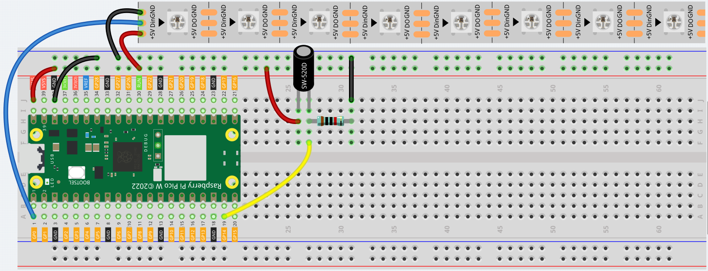
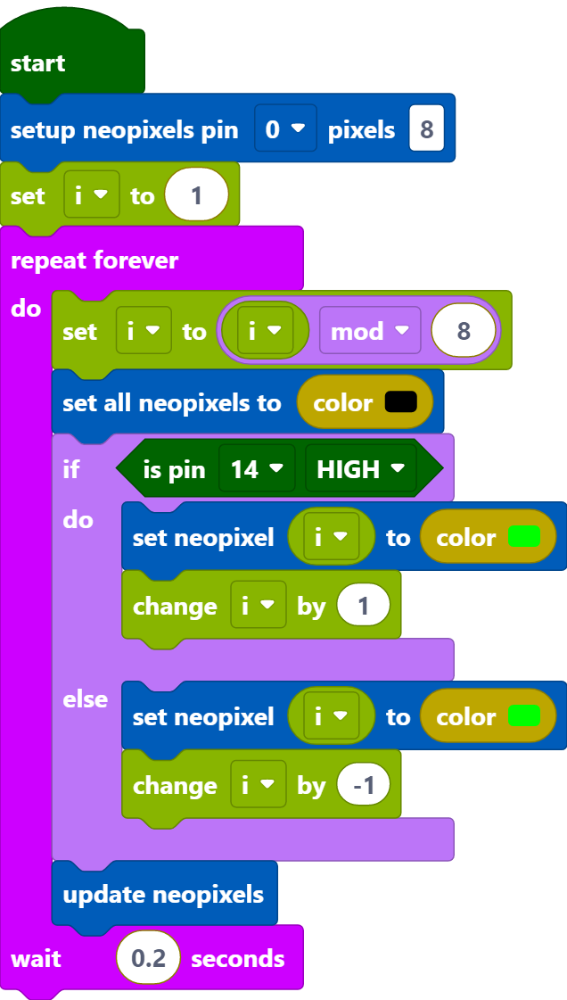
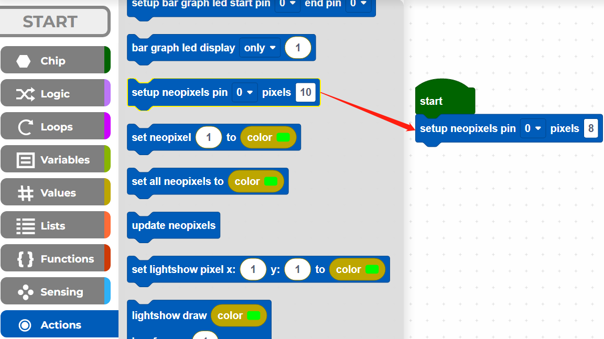
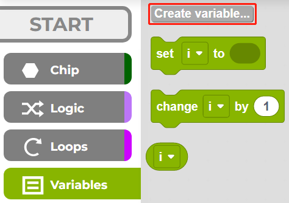
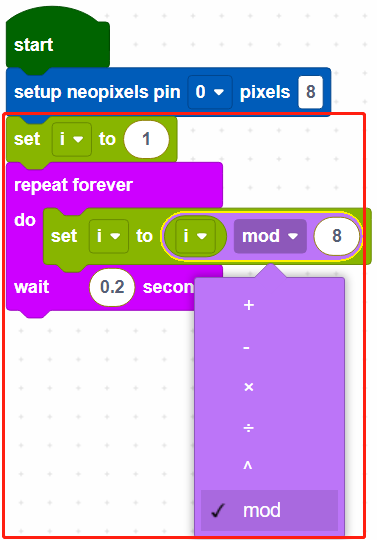
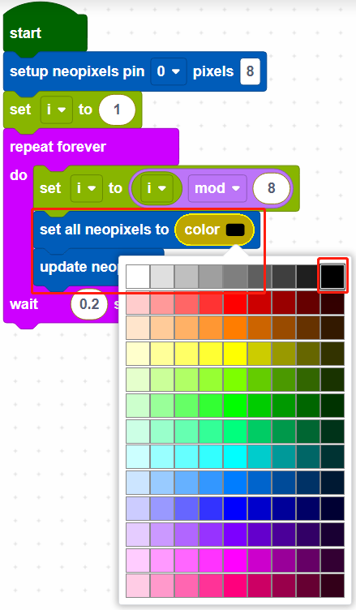
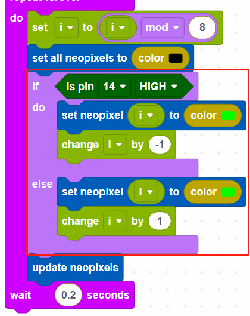

.. _per_flowing_leds:

2.10 RGB Light Strip
====================

The kit is equipped with a WS2812 RGB LED Strip, which can display colorful colors, and each LED can be independently controlled. 

Here we try to use the tilt switch to control the flow direction of the LEDs on the WS2812 RGB LED Strip.

Component List
^^^^^^^^^^^^^^^^^^^^^^^^
- Raspberry Pi Pico W x1
- MicroUSB cable x1
- 830 Tie-Points Breadboard x1
- WS2812 RGB 8 LEDs Strip x1
- Tilt Switch x1 x1
- Resistor 10kΩ x1
- Jumper Wire Several

Wiring
^^^^^^^^^^^^^^^^^^^^^^^^

Code
^^^^^^^^^^^^^^^^^^^^^^^^

.. note::

    * You can refer to the image below to write code by dragging and dropping. 
    * Import ``2.10_RGB_Light_Strip.png`` from the path of ``Ultimate-Starter-Kit-for-Pico-W\Piper_Make``. For detailed tutorials, please refer to :ref:`import_code_piper`.

After connecting Pico W, click the **Start** button and the code starts to run.

When the tilt switch is placed vertically, it makes the LEDs on the WS2812 RGB LED Strip light up one by one in green, and when the tilt switch is placed horizontally, the LEDs light up one by one in the opposite direction in green.

Programming
^^^^^^^^^^^^^^^^^^^^^^^^

**Step 1**: Use the [setup neopixel pin() pixels()] block in the **Actions** palette to initialize the WS2812 RGB LED Strip. **0** means the connected pin is GP0 and **8** means there are 8 RGB LEDs on the WS2812 RGB LED Strip.

**Step 2**: In the **Variables** palette, click the **Create variable** button to create a variable called **i** to represent the LEDs on the WS2812 RGB LED Strip. 

**Step 3**: Set the initial value of variable **i** to 1 (the LED near the wires), then in [repeat forever] block, use [() mod ()] to set the value of i from 0 to 7. e.g. 1 mod 8 = 1... 8 mod 8 =0, 9 mod 8 =1, etc.

* [() mod ()]: This is the modulo operator block, from the **Loops** palette, drop down [() = ()] to select **mod**.

**Step 4**: Set all neopixels to black to make all LEDs go off, then use [updates neopixels] to make this effect update to the WS2812 RGB LED Strip.

* [set all neopixels to ()]: Use to set a color for all LEDs, there are 13*9 colors, the top right color is black to make LEDs to go off.
* [updates neopixels]: Update the effect to the WS2812 RGB LED Strip.

**Step 5**: If pin14 is read high, let the LEDs on the WS2812 RGB LED Strip light up one by one in green, otherwise light up green one by one in the opposite direction.

* [change () by ()]: Used to increase (positive) or decrease (negative) the value of a variable by a specific step.

