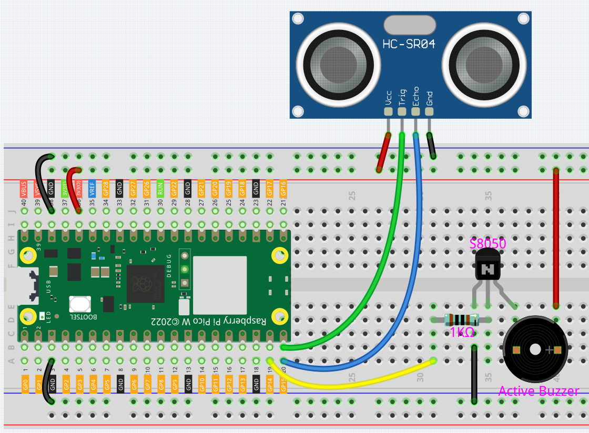
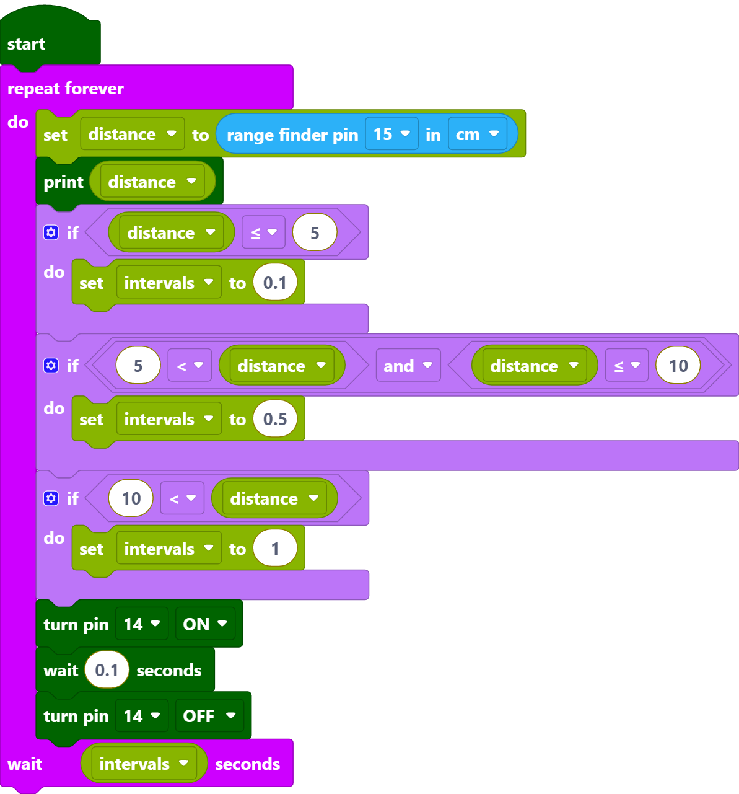
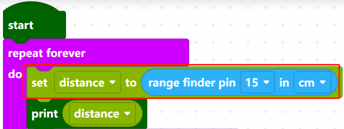
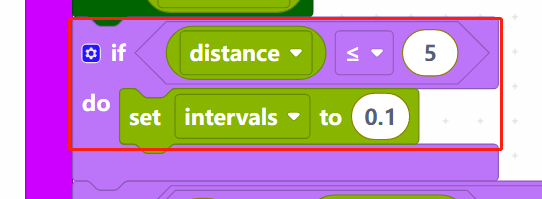
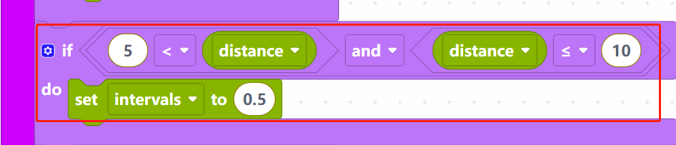
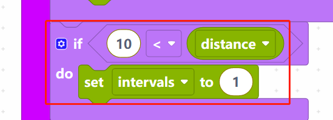
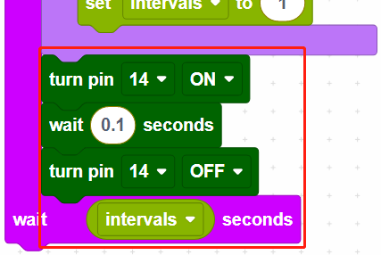

.. _per_reversing_system:

2.11 Reversing Radar
==========================

For this project we used an ultrasonic module and an active buzzer to create a reversing alarm system. The ultrasonic module is used to detect the distance, and the buzzer emits different frequencies of alarm sounds depending on the distance.

Component List
^^^^^^^^^^^^^^^^^^^^^^^^
- Raspberry Pi Pico W x1
- MicroUSB cable x1
- 830 Tie-Points Breadboard x1
- Transistor S8050 x1
- Active Buzzer x1
- ReUltrasonic Module x1
- Resistor 1kΩ x1
- Jumper Wire Several

Wiring
^^^^^^^^^^^^^^^^^^^^^^^^

* The Echo and Trig pins of the ultrasonic module are connected to GP15 at the same time, so that the ultrasonic module sends and receives signals from GP15.
* The middle pin of the transistor connected to the buzzer is connected to GP14 through a 1kΩ resistor.

Code
^^^^^^^^^^^^^^^^^^^^^^^^
.. note::

    * You can refer to the image below to write code by dragging and dropping. 
    * Import ``2.11_Reversing_Radar.png`` from the path of ``Ultimate-Starter-Kit-for-Pico-W\Piper_Make``. For detailed tutorials, please refer to :ref:`import_code_piper`.

* After connecting Pico W, click the **Start** button and the code starts to run.
* When the ultrasonic detection distance is less than 5cm, the buzzer emits a sharp sound (0.1s).
* When the detection distance is between 5~10cm, the buzzer emits a slightly slow sound (0.5s).
* When the detection distance is greater than 10cm, there is a sound prompt every 1 second.

How it Works?
^^^^^^^^^^^^^^^^^^^^^^^^

Read the distance (in cm) of the ultrasonic detection, and store it in the variable [distance].

When distance is less than or equal to 5, set the variable intervals to 0.1s. The variable [intervals] is the interval between buzzer sounds.

When distance is greater than 5 and less than or equal to 10, set the [intervals] to 0.5s.

When distance is greater than 10, set the [intervals] time to 1s.

Finally, make the buzzer sound every [intervals] seconds.

