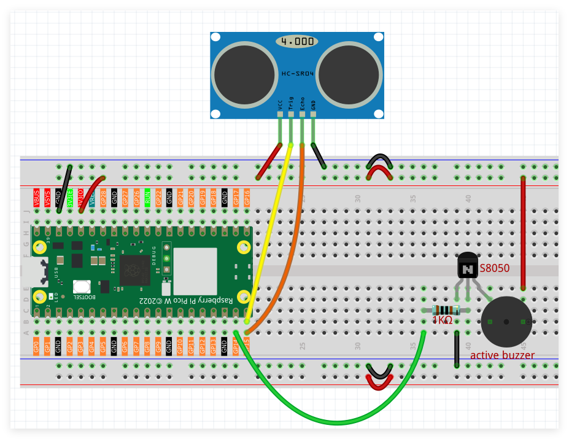
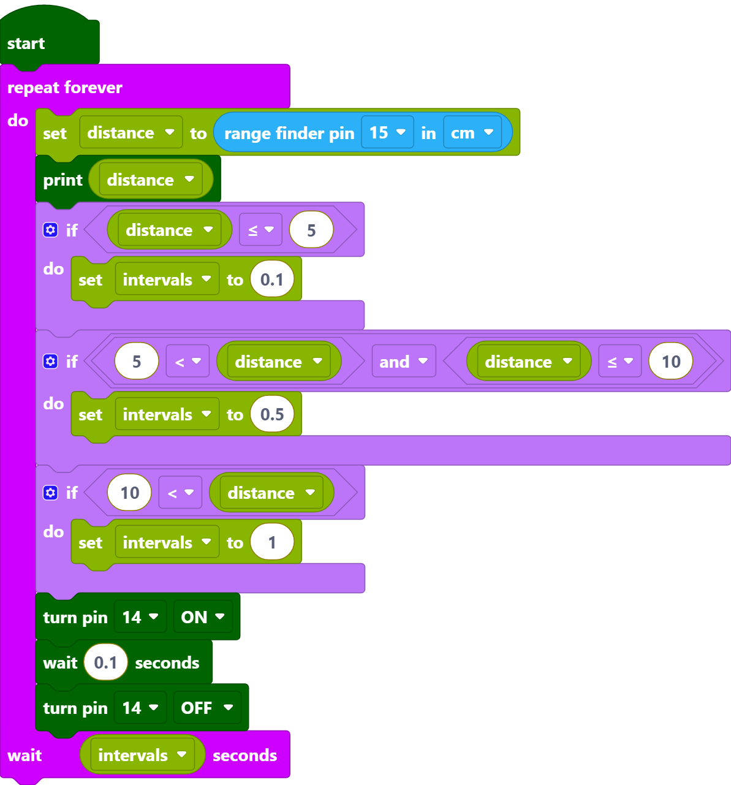
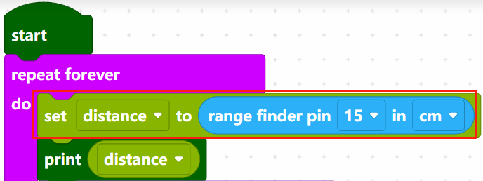
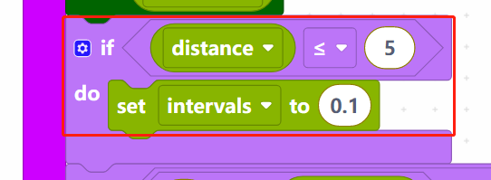
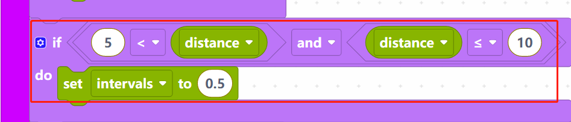
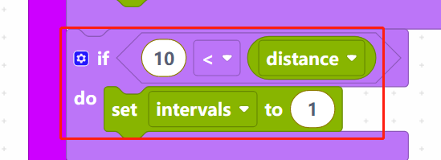
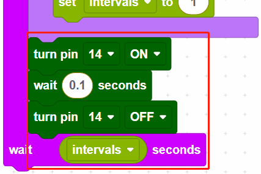

.. _reversing_radar:

2.11 Proximity Detection Alert System
=====================================

This project constructs a vehicle backup assistance system utilizing ultrasonic distance measurement and auditory warning signals to identify obstacles and deliver proximity-based feedback.

Ultrasonic distance sensors operate by transmitting high-frequency sound pulses and calculating the elapsed time for echo return from target objects. This temporal measurement enables precise distance computation through sound velocity calculations.

Required Components
^^^^^^^^^^^^^^^^^^^
- Raspberry Pi Pico W x1
- MicroUSB cable x1
- 830 Tie-Points Breadboard x1
- Ultrasonic Sensor HC-SR04 x1
- Active Buzzer x1
- Transistor S8050 x1
- Resistor 1KΩ x1
- Resistor 10KΩ x1
- Capacitor 104 x1
- Jumper Wire Several
  

Circuit Configuration
^^^^^^^^^^^^^^^^^^^^^

* Ultrasonic sensor trigger pin interfaces with digital output GP14.
* Echo reception pin connects to digital input GP15.
* Audio alert buzzer links to digital output GP13.

Programming Implementation
^^^^^^^^^^^^^^^^^^^^^^^^^^

.. note::

    * Follow the visual programming guide below using drag-and-drop techniques. 
    * Load ``2.11_Reversing_Radar.png`` from the directory ``Ultimate-Starter-Kit-for-Pico-W\Piper_Make``. For comprehensive guidance, see :ref:`import_code_piper`.

Upon Pico W connection, press the **Start** button to begin program execution. Position various objects at different distances from the ultrasonic sensor to observe buzzer tone variations corresponding to object proximity levels.

How it Works?
^^^^^^^^^^^^^^^^^^^^^^^^

Read the distance (in cm) of the ultrasonic detection, and store it in the variable [distance].

When distance is less than or equal to 5, set the variable intervals to 0.1s. The variable [intervals] is the interval between buzzer sounds.

When distance is greater than 5 and less than or equal to 10, set the [intervals] to 0.5s.

When distance is greater than 10, set the [intervals] time to 1s.

Finally, make the buzzer sound every [intervals] seconds.

