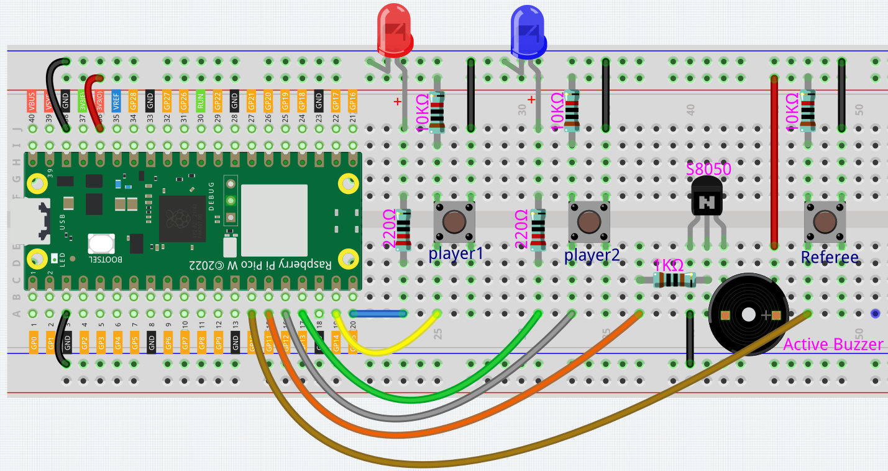
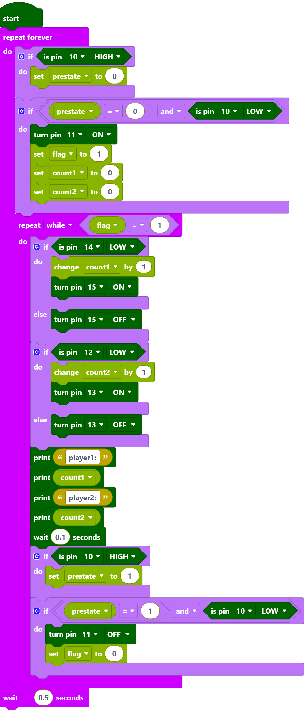
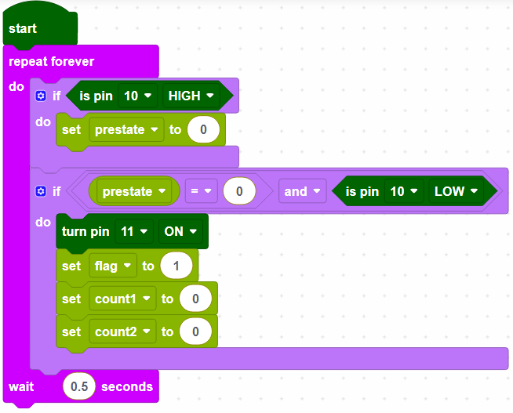
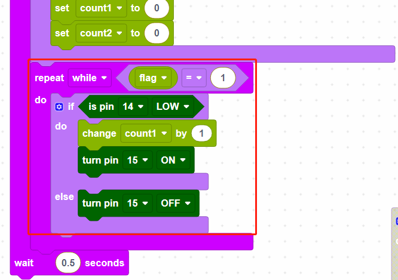
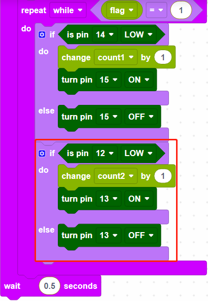
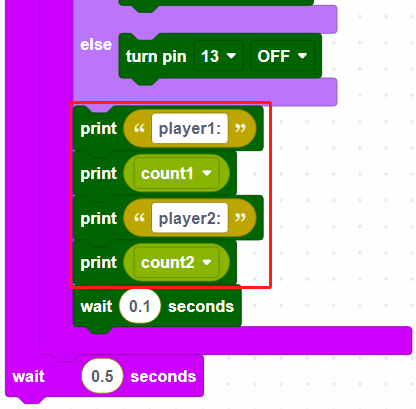
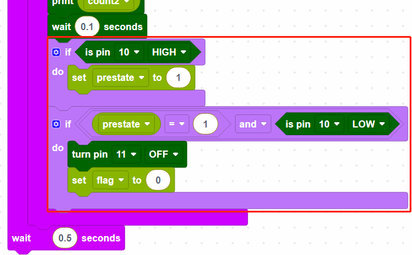

.. _per_reaction_game:

2.12 Reaction Game
===========================

Here we use several buttons, buzzer and LEDs to make a reaction game.Press the referee button to start the game, the buzzer will also keep ringing to prompt the game to continue; press the 2 player buttons quickly respectively; when the referee button is pressed again, the game is over the buzzer stops working.  At this point, look at the CONSOLE on Piper Make to see whose hand speed is fast.

Component List
^^^^^^^^^^^^^^^^^^^^^^^^
- Raspberry Pi Pico W x1
- MicroUSB cable x1
- 830 Tie-Points Breadboard x1
- Transistor S8050 x1
- Active Buzzer x1
- Resistor 220Ω x2
- Resistor 1kΩ x1
- Resistor 10kΩ x3
- 6*6 Button x3
- LED x2
- Jumper Wire Several

Wiring
^^^^^^^^^^^^^^^^^^^^^^^^

* Define 2 buttons as player1 (GP14) and player2 (GP12), both have a pull-up resistor connected. When the buttons are pressed, GP14 and GP12 are each low.
* Their indicators are connected to GP15 and GP13,  and output high to light them up.
* Define a referee button connected to GP10, when the button is pressed, GP10 goes low.
* Active buzzer is connected to GP11, when GP11 output high, the buzzer will sound.

Code
^^^^^^^^^^^^^^^^^^^^^^^^

.. note::

    * You can refer to the image below to write code by dragging and dropping. 
    * Import ``2.12_Reaction_Game.png`` from the path of ``Ultimate-Starter-Kit-for-Pico-W\Piper_Make``. For detailed tutorials, please refer to :ref:`import_code_piper`.

* After connecting Pico W, click the **Start** button and the code starts to run.
* Press the referee button and the buzzer starts to sound (continuously), representing the start of the game.
* At this point, press the **player** buttons separately and quickly, and the corresponding LEDs will light up.
* When the **referee** button is pressed again, the buzzer stops, which means the game is over.
* Click CONSOLE at this point to see who presses it more times.

How it Works?
^^^^^^^^^^^^^^^^^^^^^^^^

GP10 is the referee button, when the referee button is not pressed it is high, the game has not started yet.
When GP10 is low (referee button pressed), the game starts; set GP11 to high (buzzer), create variables and set initial values.

When flag equals to 1 for game start, then read the value of GP14 (player1); if player1 button is pressed, store the number of presses in variable [count1], and make the indicator of GP15 light up.

Read the number of presses of GP12(player2) in the same way.

Print the number of presses for player1 and player2 respectively.

When the referee button is pressed again, the buzzer stops working and the game ends.