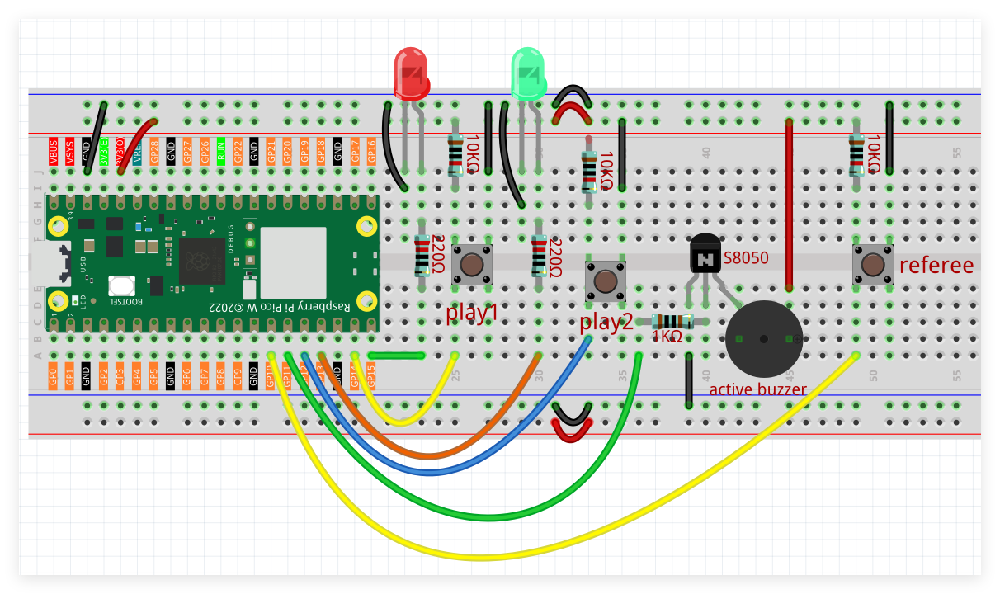
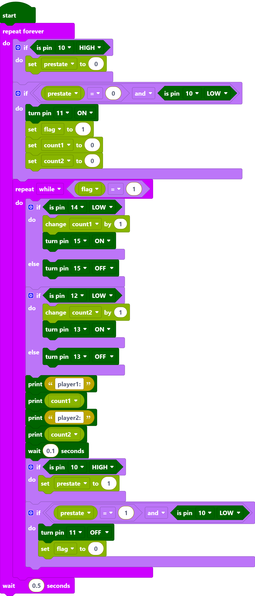
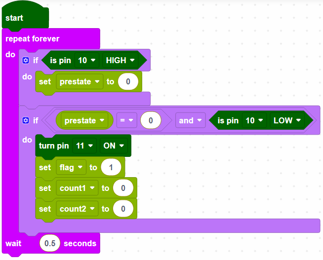
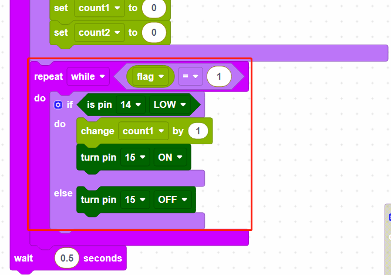
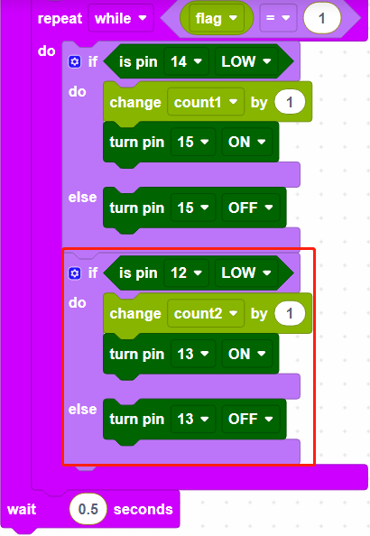
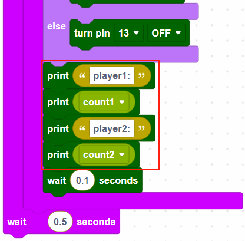
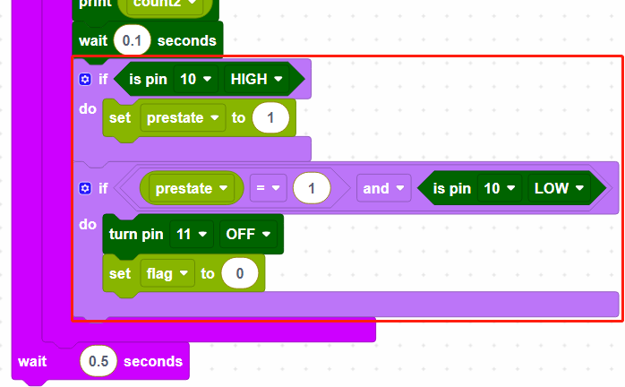

.. _reaction_game:

2.12 Response Speed Challenge
=============================

This project develops an interactive reflex testing system utilizing multiple LEDs and push buttons to evaluate user response timing when visual stimuli are presented.

The challenge mechanism operates by randomly activating individual LEDs from a multi-color array, requiring players to identify and activate the corresponding control button with minimal delay. Response duration is calculated and recorded for performance assessment.

Required Components
^^^^^^^^^^^^^^^^^^^
- Raspberry Pi Pico W x1
- MicroUSB cable x1
- 830 Tie-Points Breadboard x1
- LED Red x1
- LED Green x1
- LED Blue x1
- Button x3
- Resistor 220Ω x3
- Resistor 10KΩ x3
- Jumper Wire Several

Circuit Configuration
^^^^^^^^^^^^^^^^^^^^^

* Red LED interfaces with digital output GP13, Green LED with GP14, Blue LED with GP15.
* Push button 1 connects to digital input GP16, button 2 to GP17, button 3 to GP18.
* Individual LEDs incorporate 220Ω current limitation resistors.
* Push buttons feature 10KΩ pull-up resistor configurations.

Programming Implementation
^^^^^^^^^^^^^^^^^^^^^^^^^^

.. note::

    * Follow the visual programming guide below using drag-and-drop techniques. 
    * Load ``2.12_Reaction_Game.png`` from the directory ``Ultimate-Starter-Kit-for-Pico-W\Piper_Make``. For comprehensive guidance, see :ref:`import_code_piper`.

* After connecting Pico W, click the **Start** button and the code starts to run.
* Press the referee button and the buzzer starts to sound (continuously), representing the start of the game.
* At this point, press the **player** buttons separately and quickly, and the corresponding LEDs will light up.
* When the **referee** button is pressed again, the buzzer stops, which means the game is over.
* Click CONSOLE at this point to see who presses it more times.

How it Works?
^^^^^^^^^^^^^^^^^^^^^^^^

GP10 is the referee button, when the referee button is not pressed it is high, the game has not started yet.
When GP10 is low (referee button pressed), the game starts; set GP11 to high (buzzer), create variables and set initial values.

When flag equals to 1 for game start, then read the value of GP14 (player1); if player1 button is pressed, store the number of presses in variable [count1], and make the indicator of GP15 light up.

Read the number of presses of GP12(player2) in the same way.

Print the number of presses for player1 and player2 respectively.

When the referee button is pressed again, the buzzer stops working and the game ends.