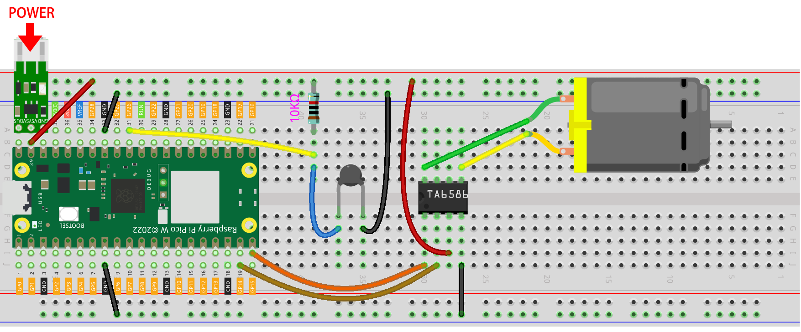
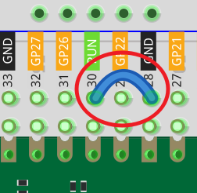
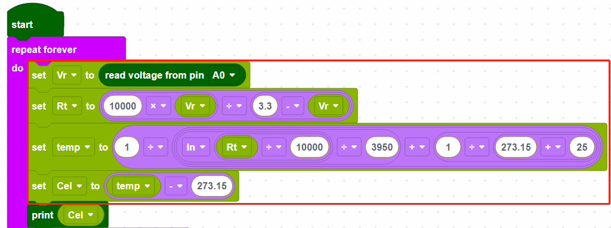
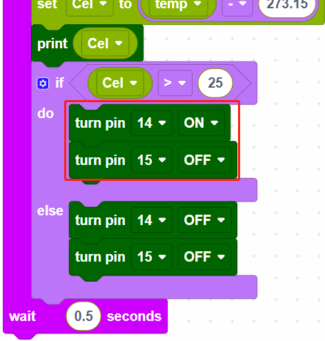

.. _per_smart_fan:

2.13 Temperature Control Fan
=============================

Here we make a temperature controlled smart fan with thermistor, TA6586, motor, and power module. The fan rotates automatically when the set temperature is reached.

Component List
^^^^^^^^^^^^^^^^^^^^^^^^
- Raspberry Pi Pico W x1
- MicroUSB cable x1
- 830 Tie-Points Breadboard x1
- TA6586 - Motor Driver Chip x1
- DC Motor x1
- Li-po Charger Module x1
- 18650 Battery x1
- Battery Holder x1
- Resistor 10kΩ x1
- Photoresistor x1
- Jumper Wire Several

Wiring
^^^^^^^^^^^^^^^^^^^^^^^^

Code
^^^^^^^^^^^^^^^^^^^^^^^^
.. note::

    * You can refer to the image below to write code by dragging and dropping. 
    * Import ``2.13_Temperature_Control_Fan.png`` from the path of ``Ultimate-Starter-Kit-for-Pico-W\Piper_Make``. For detailed tutorials, please refer to :ref:`import_code_piper`.

* After connecting Pico W, click the **Start** button and the code starts to run.
* Click CONSLE, you will see the current temperature in Celsius.
* The fan starts spinning when it is above 25 degrees, and stops spinning when it is below 25 degrees.

.. note::

    * If the motor is still spinning after you click the Stop button, you need to reset the Run pin on the Pico W with a wire to GND at this time, and then unplug this wire to run the code again.
    * This is because the motor is operating with too much current, which may cause the Pico W to disconnect from the computer. 

How it Works?
^^^^^^^^^^^^^^^^^^^^^^^^

The voltage of A0 (GP26) is read and assigned to the variable [Vr].

These calculations convert the thermistor values into centigrade degree. 

.. note::
    Here is the relation between the resistance and temperature: 

    **RT =RN expB(1/TK – 1/TN)** 

    * RT is the resistance of the NTC thermistor when the temperature is TK. 
    * RN is the resistance of the NTC thermistor under the rated temperature TN. Here, the numerical value of RN is 10k. 
    * TK is a Kelvin temperature and the unit is K. Here, the numerical value of TK is 273.15 + degree Celsius. 
    * TN is a rated Kelvin temperature; the unit is K too. Here, the numerical value of TN is 273.15+25.
    * And B(beta), the material constant of NTC thermistor, is also called heat sensitivity index with a numerical value 3950. 
    * exp is the abbreviation of exponential, and the base number e is a natural number and equals 2.7 approximately. 

    Convert this formula **TK=1/(ln(RT/RN)/B+1/TN)** to get Kelvin temperature that minus 273.15 equals degree Celsius. 

    This relation is an empirical formula. It is accurate only when the temperature and resistance are within the effective range.

When the temperature is higher than 25 degrees Celsius, set GP14 to ON and GP15 to OFF to make the motor rotate, or you can reverse their levels. When the temperature is lower than 25 degrees Celsius, set GP14 and GP15 both low to stop the motor.

