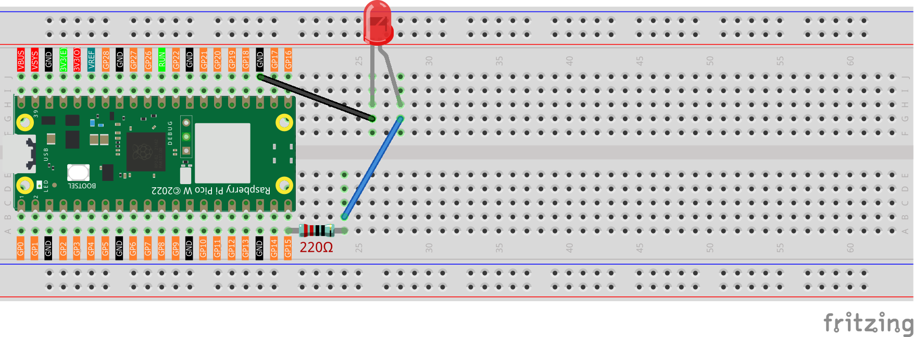
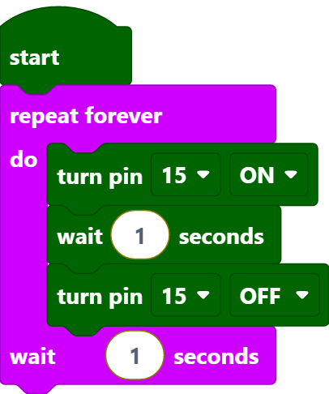

2.1 LED Blinking Fundamentals
==============================

In this tutorial, we'll create a flashing LED circuit using external components. For beginners working with electronic modules, a prototyping breadboard serves as an essential tool for circuit construction.

A breadboard consists of a plastic base featuring numerous connection points arranged in a grid pattern. These connection holes enable quick insertion of electronic parts and facilitate circuit assembly. Since components aren't permanently soldered, breadboards offer flexibility for circuit modifications and troubleshooting when errors occur.

Required Components
^^^^^^^^^^^^^^^^^^^
- Raspberry Pi Pico W x1
- MicroUSB cable x1
- 830 Tie-Points Breadboard x1
- LED x1
- Resistor 220Ω x1
- Jumper Wire Several

Circuit Assembly
^^^^^^^^^^^^^^^^^

* The 220-ohm resistor displays color bands: red, red, black, black, and brown.

* LED polarity: the extended leg represents the positive terminal (anode), while the shorter leg is the negative terminal (cathode). 

Programming
^^^^^^^^^^^
.. note::

    * Reference the visual guide below for drag-and-drop programming. 
    * Load ``2.1_Hello_Led.png`` from the directory ``Ultimate-Starter-Kit-for-Pico-W\Piper_Make``. For comprehensive instructions, see :ref:`import_code_piper`.

Once the Pico W is connected, press the **Start** button to observe the LED flashing pattern. For additional guidance, consult :ref:`quick_guide_piper`.

Operation Principles
^^^^^^^^^^^^^^^^^^^^
The program loop operates as follows: activate pin15 to illuminate the LED, pause for one second, deactivate pin15 to extinguish the LED. After another one-second delay, the sequence repeats, creating a continuous on-off pattern.

* [start]: This component establishes the program foundation and marks the execution starting point.
* [repeat forever do() wait()seconds]: Creates an infinite loop where enclosed blocks execute continuously with user-defined timing intervals.
* [turn pin () ON/OFF]: Controls pin state by setting it to high voltage (ON) or low voltage (OFF).
* [wait () seconds]: Establishes timing delays between block executions.
