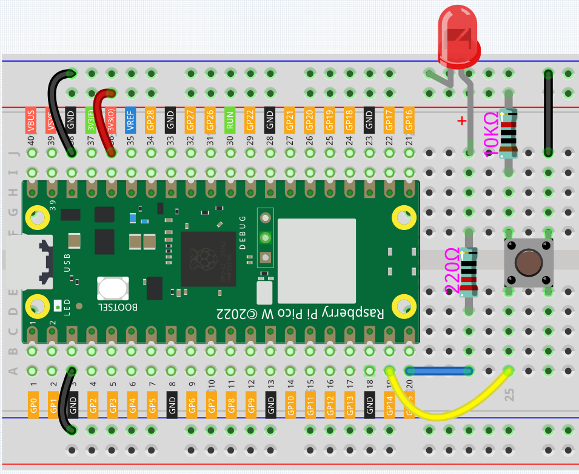
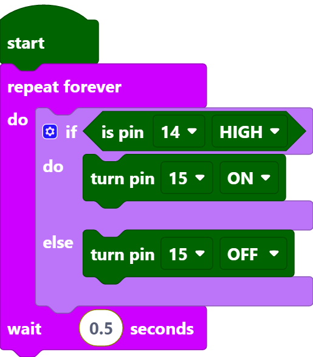

.. _per_button:

2.2 Button Control LED
===============================

In this project, we will learn how to turn on or off the LED by using a button.

Component List
^^^^^^^^^^^^^^^^^^^^^^^^
- Raspberry Pi Pico W x1
- MicroUSB cable x1
- 830 Tie-Points Breadboard x1
- LED x1
- 6*6 Button x1
- Resistor 220Ω x1
- Resistor 10kΩ x1
- Jumper Wire Several
  

Wiring
^^^^^^^^^^^^^

* One side of the button pin is connected to 3.3v, and the other side pin is connected to GP14, so when the button is pressed, GP14 will be high. 
* However, when the button is not pressed, GP14 is in a suspended state and may be high or low. In order to get a stable low level when the button is not pressed, GP14 needs to be reconnected to GND through a 10K pull-down resistor.

Code
^^^^^^^^^^^^^

.. note::

    * You can refer to the image below to write code by dragging and dropping. 
    * Import ``2.2_Button_Control_LED.png`` from the path of ``Ultimate-Starter-Kit-for-Pico-W\Piper_Make``. For detailed tutorials, please refer to :ref:`import_code_piper`.

After connecting Pico W, click the **Start** button and the code starts to run. When the button is pressed, the LED will be lit. When the button is released, the LED will go out.

How it Works?
^^^^^^^^^^^^^

When the button is pressed, pin14 is high. So if the read pin14 is high, turn the pin15 on (LED is lit); else, turn off the pin15 (LED is off).

* [if () do () else ()]: This is a judgment block, depending on the condition after the [if] block to determine whether to run the blocks inside the [do] block, or the blocks inside the [else] block.
* [is pin () HIGH]: This is used to read the level of a specific pin, if the level read is the same as the set HIGH/LOW, then execute the blocks inside [do] block, otherwise execute the blocks inside [else].

