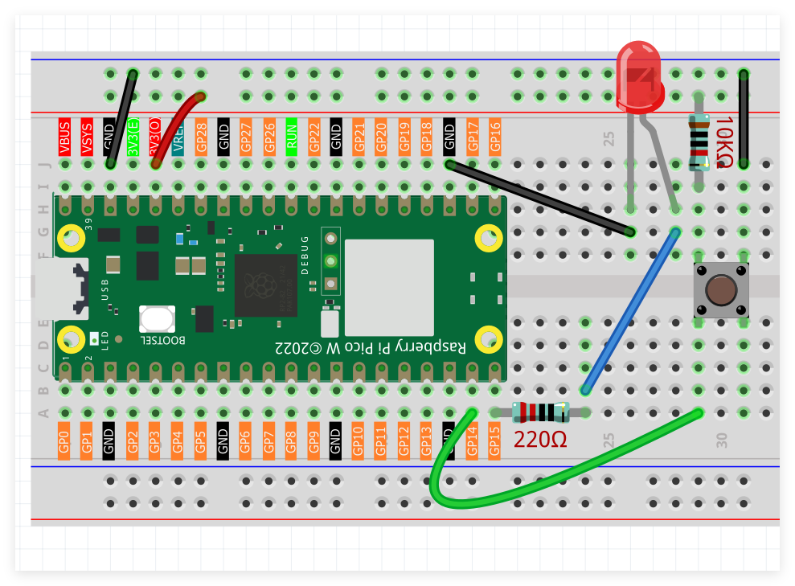
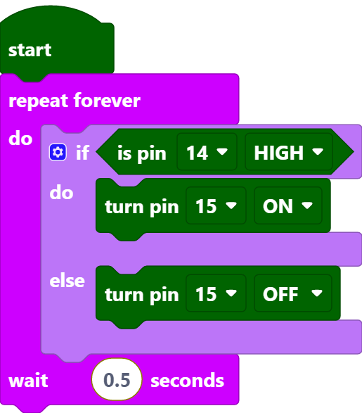

.. _per_button:

2.2 Push Button LED Controller
===============================

This tutorial demonstrates how to control LED illumination using a tactile switch input.

Required Components
^^^^^^^^^^^^^^^^^^^
- Raspberry Pi Pico W x1
- MicroUSB cable x1
- 830 Tie-Points Breadboard x1
- LED x1
- 6*6 Button x1
- Resistor 220Ω x1
- Resistor 10kΩ x1
- Jumper Wire Several
  

Circuit Connections
^^^^^^^^^^^^^^^^^^^

* Connect one button terminal to 3.3V power supply, while linking the opposite terminal to GP14, ensuring GP14 receives high voltage when the switch is activated. 
* Without button activation, GP14 remains in an undefined floating state, potentially reading either high or low. To ensure reliable low-level detection during button release, connect GP14 to ground through a 10kΩ pull-down resistor.

Programming Implementation
^^^^^^^^^^^^^^^^^^^^^^^^^^

.. note::

    * Follow the visual programming guide below using drag-and-drop methodology. 
    * Load ``2.2_Button_Control_LED.png`` from the directory ``Ultimate-Starter-Kit-for-Pico-W\Piper_Make``. For complete instructions, reference :ref:`import_code_piper`.

Upon Pico W connection, press the **Start** button to initiate code execution. LED activation occurs when the button is pressed, while LED deactivation happens upon button release.

Functional Analysis
^^^^^^^^^^^^^^^^^^^

Button activation drives pin14 to high state. The program logic reads pin14 status: if high, pin15 activates (LED illuminates); otherwise, pin15 deactivates (LED extinguishes).

* [if () do () else ()]: Conditional logic block that evaluates the [if] condition to determine execution path - either [do] block contents or [else] block contents.
* [is pin () HIGH]: Pin state detection function that compares actual pin voltage level against specified HIGH/LOW threshold, executing [do] block for matches or [else] block for mismatches.

