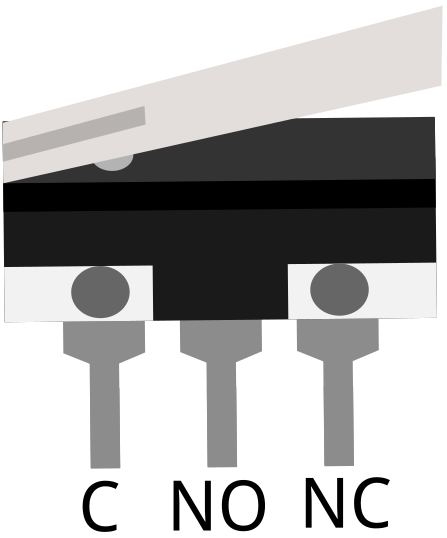
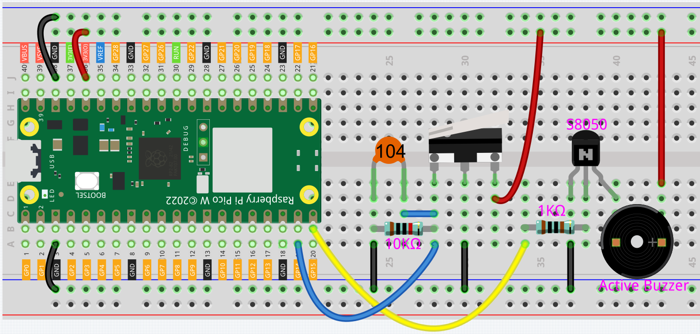
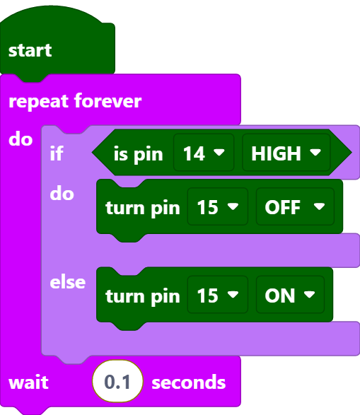

.. _per_service_bell:

2.3 Door Bell
==========================

For this project we used a microswitch and an active buzzer to create a service bell. Tap the switch and the buzzer makes a sound.

Micro Switch is also a 3-pin device, the sequence of the 3 pins are C (common pin), NO (normally open) and NC (normally closed).

When the micro switch is not pressed, 1 (C) and 3 (NC) are connected together, when pressed 1 (C) and 2 (NO) are connected together.

Component List
^^^^^^^^^^^^^^^^^^^^^^^^^
- Raspberry Pi Pico W x1
- MicroUSB cable x1
- 830 Tie-Points Breadboard x1
- Micro Switch x1
- Transistor S8050 x1
- Active Buzzer x1
- Resistor 1KΩ x1
- Resistor 10KΩ x1
- Capacitor 104 x1
- Jumper Wire Several
  

Wiring
^^^^^^^^^^^^^

* By default, pins 1 and 3 of the Micro Switch are connected together and GP14 is low. When the Micro Switch is pressed, GP14 is high.
* GP15 outputs high to make the buzzer sound.

Code
^^^^^^^^^^^^^

.. note::

    * You can refer to the image below to write code by dragging and dropping. 
    * Import ``2.3_Door_Bell.png`` from the path of  ``Ultimate-Starter-Kit-for-Pico-W\Piper_Make``. For detailed tutorials, please refer to :ref:`import_code_piper`.

After connecting Pico W, click the **Start** button and the code starts to run. Tap the switch and the buzzer makes a sound.

