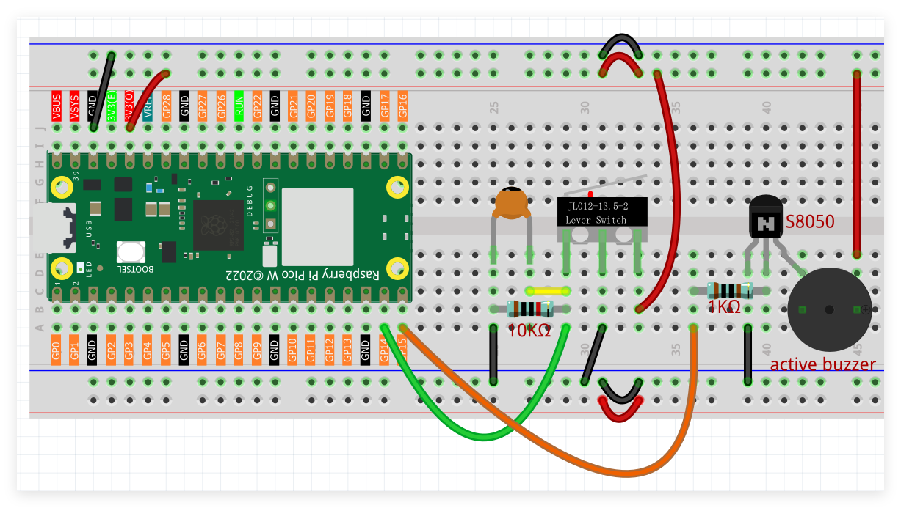
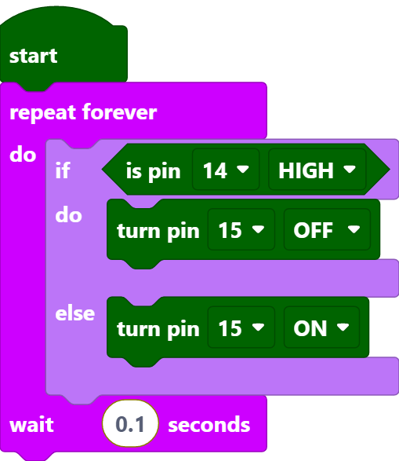

.. _per_service_bell:

2.3 Electronic Doorbell System
===============================

This project constructs an electronic doorbell using a microswitch and active buzzer combination. Pressing the switch triggers audible notification.

The microswitch features three terminals with specific designations: C (common terminal), NO (normally open contact), and NC (normally closed contact).

In the default state, terminals 1 (C) and 3 (NC) maintain electrical continuity, while activation connects terminals 1 (C) and 2 (NO).

Required Components
^^^^^^^^^^^^^^^^^^^
- Raspberry Pi Pico W x1
- MicroUSB cable x1
- 830 Tie-Points Breadboard x1
- Micro Switch x1
- Transistor S8050 x1
- Active Buzzer x1
- Resistor 1KΩ x1
- Resistor 10KΩ x1
- Capacitor 104 x1
- Jumper Wire Several
  

Circuit Configuration
^^^^^^^^^^^^^^^^^^^^^

* In the resting position, microswitch terminals 1 and 3 form a closed circuit, maintaining GP14 at low potential. Switch activation establishes GP14 high state.
* GP15 generates high output signal to activate buzzer operation.

Programming Code
^^^^^^^^^^^^^^^^

.. note::

    * Follow the visual programming guide below using drag-and-drop techniques. 
    * Load ``2.3_Door_Bell.png`` from the directory ``Ultimate-Starter-Kit-for-Pico-W\Piper_Make``. For comprehensive guidance, see :ref:`import_code_piper`.

Upon Pico W connection, press the **Start** button to begin program execution. Switch activation produces audible buzzer output.

