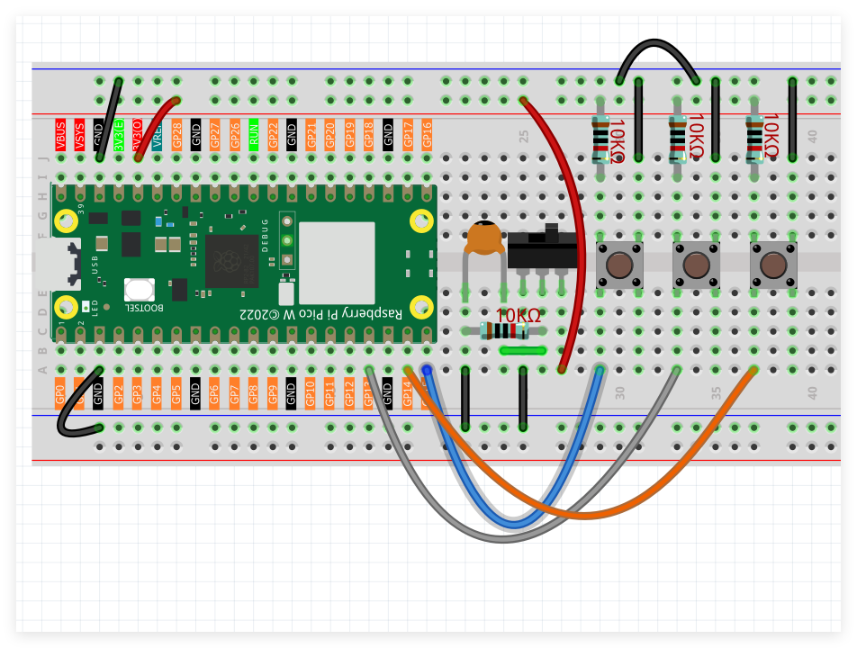
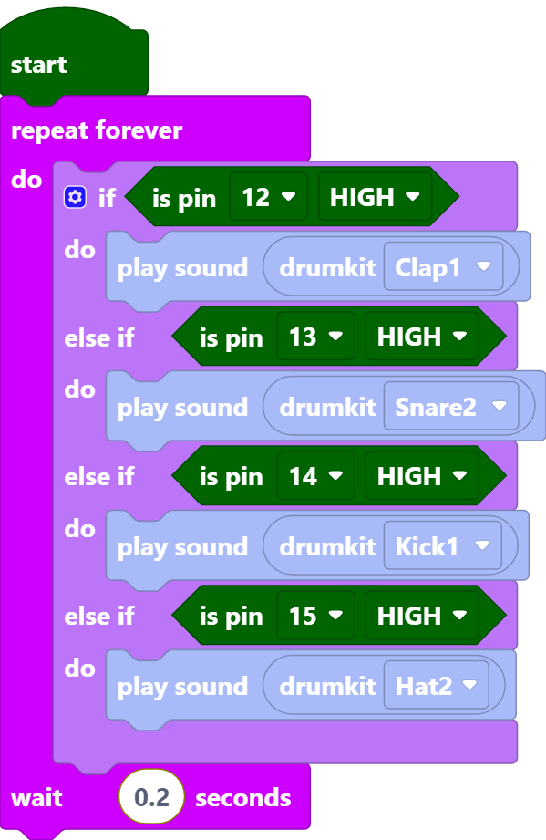

.. _per_drummer:

2.5 Electronic Percussion Kit
=============================

This project creates a digital drum set using three push buttons to trigger three distinct buzzer tones, simulating percussion instrument functionality.

Required Components
^^^^^^^^^^^^^^^^^^^
- Raspberry Pi Pico W x1
- MicroUSB cable x1
- 830 Tie-Points Breadboard x1
- Button x3
- Active Buzzer x3
- Transistor S8050 x3
- Resistor 1KΩ x3
- Resistor 10KΩ x3
- Capacitor 104 x3
- Jumper Wire Several

Circuit Configuration
^^^^^^^^^^^^^^^^^^^^^

* Three push buttons interface with GPIO pins GP14, GP15, and GP16 respectively.
* Three active buzzers connect to GPIO pins GP13, GP12, and GP11 correspondingly.

Programming Code
^^^^^^^^^^^^^^^^

.. note::

    * Follow the visual programming guide below using drag-and-drop techniques. 
    * Load ``2.5_Drummer.png`` from the directory ``Ultimate-Starter-Kit-for-Pico-W\Piper_Make``. For comprehensive guidance, see :ref:`import_code_piper`.

Upon Pico W connection, press the **Start** button to begin program execution. Activate the three buttons to trigger corresponding buzzer sounds, creating percussion-like audio effects.