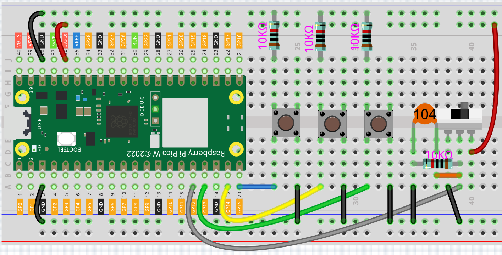

.. _per_drum_kit:

2.5 Drummer
=============================

For this project, let's make a drum kit with three buttons and a slide switch. Now, play your own drums.

Component List
^^^^^^^^^^^^^^^^^^
- Raspberry Pi Pico W x1
- MicroUSB cable x1
- 830 Tie-Points Breadboard x1
- Micro Switch x1
- 6*6 Button x3
- Capacitor 104 x1
- Resistor 10kΩ x4
- Jumper Wire Several

Wiring
^^^^^^^^^^^^^^^^^^

* When the slide switch is toggled to the right, GP12 is high; when toggled to the left, GP12 is low.
* Each of the three buttons is connected to a pull-down resistor, GP13~GP15 are low by default; when the button is pressed, GP13~GP15 are high.

Code
^^^^^^^^^^^^^^^^^^
.. note::

    * You can refer to the image below to write code by dragging and dropping. 
    * Import ``2.5_Drummer.png`` from the path of ``Ultimate-Starter-Kit-for-Pico-W\Piper_Make``. For detailed tutorials, please refer to :ref:`import_code_piper`.

After connecting Pico W, click the **Start** button and the code starts to run. Pressing different buttons or toggling the slide switch will produce different drum sounds, just like a drum kit.

.. note::
    If you are using a computer, you will need to plug in headphones or audio to your computer to hear the sound emitted.