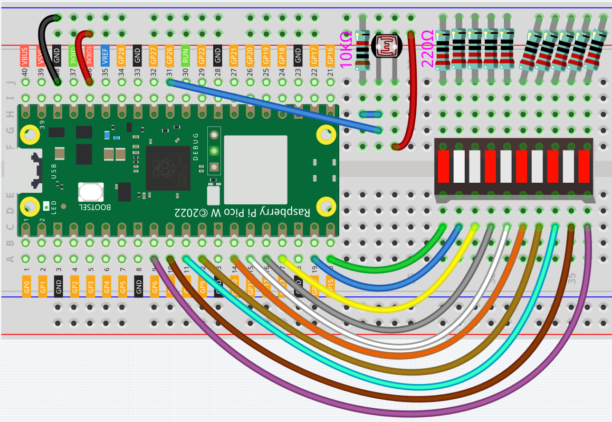
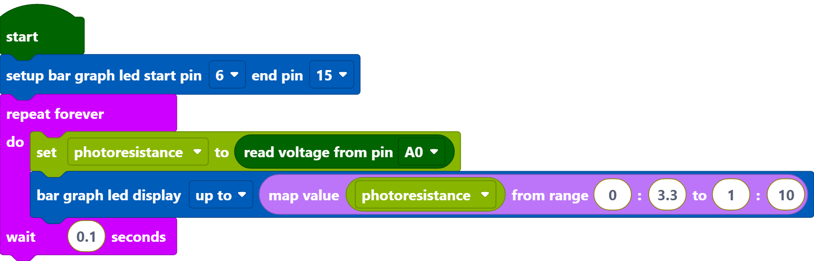
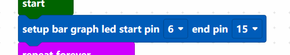
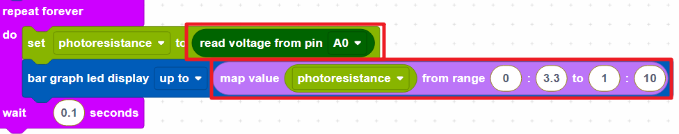

.. _per_light_display:

2.6 Light Intensity Display
=====================================

In this project, we use a photoresistor and the LED Bar Graph to make a light intensity display, where the stronger the light is the more the number of the LED Bar Graph lights up.

Component List
^^^^^^^^^^^^^^^^^^^^^^^^^^
- Raspberry Pi Pico W x1
- MicroUSB cable x1
- 830 Tie-Points Breadboard x1
- LED Bar Graph x1
- Photoresistor x1
- Resistor 220Ω x10
- Resistor 10KΩ x1
- Jumper Wire Several

Wiring
^^^^^^^^^^^^^^^^^^^^^^^^^^

* The LED Bar Graph consists of 10 LEDs, with the side with the label as the anode and the other side as the cathode.
* The anode of the LED Bar Graph are connected to GP6~GP15. The cathode are connected to a 220 ohm resistor and then to GND.
* Connect one end of the photoresistor to 3.3V and the other end to GP26 (A0). At the same time, GP26 needs to be connected to another 10K resistor to GND. This way, when the light is stronger, the resistance of the photoresistor decreases and the voltage of A0 increases.

Code
^^^^^^^^^^^^^^^^^^^^^^^^^^

.. note::

    * You can refer to the image below to write code by dragging and dropping. 
    * Import ``2.6_Light_Intensity_Display.png`` from the path of ``Ultimate-Starter-Kit-for-Pico-W\Piper_Make``. For detailed tutorials, please refer to :ref:`import_code_piper`.

* After connecting Pico W, click the **Start** button and the code starts to run.
* When the light is stronger, more LEDs are lit on the LED Bar Graph. 
* If running the code does not light up properly, you can try flipping the led bar.

How it Works?
^^^^^^^^^^^^^^^^^^^^^^^^^^

Set the pins of LED Bar Graph connected to GP6 ~ GP15.

Store the voltage value of A0 (GP26) read into the variable [photo_vol].  Use the [map value () from () to ()] block to map the variable [photo_vol] from 0 to 3.3V to 0 to 10 (the number of LEDs on the LED Bar Graph).

* [map value () from () to ()]: map a value from one range to another.
