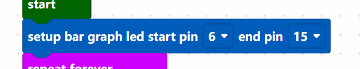
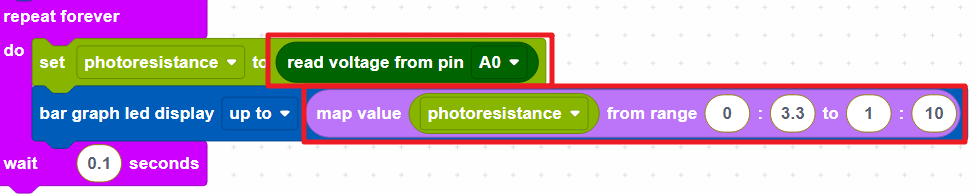

.. _per_light_intensity_display:

2.6 Ambient Light Visualization System
======================================

This project implements an ambient light monitoring system using a photoresistor sensor to measure illumination levels and visualize the data through an LED bar graph display.

A photoresistor functions as a light-dependent resistor, exhibiting variable resistance characteristics based on ambient illumination. Under bright conditions, resistance decreases; in dim environments, resistance increases proportionally.

The LED bar graph serves as a visual indicator comprising ten individual LEDs arranged linearly, providing analog-style representation of measured values.

.. image:: img/Light_Intensity_Display_photoresistor_pic.png

Required Components
^^^^^^^^^^^^^^^^^^^
- Raspberry Pi Pico W x1
- MicroUSB cable x1
- 830 Tie-Points Breadboard x1
- Photoresistor x1
- LED Bar Graph x1
- Resistor 10KΩ x1
- Resistor 220Ω x10
- Jumper Wire Several
  

Circuit Assembly
^^^^^^^^^^^^^^^^

.. image:: img/Light_Intensity_Display_Wiring.png

* The photoresistor interfaces with analog input pin GP26.
* LED bar graph elements connect to digital output pins GP13 through GP22.

Programming Implementation
^^^^^^^^^^^^^^^^^^^^^^^^^^

.. note::

    * Utilize the visual programming interface shown below through drag-and-drop methodology. 
    * Import ``2.6_Light_Intensity_Display.png`` from the location ``Ultimate-Starter-Kit-for-Pico-W\Piper_Make``. For complete instructions, reference :ref:`import_code_piper`.

.. image:: img/Light_Intensity_Display_Code.png

Following Pico W connection, activate the **Start** button to initiate program execution. Obstruct the photoresistor with your hand to observe corresponding changes in the LED bar graph illumination pattern.

How it Works?
^^^^^^^^^^^^^^^^^^^^^^^^^^

Set the pins of LED Bar Graph connected to GP6 ~ GP15.

Store the voltage value of A0 (GP26) read into the variable [photo_vol].  Use the [map value () from () to ()] block to map the variable [photo_vol] from 0 to 3.3V to 0 to 10 (the number of LEDs on the LED Bar Graph).

* [map value () from () to ()]: map a value from one range to another.
