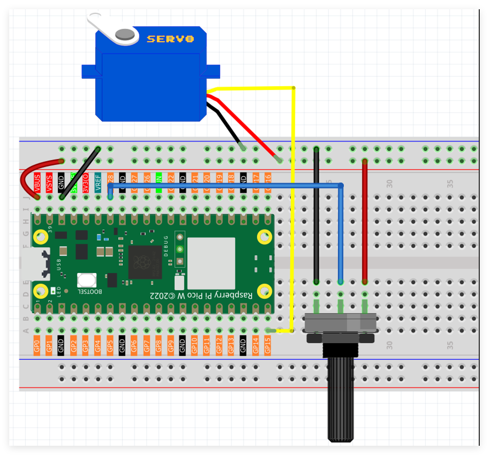
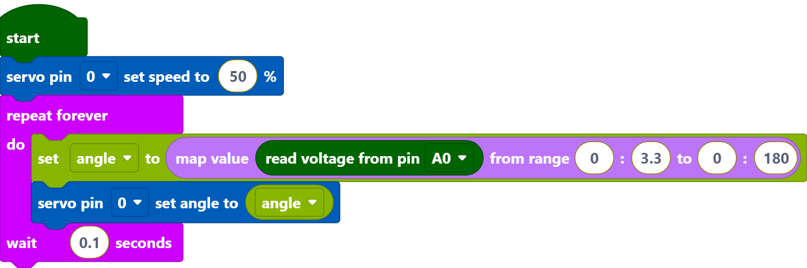
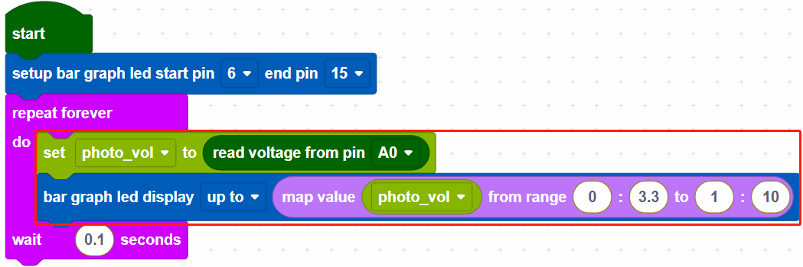

.. _per_potentiometer_control_servo:

2.7 Variable Resistor Servo Control System
==========================================

In this project, we use a servo and a potentiometer to simulate a steering wheel. Rotating the potentiometer will drive the servo to turn together.

Component List
^^^^^^^^^^^^^^^^^^^
- Raspberry Pi Pico W x1
- MicroUSB cable x1
- 830 Tie-Points Breadboard x1
- Potentiometer x1
- Servo x1
- Jumper Wire Several
  

Circuit Configuration
^^^^^^^^^^^^^^^^^^^^^

* Servo motor control signal interfaces with GPIO pin GP13.
* Potentiometer analog output connects to GPIO pin GP26.

Programming Implementation
^^^^^^^^^^^^^^^^^^^^^^^^^^

.. note::

    * Follow the visual programming guide below using drag-and-drop techniques. 
    * Load ``2.7_Potentiometer_Control_Servo.png`` from the directory ``Ultimate-Starter-Kit-for-Pico-W\Piper_Make``. For comprehensive guidance, see :ref:`import_code_piper`.

Upon Pico W connection, press the **Start** button to begin program execution. Adjust the potentiometer knob to control servo motor angular positioning in real-time.

How it Works?
^^^^^^^^^^^^^^^^^^^^^^^^

Set the rotation speed of pin15 (servo) to 15%.

* [servo pin() set speed to ()%]: Used to set the rotation speed of the servo pin, the range is 0%~100%.

Create a variable [angle], then read the voltage of A0. Use the [map value () from () to ()] block, map the voltage of A0 from 0 to 3.3V voltage range to 0 to 180°, and then use the mapped angle as the rotation angle of the servo.

* [map value () from () to ()]: map a value from one range to another.

.. note::
    The voltage of A0~A2 takes the range of 0~3.3V, even if your power supply is connected to VBUS (5V).