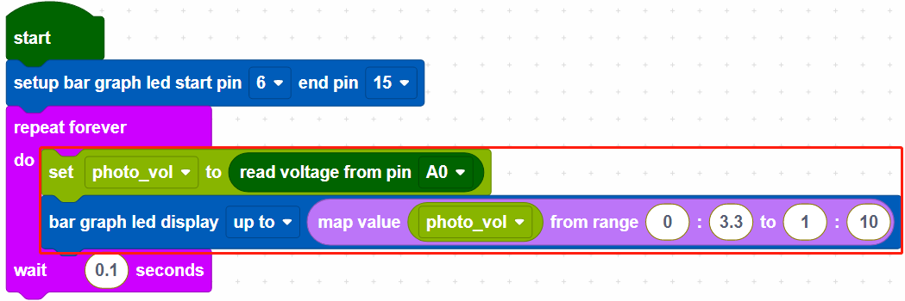

.. _per_swing_servo:

2.7 Potentiometer Control Servo
===============================================

In this project, we use a servo and a potentiometer to simulate a steering wheel. Rotating the potentiometer will drive the servo to turn together.

Component List
^^^^^^^^^^^^^^^^^^^
- Raspberry Pi Pico W x1
- MicroUSB cable x1
- 830 Tie-Points Breadboard x1
- Potentiometer x1
- Servo x1
- Jumper Wire Several

Wiring
^^^^^^^^^^^^^^^^^^^^^^^^

* The orange wire (signal) of the servo is connected to GP15, the red wire (power) is connected to VBUS, and the brown wire (ground) is connected to GND. 
* Potentiometer is a resistive element with 3 terminals, the 2 side pins are connected to 5V and GND, and the middle pin is connected to GP26(A0).

Code
^^^^^^^^^^^^^^^^^^^^^^^^
.. note::

    * You can refer to the image below to write code by dragging and dropping. 
    * Import ``2.7_Potentiometer_Control_Servo.png`` from the path of ``Ultimate-Starter-Kit-for-Pico-W\Piper_Make``. For detailed tutorials, please refer to :ref:`import_code_piper`.

* After connecting Pico W, click the **Start** button and the code starts to run.
* Turn the potentiometer and the servo will follow. To see it clearly, you can insert a rocker arm in the servo shaft.

How it Works?
^^^^^^^^^^^^^^^^^^^^^^^^

Set the rotation speed of pin15 (servo) to 15%.

* [servo pin() set speed to ()%]: Used to set the rotation speed of the servo pin, the range is 0%~100%.

Create a variable [angle], then read the voltage of A0. Use the [map value () from () to ()] block, map the voltage of A0 from 0 to 3.3V voltage range to 0 to 180°, and then use the mapped angle as the rotation angle of the servo.

* [map value () from () to ()]: map a value from one range to another.

.. note::
    The voltage of A0~A2 takes the range of 0~3.3V, even if your power supply is connected to VBUS (5V).